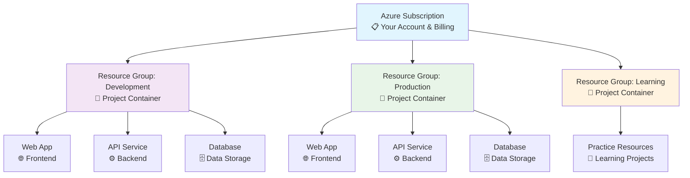
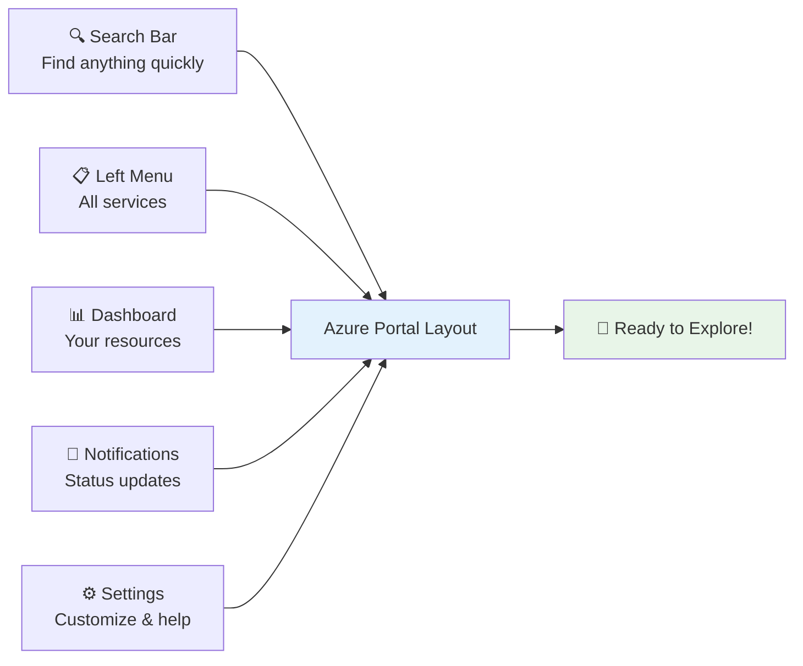
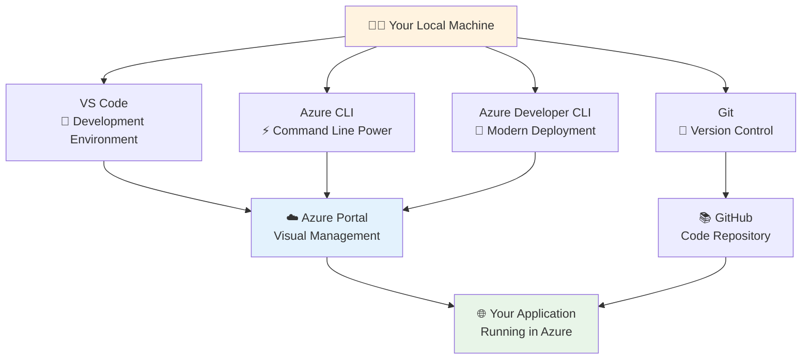
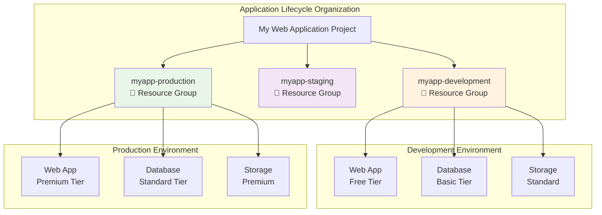
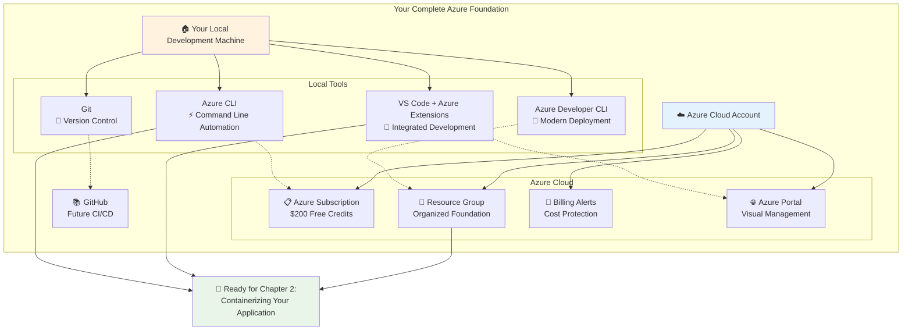
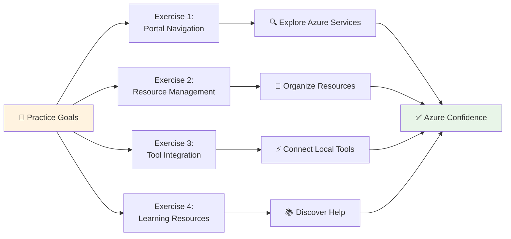
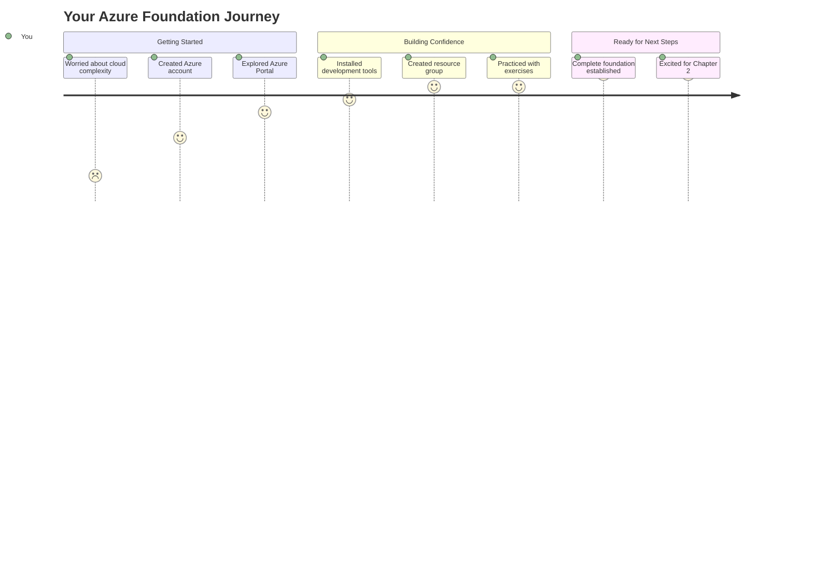

# Get Started with Confidence by Setting Up Your Azure Environment

Welcome to your exciting journey into cloud development! If you're like many developers today, you might have a fantastic application running on your computer, but you're wondering how to share it with the world. Perhaps you've heard about "the cloud" and Microsoft Azure, but aren't quite sure where to begin. That's perfectly normal, and you're in exactly the right place to start learning.

> 💡 **Learning Tip**: Don't worry if Azure sounds complicated right now. By the end of this chapter, you'll feel comfortable and confident navigating the basics!

Think of this chapter as your friendly introduction to Azure—like having a helpful guide show you around a new city. We'll walk through everything step by step, making sure you feel comfortable before moving on. By the end of this chapter, you'll have your own Azure environment set up and ready for the exciting journey ahead.

Just like our friend Alex from the course introduction, you'll start with that familiar feeling of "I have this great app on my computer, but how do I get it to Azure?" Don't worry—we'll answer that question together, one step at a time.

> ⏱️ **Time Check**: This chapter takes about 45 minutes to complete. Grab a drink and let's get started!

## Introduction

Let's start with a story that might sound familiar. Alex has spent weeks building an amazing web application—a React frontend that looks fantastic, a Node.js backend that handles data perfectly, and a database that stores everything safely. When Alex runs the application on their computer, everything works beautifully. Friends and family who visit can see the app running and they're impressed!

But then Alex realizes something important: "How can I show this to my friends across the country? How can users actually use my application? And what happens if my computer breaks—will I lose everything?" These are the exact questions that lead developers to explore cloud computing, and specifically Microsoft Azure.

> 🤔 **Quick Check**: Can you think of a time when you wanted to share something you created with someone far away? That's exactly the problem we're solving!

**What is Cloud Computing? (The Simple Version)**

Cloud computing might sound complex, but think of it like this: instead of running your application only on your personal computer, you can run it on powerful computers owned by Microsoft. These computers are:
- Available 24/7 from anywhere in the world
- Maintained by experts (so you don't have to worry about them)
- Backed up regularly (so your work is safe)
- Able to handle thousands of users at the same time

When you store photos on Google Photos or watch Netflix, you're already using cloud computing!

**What is Microsoft Azure? (Think Digital Toolbox)**

Microsoft Azure is like a massive, well-organized toolbox containing hundreds of tools that help you build applications in the cloud. Just like a real toolbox has different tools for different jobs, Azure has different services for different parts of your application.

Some Azure services help you show your website to users, others help you store data, and still others help you keep everything secure. The best part? You only pay for what you use, and you can start with free services that are perfect for learning.

> 💡 **Learning Tip**: Don't feel like you need to understand all Azure services right now. We'll learn them one at a time as we need them!

In this chapter, we'll focus on getting comfortable with Azure's environment before we start moving any application parts. Think of it as setting up your workspace before starting a project—you want to know where all your tools are and how to use them safely.

## Learning Objectives

By the end of this chapter, you'll feel confident and excited about these new skills:

> 🎯 **Your Success Goals**

• **Navigate Azure like a pro**: You'll know how to find your way around the Azure Portal and feel comfortable exploring new services without worrying about breaking anything.

• **Set up your foundation**: You'll have your own Azure account with safety features, so you can learn and experiment without worrying about costs.

• **Organize like a professional**: You'll understand resource groups and create your first one—this becomes the home for all your Azure services.

• **Connect your tools**: You'll have all the right development tools installed, turning your computer into a powerful Azure development environment.

> ✅ **Confidence Check**: After this chapter, you'll go from "Azure seems scary" to "I've got this!"

## Concept Foundation

Before we start the hands-on work, let's understand the basic concepts you'll use throughout your Azure journey. Think of these as the vocabulary words you need to know to feel confident.

> 💡 **Learning Strategy**: We'll explain each concept using things you already know, so nothing feels overwhelming!

**Understanding Cloud Computing Through Things You Use Every Day**

Cloud computing is easier to understand when you compare it to services you already use:

- When you store photos on **Google Photos** or **iCloud** → that's cloud storage
- When you watch **Netflix** or **YouTube** → that's cloud computing  
- When you use **Gmail** or **Outlook online** → that's cloud applications

Cloud computing for your applications works the same way. Instead of your app running only on your computer, it runs on servers around the world. Users can access your app anytime, from anywhere!

> 🤔 **Think About It**: What other apps do you use that work from any device? Those are probably using cloud computing too!

**Microsoft Azure: Your Digital Toolbox**

Microsoft Azure is like a huge, well-organized toolbox containing hundreds of tools that help you build applications in the cloud. Just like a real toolbox has different tools for different jobs:

- **Hammer** → Azure App Service (runs your website)
- **Screwdriver** → Azure Database (stores your data)  
- **Measuring tape** → Azure Monitor (checks if everything is working)

The cool thing is that these tools work together perfectly, and Azure handles all the complicated stuff for you.

**Azure Portal: Your Control Panel**

The Azure Portal is a website that lets you control all your Azure services. Think of it like:
- The **dashboard** of a car (shows you what's happening)
- The **control panel** of a game console (lets you manage everything)
- The **admin panel** of a website (gives you all the controls)

> 💡 **Pro Tip**: The Azure Portal is designed to be beginner-friendly. If you can use a smartphone, you can use the Azure Portal!

While experienced developers often use command-line tools (which we'll learn about later), the Azure Portal is perfect for beginners because it's visual, intuitive, and helps you understand the relationships between different services. You can see exactly what resources you have, how they're configured, and how much they're costing you.

**Key Azure Concepts That Organize Everything**

Understanding these three fundamental concepts will make everything else in Azure much clearer. Let's visualize how these concepts work together:



| Azure Concept | Real-World Analogy | Purpose | Example |
|---------------|-------------------|---------|---------|
| **Subscription** | Your Netflix account | Billing and access control | "My Azure Learning Account" |
| **Resource Group** | Project folder on your computer | Organize related services | "my-web-app-development" |
| **Resources** | Individual files in a folder | Actual cloud services | Web App, Database, Storage |

• **Subscription**: Think of this as your Azure account and billing container. Everything you create in Azure belongs to a subscription, and this is where Azure tracks your usage and bills you accordingly.

• **Resource Group**: This is like a folder that contains related Azure services for a specific project. For example, you might create a resource group called "my-web-app" that contains your website, database, and storage account.

• **Resources**: These are the actual Azure services you use—things like web apps, databases, storage accounts, and virtual machines. Every resource belongs to exactly one resource group.

This hierarchy helps keep everything organized: you have a subscription that contains multiple resource groups, and each resource group contains the related resources for a specific project or application.

## Creating Your Azure Account and Exploring the Portal

Now that you understand the basic concepts, let's get your hands dirty by creating your Azure account and taking a guided tour of the Azure Portal. This is where your cloud journey officially begins, and it's easier than you might expect.

**Setting Up Your Free Azure Account**

Microsoft gives you amazing free stuff to learn with! When you create a free Azure account, you get:
- **$200 free credits** to use in your first 30 days (that's enough to build several small apps!)
- **Access to many services that stay free forever** (perfect for learning projects)

> 💰 **Money Tip**: You won't be charged unless you choose to upgrade. Azure will warn you before you spend any real money!

Here's how to get started:

1. Go to `portal.azure.com` in your web browser
2. Click "Start free" or "Create a free account"
3. Use a Microsoft account (same as Xbox, Outlook, or Office 365)
4. You'll need a phone number (for safety) and credit card (just to prove you're real)

> ⏱️ **Time Check**: This usually takes about 5 minutes. Perfect time for a quick break!

**Your First Azure Portal Tour**

Once your account is ready, sign in to the Azure Portal at `portal.azure.com`. Take a moment to appreciate what you're seeing—this is your personal gateway to one of the world's most powerful cloud platforms!

> 🎉 **Celebration Moment**: You now have access to the same tools that power apps used by millions of people!

The Azure Portal is designed to be easy to use. Let's explore the main areas:

| Portal Area | Location | Purpose | Beginner Tip |
|-------------|----------|---------|--------------|
| **Left Navigation Menu** | Left sidebar | Access to all Azure services | Can be collapsed to save space |
| **Dashboard** | Main center area | Personalized view of your resources | Customizable with widgets |
| **Top Search Bar** | Top center | Find services, resources, documentation | Type service names for quick access |
| **Notifications Bell** | Top-right corner | Important alerts and updates | Check here for deployment status |
| **Settings & Help** | Top-right icons | Portal preferences and support | Great for learning resources |



> 💡 **Explorer Tip**: Don't be afraid to click around! Azure makes it very hard to accidentally break things or spend money, especially with the free tier.

**Getting Comfortable with the Layout**

Spend a few minutes clicking different sections. Notice how it feels similar to other websites you use—this is on purpose to help you feel comfortable while learning.

• **Left Navigation Menu**: This menu contains links to all Azure services. You can make it smaller to see more of your screen.

• **Dashboard**: The main area shows your personalized view with quick access to your stuff and important info like spending alerts.

• **Top Search Bar**: This powerful search helps you find anything quickly. Try typing "storage" to see how it shows both services and your actual resources.

• **Notifications Bell**: Click the bell in the top-right to see important updates about your Azure resources or spending.

• **Settings and Help**: The gear and question mark icons give you access to help and settings—great for when you need support.

> ✅ **Quick Check**: Can you find the search bar and left menu? If yes, you're ready to move on!

Spend a few minutes clicking around different sections. Notice how the interface feels familiar if you've used other Microsoft products—this is intentional design that helps you feel comfortable while learning.

**Understanding the Azure Portal's Learning-Friendly Design**

One of the best features of the Azure Portal for beginners is its progressive disclosure approach. When you click on a service, you'll see basic options first, with links to more advanced features clearly labeled. This means you can start simple and gradually explore more complex capabilities as your knowledge grows.

The Portal also includes helpful features specifically designed for learning:

• **Quickstart tutorials**: Most services include step-by-step tutorials that guide you through common tasks.

• **Cost estimates**: Before creating resources, Azure shows you estimated costs, helping you make informed decisions.

• **Resource templates**: Azure can generate templates of your infrastructure, helping you understand how different components work together.

• **Activity logs**: You can see a history of everything you've done, which is helpful for learning and troubleshooting.

Don't be afraid to explore—Azure makes it very difficult to accidentally create expensive resources or break things, especially with the free tier protections in place.

## Installing Essential Development Tools

While the Azure Portal is fantastic for learning and managing resources visually, professional Azure development requires some additional tools on your local machine. Think of these tools as extending your development environment to work seamlessly with Azure—like adding specialized equipment to a workshop.

Let's visualize how these tools work together in your development workflow:



| Tool | Purpose | When You'll Use It | Installation Method |
|------|---------|-------------------|-------------------|
| **Azure CLI** | Automate Azure tasks from command line | Scripting, automation, quick resource management | Windows installer, Homebrew (Mac), Package manager (Linux) |
| **Azure Developer CLI** | Deploy complete applications with Infrastructure as Code | Full application deployment, environment management | Download from Microsoft docs |
| **VS Code + Extensions** | Integrated development with Azure services | Daily coding, resource management, debugging | Download from code.visualstudio.com |
| **Git** | Version control and collaboration | Source code management, CI/CD preparation | Download from git-scm.com |

**Azure CLI: Your Command-Line Power Tool**

The Azure Command-Line Interface (CLI) is a powerful tool that lets you control Azure from your terminal or command prompt. While it might seem scary at first, the Azure CLI becomes super useful once you start automating deployments and managing multiple resources.

> 💡 **Don't Worry!** You don't need to be a command-line expert. We'll start with simple commands and build up gradually.

**Installation is Easy:**
- **Windows**: Download the installer from Microsoft (just like installing any other program)
- **Mac**: Use Homebrew: `brew install azure-cli` (if you don't have Homebrew, use the installer instead)
- **Linux**: Use your package manager (Ubuntu users can follow Microsoft's simple guide)

After installation, open your terminal and type `az --version` to make sure everything worked. You should see some version numbers—that means you're ready to go!

> ✅ **Quick Test**: Try typing `az --help` to see all the things Azure CLI can do. Pretty cool, right?

**Azure Developer CLI: Modern Infrastructure Management**

The Azure Developer CLI (azd) is a newer tool designed specifically for application developers who want to work with Infrastructure as Code patterns. While we won't use it extensively in this first chapter, installing it now prepares you for the advanced deployment techniques we'll learn later in the course.

Azure Developer CLI focuses on managing complete application environments rather than individual resources. It's particularly powerful when you want to deploy your entire application stack—frontend, backend, database, and all configuration—with a single command.

Installation is straightforward: visit the Azure Developer CLI documentation page for your operating system and follow the installation instructions. The tool is actively developed and regularly updated with new features that make application deployment even easier.

**Visual Studio Code with Azure Extensions**

Visual Studio Code (VS Code) is like the Swiss Army knife of code editors—it's free, fast, and works great with Azure. If you don't have VS Code yet, download it from `code.visualstudio.com`.

> 🎯 **Pro Tip**: VS Code is used by millions of developers worldwide. Learning it well will help you in many projects!

**Getting the Azure Extensions:**
1. Open VS Code
2. Click the Extensions icon (looks like four squares) on the left side
3. Search for "Azure Tools" 
4. Install the pack created by Microsoft

This gives you superpowers like:
- **Azure Account**: Sign in to Azure right from VS Code
- **Azure App Service**: Deploy websites without leaving your editor
- **Azure Functions**: Create serverless functions with easy debugging
- **Azure Storage**: Browse and manage your files visually
- **Azure Databases**: Connect to and query databases directly

> ✅ **Success Check**: After installing, look for a new Azure icon in the left sidebar. Click it to see your Azure account info!

**Why This Matters:**
Instead of switching between VS Code (for coding) and the Azure Portal (for Azure stuff), you can do everything in one place. It's like having your code and your Azure controls on the same desk!

**Git and GitHub Integration**

Modern Azure development relies heavily on Git for source control and GitHub for repository hosting and CI/CD automation. If you don't already have Git installed, download it from `git-scm.com` and follow the installation instructions for your operating system.

During Git installation, you'll make several configuration choices. For beginners, the default options are usually perfect, but pay attention to the default editor selection—choosing VS Code as your default Git editor will provide a better experience if you're comfortable with it.

After installing Git, configure it with your name and email address using these commands in your terminal:

```bash
git config --global user.name "Your Name"
git config --global user.email "your.email@example.com"
```

If you don't have a GitHub account, create one at `github.com`. GitHub integration with Azure enables powerful automation workflows that we'll explore in later chapters. For now, having the account created and your local Git configured is sufficient preparation.

## Organizing Your Azure Resources with Resource Groups

Resource groups are one of Azure's most important organizational concepts, and understanding them well will save you tremendous time and effort throughout your Azure journey. Think of resource groups as project folders that keep all related Azure services organized and manageable.

**Understanding Resource Groups Through Real-World Analogies**

Imagine you're organizing a home office. You might have one drawer for all your tax-related documents, another drawer for insurance papers, and a third for household warranties. Each drawer contains all the documents related to that specific area of your life, making it easy to find what you need and manage everything together.

Resource groups work the same way in Azure. When you build a web application, you'll create multiple Azure services—perhaps a web app for your frontend, another web app for your backend API, a database for storing data, and a storage account for user uploads. Rather than having these services scattered randomly across your Azure subscription, you group them all in a single resource group.

This organization provides several practical benefits. When you want to see all the components of your application, you can view the resource group and see everything at once. When you're finished with a project, you can delete the entire resource group and all its contents with a single action. Most importantly for beginners, resource groups help you track costs—you can see exactly how much your entire application is costing you by viewing the resource group's aggregated billing information.

**Creating Your First Resource Group**

Let's create your first resource group! This will be the home for all the Azure services you'll use throughout this course. 

> 🎯 **What We're Doing**: Think of this like creating a new folder on your computer, but for Azure services.

**Step-by-Step:**
1. In the Azure Portal, use the search bar to find "resource groups"
2. Click on "Resource groups" when it appears
3. You'll see an empty list (since this is your first one) and a "Create" button
4. Click "Create" to start

**Filling Out the Form (Don't Worry, It's Simple!):**

The form has a few fields, but they're straightforward:

• **Subscription**: Should already show your free Azure subscription (nothing to change!)
• **Resource group name**: Pick something descriptive like "my-first-web-app" or "azure-learning"
• **Region**: Choose somewhere close to you (like "East US" or "West Europe")

> 💡 **Naming Tip**: Use lowercase letters, numbers, and hyphens. Avoid spaces and weird characters to keep things simple.

> ⚠️ **Region Note**: This only affects where Azure stores info about your resource group, not where your actual services will be.

After filling it out, click "Review + create" then "Create." In a few seconds, you'll get a success notification!

> ✅ **Celebration Moment**: Congratulations! You just created your first piece of Azure infrastructure!

**Exploring Resource Group Management Features**

Once your resource group is created, click on its name to explore its management interface. This view will become very familiar as you build applications, so it's worth understanding all its capabilities.

The Overview tab shows you a summary of all resources in the group, their current status, and aggregated cost information. Initially, this will be empty since you haven't created any resources yet, but soon it will become a valuable dashboard for monitoring your application's health and costs.

The Access control (IAM) tab manages who can view, modify, or delete resources in this resource group. This becomes important when working in teams or organizations, but for personal learning projects, you'll typically be the only person with access.

The Tags section allows you to add metadata labels to your resource group. Tags are incredibly useful for organization—you might tag resource groups with information like "Environment: Development," "Project: PersonalWebsite," or "Owner: YourName." These tags help with cost tracking and resource management as your Azure usage grows.

**Resource Group Best Practices for Application Development**

As you begin planning your application migration, consider these organizational strategies that will make your Azure experience much smoother. Here's how professional developers organize their resources:



| Organization Strategy | Resource Group Name | Benefits | Use Case |
|----------------------|-------------------|----------|----------|
| **By Environment** | `myapp-development`<br/>`myapp-production` | Independent cost tracking, different access permissions | Most common approach |
| **By Project** | `website-project`<br/>`mobile-app-project` | Clear project boundaries, easy cleanup | Multiple distinct applications |
| **By Team** | `frontend-team-resources`<br/>`backend-team-resources` | Team-based access control | Large organizations |
| **By Region** | `myapp-eastus`<br/>`myapp-westeurope` | Geographic distribution, compliance | Global applications |

**Best Practices Summary:**

• **One resource group per application environment**: Create separate resource groups for development, testing, and production versions of your application. This allows you to manage and cost-track each environment independently.

• **Descriptive naming conventions**: Use names that clearly indicate the application and environment, such as "myapp-development" or "learningproject-production."

• **Geographic considerations**: While the resource group's region only affects where its metadata is stored, many developers choose a region where they plan to deploy most of their application's actual resources.

• **Cost management preparation**: Even though you're using free tier resources now, developing good organizational habits will serve you well when you start building production applications.

The resource group you've just created will become the foundation for all the Azure services we'll explore in subsequent chapters. Every time we create a new Azure service—whether it's a web app, database, or storage account—we'll place it in this resource group, keeping everything organized and manageable.

## Putting It Together: Your Complete Azure Foundation

Now that you've created your Azure account, explored the Portal, installed development tools, and set up your first resource group, let's bring everything together to see your complete Azure development foundation. This is an exciting moment—you've built the groundwork for everything we'll accomplish in the coming chapters.

Here's a visual overview of your complete Azure foundation:



**Foundation Component Verification Checklist:**

| Component | Status Check | What This Enables |
|-----------|-------------|-------------------|
| ✅ **Azure Account** | Can sign into portal.azure.com | Access to Azure services |
| ✅ **Free Subscription** | $200 credits visible in billing | Cost-free learning and experimentation |
| ✅ **Resource Group** | Visible in Portal and CLI | Organized home for your Azure services |
| ✅ **Azure CLI** | `az --version` works | Command-line automation and scripting |
| ✅ **VS Code + Extensions** | Azure tab shows your subscription | Integrated development workflow |
| ✅ **Billing Alerts** | Configured in Cost Management | Protection from unexpected charges |

**Verifying Your Azure Environment Setup**

Let's systematically verify that every component of your Azure environment is working correctly. Think of this as a final inspection before starting a construction project—we want to ensure all our tools and foundation are solid before building our application.

Start by signing into the Azure Portal and navigating to your resource group. You should see your newly created resource group with a green checkmark indicating it's healthy and ready to use. The fact that you can access this and see the empty resource group proves that your Azure account is properly configured and your permissions are working correctly.

Next, let's verify your local development tools are properly connected to Azure. Open your terminal or command prompt and run `az --version` to confirm Azure CLI is installed. Then run `az login` to authenticate with your Azure account. This command will open a web browser where you'll sign in with the same credentials you use for the Azure Portal.

After successful authentication, run `az account show` to display information about your current subscription. You should see details like your subscription name, ID, and the tenant information. This confirms that your local development environment can communicate with your Azure account.

If you installed Visual Studio Code with Azure extensions, open VS Code and click the Azure icon in the activity bar. You should see your subscription listed, and you can expand it to see your resource group. This visual confirmation shows that your development environment is fully integrated with Azure.

**Understanding Your Azure Resource Landscape**

Take a moment to appreciate what you've accomplished. You now have a complete Azure development environment that includes:

• **Cloud access**: Your Azure account gives you access to hundreds of services and the ability to deploy applications globally.

• **Visual management**: The Azure Portal provides an intuitive interface for learning, creating, and managing cloud resources.

• **Command-line power**: Azure CLI enables automation, scripting, and efficient resource management from your terminal.

• **Integrated development**: VS Code with Azure extensions creates a seamless development experience where you can write code and manage Azure resources in the same environment.

• **Organized foundation**: Your resource group provides a clean, organized space for all the services you'll create throughout your learning journey.

This foundation might seem simple now, but it represents everything you need to build and deploy professional cloud applications. Many developers work for years with just these tools, and they're sufficient for applications serving millions of users.

**Exploring What's Possible with Your Foundation**

With your Azure environment ready, let's preview what becomes possible in the upcoming chapters. Your resource group is like an empty plot of land where you can build anything you imagine. Soon, you'll be adding Azure services to this resource group that will host your application components.

Your development tools are like having a workshop fully stocked with professional equipment. The Azure CLI will help you automate deployment processes, VS Code will help you write and deploy code seamlessly, and the Azure Portal will help you monitor and manage everything visually.

**Setting Up Billing Alerts for Peace of Mind**

Before we finish this chapter, let's set up billing alerts to ensure you never have unexpected costs while learning. Navigate to "Cost Management + Billing" in the Azure Portal (you can find it using the search bar).

Click on "Budgets" and then "Add" to create a new budget. Set the budget amount to something comfortable—perhaps $10 or $20 for your first month of learning. Configure the alert to notify you when you've spent 80% of your budget, giving you plenty of warning before any actual charges occur.

This billing alert provides peace of mind that lets you experiment and learn without worrying about costs. With the free tier and budget alerts in place, you can focus entirely on learning Azure concepts rather than monitoring spending.

**Your Azure Journey Roadmap**

Looking ahead, your next steps will involve putting this foundation to work by deploying actual application components. In Chapter 2, you'll learn about containerizing your local application to prepare it for cloud deployment. Chapter 3 will use this Azure environment to deploy your first web application, and each subsequent chapter will add new services to your resource group.

Every service you add will integrate seamlessly with this foundation you've built. Your resource group will become a organized collection of services that work together to host your complete application, your development tools will help you deploy and manage everything efficiently, and your Azure knowledge will grow naturally as you solve real problems.

## Practice Time: Hands-On Azure Exploration

Now it's time to solidify your learning through guided practice. These exercises are designed to help you feel more comfortable with Azure while building confidence in your new environment. Remember, the goal isn't to rush through these activities, but to truly understand what you're doing and why it matters.



**Exercise Overview & Learning Objectives:**

| Exercise | Duration | Learning Focus | Skills Gained |
|----------|----------|----------------|---------------|
| **Portal Navigation** | 15 minutes | Azure service discovery | Comfort finding and exploring services |
| **Resource Management** | 20 minutes | Organization and tagging | Professional resource organization |
| **Tool Integration** | 15 minutes | Local-to-cloud workflow | Command-line and IDE integration |
| **Learning Resources** | 10 minutes | Self-service learning | Independent problem-solving |

**Exercise 1: Azure Portal Navigation Challenge**

Let's practice finding your way around Azure like a pro. This exercise helps you get comfortable with the Portal, which is essential for everything we'll do next.

> 🎯 **Goal**: By the end of this exercise, you'll feel confident exploring Azure services without getting lost.

**Your Mission:** Use the Portal search to find these services. Don't create anything yet—just explore and learn!

• **Azure App Service**: This is where you'll put your websites. Notice how it explains it's a platform for hosting web apps and APIs.

• **Azure SQL Database**: This managed database service will store your app's data. Check out the different pricing levels and notice how Azure handles maintenance and backups automatically.

• **Azure Storage**: This handles file storage, like user uploads and images. Look at the different types of storage accounts and what they're used for.

• **Azure Functions**: This serverless computing service runs code without you managing servers. Even if you don't need it now, it's cool to see what's possible.

> 💡 **Explorer Tip**: For each service, read the overview and click on "Getting Started" links. This builds your mental map of what Azure can do!

> ⏱️ **Time Check**: Spend about 3-4 minutes on each service. Don't rush—let yourself get curious about what each one does.

**Exercise 2: Resource Group Management Practice**

Practice essential resource group management skills that you'll use throughout your Azure journey. These skills become increasingly important as you build more complex applications with multiple components.

First, create a second resource group called "practice-environment" in a different region than your first resource group. This exercise helps you understand that you can organize resources geographically and gives you hands-on experience with the creation process.

Next, practice adding tags to both of your resource groups. Add tags like "Purpose: Learning", "Environment: Development", and "Owner: [YourName]". Tags might seem unnecessary now, but they become invaluable for organization and cost tracking as your Azure usage grows.

Explore the cost analysis features for your resource groups. Even though they're empty and generating no costs, familiarizing yourself with these views now will help you monitor spending effectively when you start deploying resources.

Finally, practice using the Azure Portal's filtering and sorting capabilities. Learn how to filter resources by type, status, or location. These navigation skills become essential when you're managing dozens of resources across multiple projects.

**Exercise 3: Development Tool Integration**

Practice integrating your local development environment with Azure to ensure everything works smoothly when you start deploying applications.

Open your terminal and practice basic Azure CLI commands. Start with `az account list` to see your subscription information, then try `az group list` to display your resource groups from the command line. These commands demonstrate that your local tools can communicate with Azure successfully.

Experiment with `az group show --name [your-resource-group-name]` to display detailed information about one of your resource groups. Notice how the command-line interface provides the same information as the Azure Portal, but in a format that's easy to use in scripts and automation.

In Visual Studio Code, practice navigating your Azure resources using the Azure extensions. Sign in to your Azure account through the Azure extension and explore your subscription and resource groups visually. Try right-clicking on different elements to see the available actions—this context menu will become very useful for managing resources directly from your editor.

Create a simple text file and practice saving it to different locations, ensuring your development environment is working correctly. While this seems basic, confirming that all your tools work properly now prevents frustration later when you're trying to deploy real applications.

**Exercise 4: Exploring Azure's Learning Resources**

Azure provides extensive learning resources that will support your journey beyond this course. Spend time exploring these resources to understand what's available when you need help or want to learn advanced topics.

Visit Azure's documentation site and explore the "Get Started" sections for services you investigated earlier. Notice how Microsoft provides multiple learning paths—from simple tutorials to comprehensive architectural guidance.

Explore the Azure Quickstart templates repository, which contains pre-built infrastructure templates for common scenarios. While you won't use these immediately, understanding that these resources exist helps you see how experienced developers accelerate their work.

Try the interactive Azure learn modules related to basic Azure concepts. These hands-on tutorials complement what you're learning in this course and provide additional practice with different learning approaches.

Join the Azure community forums or Reddit communities focused on Azure development. While you don't need to post questions yet, reading other developers' discussions helps you understand common challenges and solutions.

## Solution Walkthrough: Understanding Your Azure Setup

Let's walk through the complete solution for setting up your Azure environment, explaining not just what you accomplished, but why each step matters for your future Azure development work. Understanding the reasoning behind each component helps you make better decisions as your projects become more complex.

**Azure Account and Subscription Configuration**

Your Azure account serves as the foundation for everything you'll build in the cloud. When you created your free Azure subscription, you established several important elements that will serve you throughout your cloud journey.

The free tier provides $200 in credits for your first 30 days, which is more than sufficient for learning and building small to medium-sized applications. Beyond the initial credits, many Azure services include generous free tiers that continue indefinitely. For example, Azure App Service allows you to host small web applications completely free, and Azure SQL Database includes a free tier suitable for development and testing.

Your subscription also establishes billing boundaries and administrative control. Everything you create in Azure belongs to this subscription, and Azure tracks usage and costs at the subscription level. This organization becomes important when you start working with teams or managing multiple projects—different projects can use different subscriptions for clear cost separation and access control.

**Resource Group Strategic Organization**

The resource group you created represents more than just a container for Azure services—it embodies a strategic approach to cloud resource organization. By naming your resource group descriptively and placing it in a specific region, you've established patterns that will serve you well as your Azure usage grows.

Resource groups enable lifecycle management for related resources. When you're finished with a project, deleting the resource group removes all its contained resources with a single action. This capability prevents "resource sprawl" where forgotten resources continue generating costs.

The regional placement of your resource group's metadata doesn't dictate where your actual resources must be located, but it establishes a logical grouping that often aligns with your application architecture. Many developers create resource groups that correspond to application environments (development, staging, production) or project phases.

**Development Tool Integration Benefits**

The development tools you installed create a powerful, integrated workflow that professional Azure developers use daily. Each tool serves specific purposes that complement the others:

Azure CLI excels at automation, scripting, and infrastructure management. As you advance in your Azure journey, you'll write scripts that provision entire application environments with single commands. The CLI also integrates beautifully with CI/CD pipelines for automated deployments.

Visual Studio Code with Azure extensions provides seamless integration between code development and Azure resource management. You can write your application code, deploy it to Azure, monitor its performance, and troubleshoot issues without leaving your editor. This integration significantly accelerates development velocity.

The Azure Portal remains valuable for learning, visual resource management, and monitoring. Even experienced developers use the Portal regularly for tasks that benefit from visual interfaces, such as exploring new services, analyzing performance metrics, or configuring complex security policies.

**Security and Cost Management Foundation**

Your billing alerts and free tier configuration establish responsible Azure usage patterns from the beginning. These safeguards let you experiment and learn without financial worry, while building good habits for cost management that become crucial in production environments.

The free tier limitations serve as gentle guardrails that encourage efficient resource usage. Many professional applications operate comfortably within free tier limits for their development and testing environments, reserving paid resources only for production workloads that require guaranteed performance and availability.

**Understanding the Azure Resource Hierarchy**

Your setup demonstrates Azure's logical resource hierarchy in action. Your subscription contains resource groups, which contain individual resources (services). This hierarchy provides multiple levels of organization, access control, and cost tracking.

As you add Azure services to your resource group in upcoming chapters, they'll inherit organizational context from the resource group. Tags applied at the resource group level can be inherited by contained resources, billing analysis can be performed at the resource group level, and access permissions can be granted to entire resource groups rather than individual resources.

**Preparing for Application Deployment**

Everything you've accomplished in this chapter prepares you for the exciting work ahead. Your Azure environment is ready to host applications, your development tools can deploy and manage code efficiently, and your organizational structure will keep everything manageable as complexity grows.

The foundation you've built supports applications of any size, from simple static websites to complex microservices architectures. The same tools and organizational patterns scale effectively from learning projects to production applications serving millions of users.

Your next steps will involve putting this foundation to practical use by deploying actual application components. Each new Azure service you add will integrate seamlessly with this foundation, building toward a complete cloud-hosted application that demonstrates professional Azure development practices.

## Knowledge Check: Confirming Your Azure Foundation

Let's verify your understanding of the essential concepts from this chapter. This isn't a test to stress about—it's a friendly way to confirm that you're ready to move forward with confidence to more advanced topics.

**Question 1: Azure Resource Organization**

You're planning to build a web application that needs separate environments for development and production. Each environment will include a web app, database, and storage account. What's the best way to organize these resources in Azure?

A) Create one resource group and put all resources for both environments together  
B) Create separate resource groups for development and production environments  
C) Create individual resource groups for each type of service (web apps, databases, storage)  

**Correct Answer: B) Create separate resource groups for development and production environments**

The best practice is to organize resources by environment and project lifecycle. Creating separate resource groups for development and production provides several benefits: independent cost tracking for each environment, ability to grant different access permissions to different teams, and simplified cleanup when environments are no longer needed.

This organization pattern reflects how professional development teams structure their Azure resources, and it's a pattern you'll use throughout your career. When you delete a development environment, you can remove the entire resource group and all its contents with confidence that you won't affect production resources.

**Understanding the Reasoning Behind the Answer**

Organizing resources by environment rather than by service type aligns with how applications are developed and deployed. Your development environment might need frequent changes, experimentation, and occasional complete rebuilds, while your production environment requires stability and careful change management.

Separate resource groups also enable different configuration approaches for each environment. Your development environment might use free tier services and relaxed security settings to facilitate rapid experimentation, while your production environment uses paid tiers with enhanced security and monitoring capabilities.

This organizational strategy scales beautifully as your applications become more complex. Whether you're building a simple web app or a sophisticated microservices architecture, organizing by environment and project lifecycle remains effective and maintainable.

## Chapter Recap: Celebrating Your Azure Foundation Success

Wow! You've done something really amazing in this chapter. What might have seemed like "just setup" is actually the foundation that will support everything you build in Azure. Let's celebrate what you've achieved and get excited about what's coming next!

> 🏆 **Major Achievement Unlocked**: You now have the same Azure setup that professional developers use to build apps for millions of people!

**Your Learning Journey Progress:**



**What You Built and Why It's Awesome:**

| What You Built | Why It's Awesome | What Pros Think |
|----------------|----------------|-------------------|
| **Azure Account & Portal Access** | Gateway to global cloud infrastructure | "This person is ready for real development!" |
| **Resource Group Organization** | Professional project organization | "They understand how to keep things organized!" |
| **Development Tool Integration** | Seamless workflow from computer to cloud | "Smart setup—they'll work efficiently!" |
| **Cost Management Setup** | Responsible spending habits | "They think like a professional!" |
| **Learning Confidence** | Comfortable exploring Azure | "They'll keep growing their skills!" |

**What You've Really Accomplished**

You've built a complete Azure development environment that's exactly like what professional developers use for real applications. Your Azure account gives you access to the same cloud infrastructure that powers apps used by millions of people every day. Pretty cool, right?

The resource group you created shows you're thinking like a professional—organizing things properly prevents chaos and saves money later.

The development tools you set up create a smooth workflow between your computer and the cloud. This makes everything easier and helps you avoid the frustrating problems that trip up beginners.

> 💪 **Confidence Boost**: You've built confidence in exploring Azure. The Portal doesn't feel scary anymore—it's become a familiar tool that helps you discover and control cloud services!

**From Setup to Application: Your Journey Ahead**

Your solid foundation makes everything that follows both possible and enjoyable. Here's the exciting roadmap of what you'll build using the foundation you've created:

```mermaid
graph LR
    A[✅ Chapter 1<br/>Azure Foundation] --> B[📦 Chapter 2<br/>Containerize App]
    B --> C[🌐 Chapter 3<br/>Deploy Frontend]
    C --> D[⚙️ Chapter 4<br/>Deploy Backend]
    D --> E[🗄️ Chapter 5<br/>Migrate Database]
    E --> F[📁 Chapter 6<br/>Add File Storage]
    F --> G[🔐 Chapter 7<br/>Add Authentication]
    G --> H[🔑 Chapter 8<br/>Manage Secrets]
    H --> I[🤖 Chapter 9<br/>Automate Deployment]
    I --> J[🚀 Chapter 10+<br/>Production Ready]
    
    style A fill:#e8f5e8
    style B fill:#fff3e0
    style J fill:#e3f2fd
```



**Your Resource Group Evolution:**

| Chapter | What Gets Added to Your Resource Group | Your Application Capability |
|---------|----------------------------------------|----------------------------|
| **Chapter 2** | *Preparation only* | Application ready for cloud deployment |
| **Chapter 3** | Azure App Service (Frontend) | Users can access your app globally |
| **Chapter 4** | Azure App Service (Backend API) | Full application functionality in cloud |
| **Chapter 5** | Azure SQL Database | Persistent data storage in cloud |
| **Chapter 6** | Azure Storage Account | User file uploads and static assets |
| **Chapter 7** | Azure AD B2C | User authentication and accounts |
| **Chapter 8** | Azure Key Vault | Secure secrets management |
| **Chapter 9** | *Automation only* | Professional CI/CD workflows |

In Chapter 2, you'll learn to containerize your local application, preparing it for cloud deployment using the Azure tools you've installed. Chapter 3 will use your resource group to deploy your first web application to Azure App Service, and you'll see your code running in the cloud for the first time.

Each subsequent chapter will add new Azure services to your resource group—databases for persistent storage, storage accounts for file uploads, authentication services for user management, and monitoring tools for application insights. Your resource group will evolve from empty container to comprehensive application hosting environment.

The development workflow you've established will support increasingly sophisticated deployment scenarios. You'll use Azure CLI for automated deployments, VS Code for seamless development and debugging, and the Azure Portal for monitoring and management as your application serves real users.

**Building on Azure Best Practices**

The organizational patterns you've learned—resource groups for project organization, billing alerts for cost management, and proper tool integration—represent industry best practices that scale from learning projects to enterprise applications. These habits serve you well regardless of whether you're building personal projects or working on teams managing complex business applications.

Your approach to exploring Azure services and documentation establishes a learning methodology that helps you continue growing your Azure expertise. Azure's ecosystem includes hundreds of services, and new capabilities are added regularly. The exploration and learning patterns you've developed enable you to master new services as your application requirements evolve.

**Ready for the Next Adventure**

You're now ready to begin the exciting work of moving a real application to Azure. Your environment is set up, your tools are ready, and your foundation is solid. More importantly, you understand the reasoning behind what you've built, preparing you to make good choices as things get more complex.

The next chapter will teach you about containerizing your local application to prepare it for cloud deployment. You'll learn why containers make cloud deployment easier and more reliable, and you'll create Docker containers for your application parts using the development environment you've built.

**Your Continuing Learning Path**

Azure is a huge platform that's always growing, so your learning journey goes far beyond this course. The foundation you've built supports ongoing exploration and skill development. Consider bookmarking Azure's help site, following Azure development blogs, and joining developer communities focused on cloud development.

Most importantly, remember that every expert Azure developer started exactly where you are now. The concepts you've learned in this chapter—subscriptions, resource groups, development tool integration, and cost management—stay relevant and important no matter how advanced your Azure skills become.

> 🎉 **Big Win**: You've taken the crucial first step from local development to cloud development. Your journey from "I have this app on my computer" to "I have this professional application running in Azure" has officially begun!

## What You Can Do Next

Now that you've completed Chapter 1, here are concrete actions you can take to build on your learning:

### 🚀 **Next 5 Minutes**
- [ ] **Bookmark the Azure Portal** (`portal.azure.com`) in your browser
- [ ] **Pin Azure to your taskbar/dock** for quick access
- [ ] **Take a screenshot** of your resource group to remember this moment
- [ ] **Share your progress** with a friend or on social media

### ⏰ **Next 1 Hour**  
- [ ] **Explore 3 Azure services** you're curious about (use the Portal search)
- [ ] **Watch an Azure basics video** on YouTube or Microsoft Learn
- [ ] **Set up a simple GitHub repository** for your learning project code
- [ ] **Install Docker Desktop** to prepare for Chapter 2 (optional but helpful)

### 📅 **Next 1 Week**
- [ ] **Complete Chapter 2** of this course (containerizing your application)
- [ ] **Join the Azure community** on Reddit or Stack Overflow
- [ ] **Explore Microsoft Learn** for additional free Azure training
- [ ] **Start thinking about** what application you want to migrate to Azure

### 🌟 **Bonus Challenges**
- [ ] **Create a second resource group** to practice the process
- [ ] **Explore Azure pricing calculator** to understand costs for different services
- [ ] **Set up GitHub Copilot** if you haven't already (great for Azure development)
- [ ] **Find a local Azure user group** or online community to join

> 💡 **Study Tip**: The best way to remember what you've learned is to use it! Try exploring the Azure Portal for a few minutes each day.

---

**Ready for Chapter 2?** → [Prepare for Success by Understanding Your Local Application](../02-prepare-local-app/README.md)

You've done amazing work setting up your Azure foundation. Take a moment to celebrate this achievement—you're now officially on your way to becoming a cloud developer! 🎉