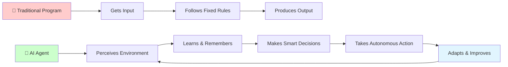
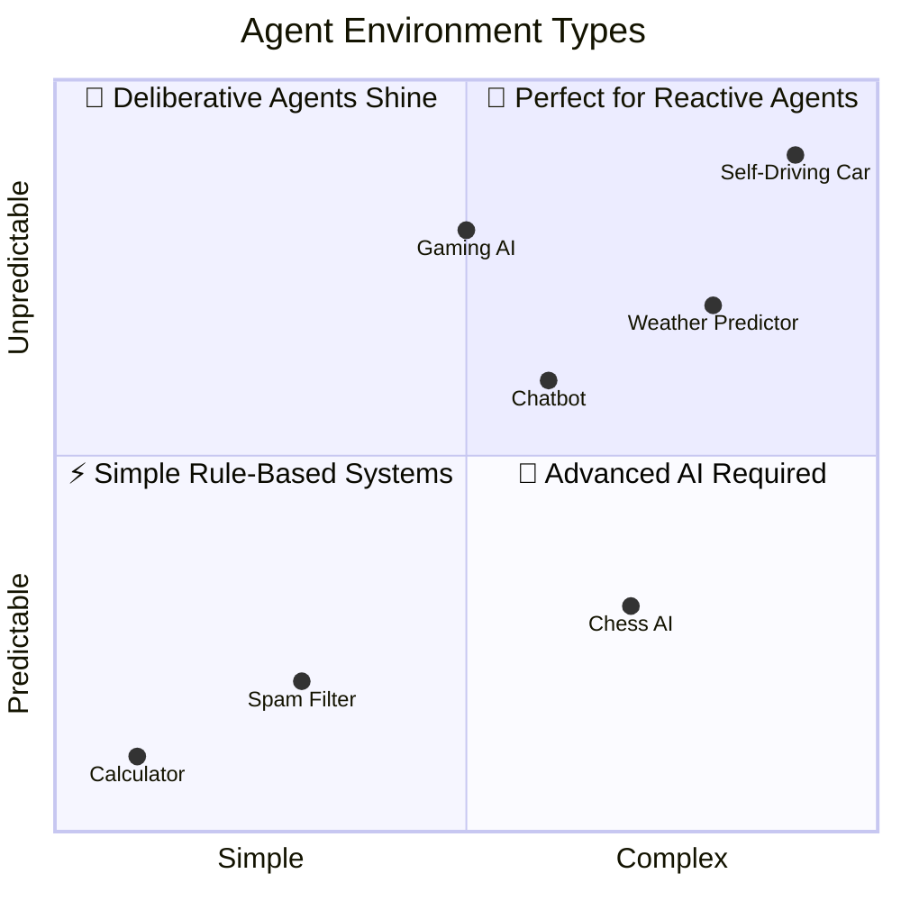
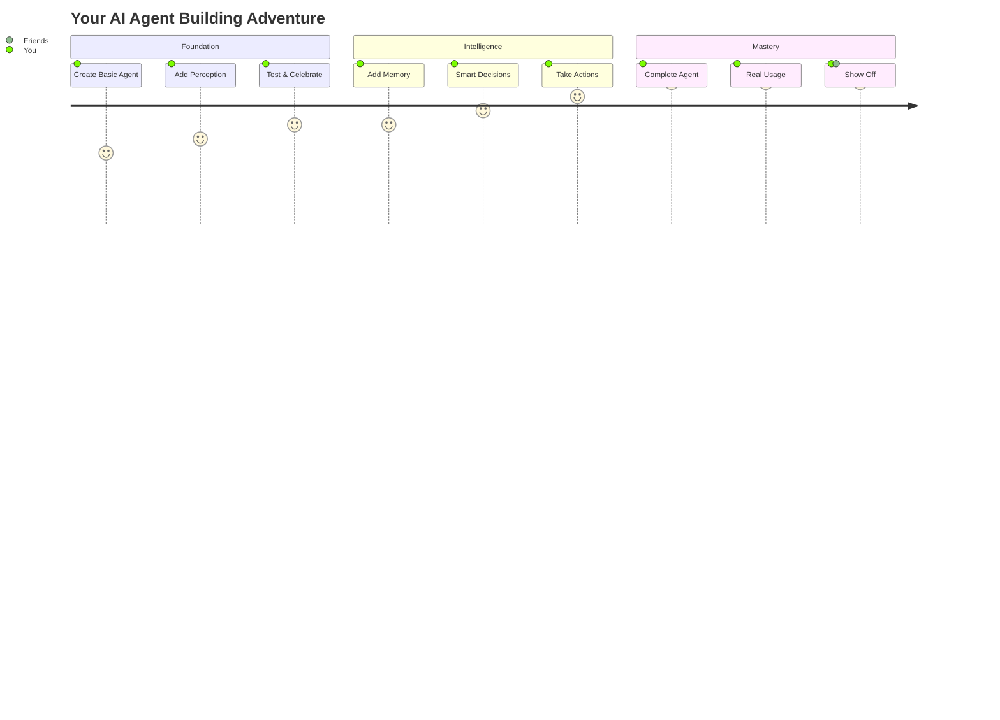
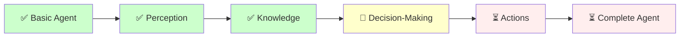
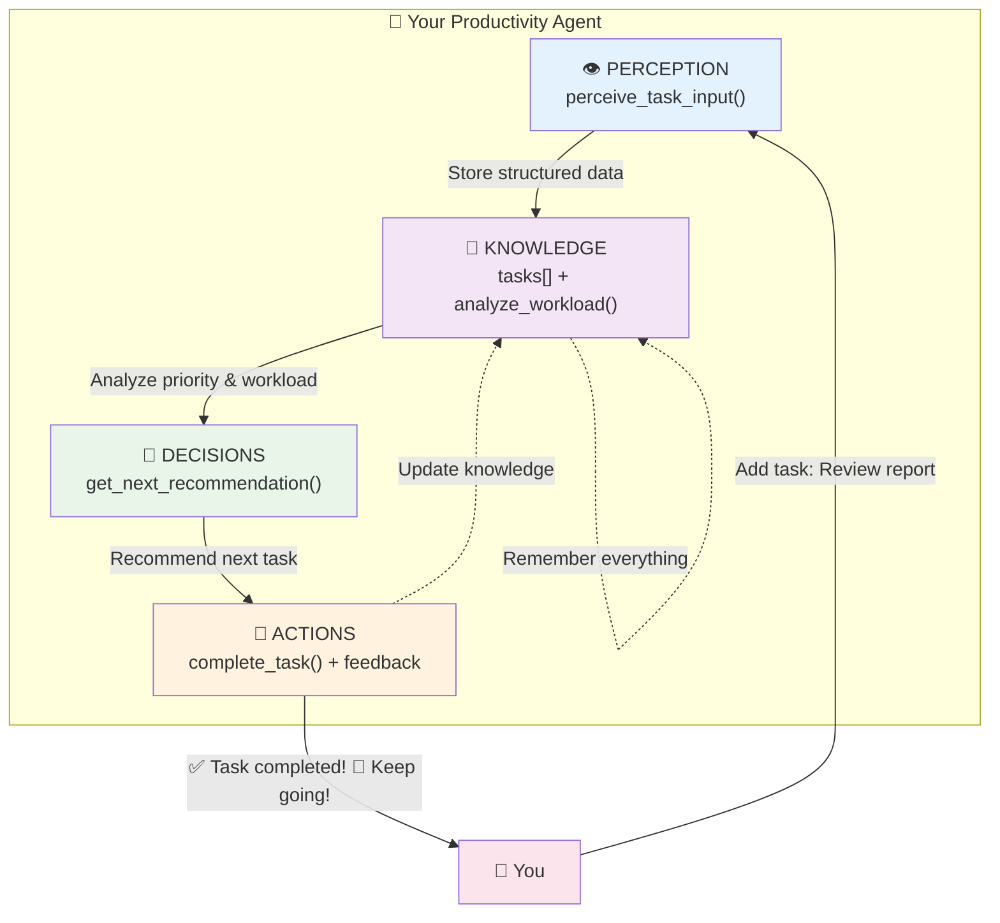
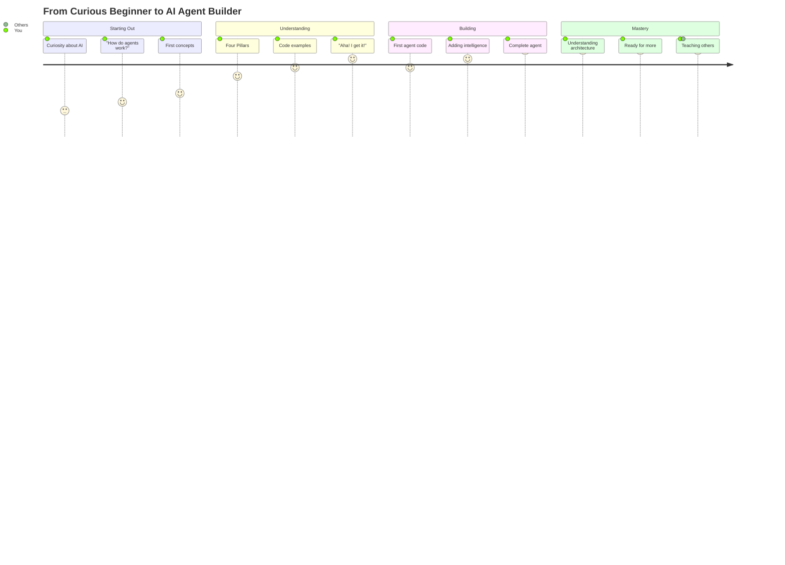

# What Is an AI Agent?

Welcome to your exciting journey into the world of AI agents! You're about to discover one of the most fascinating and rapidly growing areas of artificial intelligence. Think of this chapter as your friendly introduction to understanding what makes software truly "intelligent" and autonomous.

If you've ever wondered how virtual assistants like Siri or Alexa know what to do when you speak to them, or how chatbots can hold conversations and help solve problems, you're already curious about AI agents. These aren't just simple programs that follow rigid instructions—they're software systems that can perceive their environment, make decisions, and take actions to achieve goals, much like how you might navigate through your day.

Don't worry if this sounds complex right now. We'll start with simple, everyday examples that you already understand, and gradually build up to more sophisticated concepts. By the end of this chapter, you'll have a clear understanding of what AI agents are, how they work, and why they're becoming such an important part of our digital world. You'll also write your first simple agent in Python, giving you hands-on experience with these fascinating systems.

## Introduction

Let's start by connecting AI agents to something you already understand: helpful assistants in your daily life. Think about a really good personal assistant—someone who knows your preferences, can understand what you need, makes decisions on your behalf, and takes action to help you achieve your goals. Now imagine if that assistant was a computer program that never gets tired, can process vast amounts of information instantly, and can work 24/7. That's essentially what an AI agent is!

The term "agent" in AI comes from the idea of something that acts on behalf of someone else. Just like a travel agent helps you plan trips or a real estate agent helps you find houses, an AI agent is software that acts on your behalf to accomplish tasks. What makes these agents special is their ability to operate independently—they can perceive what's happening around them, reason about situations, and take appropriate actions without needing constant instruction.

This isn't science fiction anymore. AI agents are already working behind the scenes in countless applications you use every day. When Netflix recommends movies you might enjoy, when your email automatically filters spam, or when a chatbot helps you track a package, you're interacting with AI agents. They're becoming the invisible helpers that make our digital experiences smoother and more personalized.

Here's a fun way to visualize what makes AI agents special compared to regular programs:



**🎯 Spot the Difference**: Traditional programs are like following a recipe step-by-step, while AI agents are like having a smart cooking assistant who can adapt the recipe based on what ingredients you have, what you like, and what they've learned from previous meals!

## Learning Objectives

Now that you're excited about the journey ahead, let's establish exactly what you'll accomplish in this chapter. Think of these learning objectives as your roadmap—they'll help you track your progress and celebrate your achievements along the way.

These goals might seem ambitious right now, but remember that every expert programmer started exactly where you are. We've carefully designed this chapter to build your understanding step by step, so by the end, these objectives will feel not just achievable, but natural.

Don't worry if some of these terms are unfamiliar—we'll explore each concept thoroughly with plenty of examples and practice. The most important thing is that you're curious and ready to learn. Let's see what you'll master together:

By the end of this chapter, you'll be able to confidently:

• **Explain AI agents to anyone**: Describe what makes software "intelligent" using simple, everyday language that connects to examples people already understand, like virtual assistants or smart home devices.

• **Identify and describe the four essential pillars**: Recognize how real AI agents perceive their environment, organize knowledge, make intelligent decisions, and take meaningful actions—and explain each pillar with concrete examples.

• **Spot AI agents in your daily life**: Point out agent behavior in applications you use regularly, from Netflix recommendations to email spam filters, and understand what makes them "intelligent."

• **Understand what makes agents autonomous**: Explain how AI agents can work independently toward goals while adapting to changing circumstances, without needing step-by-step human instructions.

• **Compare different agent types effectively**: Distinguish between reactive agents (like spam filters) and deliberative agents (like virtual assistants) and explain when each approach works best.

• **Build and run your first complete AI agent**: Create a working productivity assistant in Python that demonstrates all four pillars, with code you understand and can modify for your own needs.

## Essential Background

Before we explore the fascinating world of AI agents, let's take a moment to build a solid foundation together. You already understand more about intelligent behavior than you might realize—after all, you make decisions, solve problems, and adapt to new situations every day.

What we're going to do now is connect that natural human intelligence to how we can create similar capabilities in software. Don't worry if these concepts seem abstract at first; we'll use plenty of familiar examples to make everything concrete and understandable.

Think of this section as gathering the essential building blocks we'll use throughout this chapter. Each concept we explore here will become a tool in your toolkit for understanding and building AI agents. By the end of this foundation section, you'll have the vocabulary and mental models you need to tackle the more exciting hands-on work ahead.

Before we dive into the technical details, let's establish some foundational concepts that will help you understand AI agents more clearly. Think of this as gathering the building blocks we'll use throughout this chapter.

### What Makes Software "Intelligent"?

Traditional computer programs are like following a detailed recipe. They execute a specific sequence of instructions in a predetermined order: if A happens, do B; if C happens, do D. These programs work perfectly for many tasks, but they can't adapt to unexpected situations or make decisions about what to do next when faced with new circumstances.

Intelligent software, on the other hand, is more like having good judgment. It can assess situations, consider multiple options, and choose the best course of action based on its goals and current circumstances. This doesn't mean the software is conscious or self-aware—rather, it means the software can exhibit behavior that appears thoughtful and purposeful.

### Understanding Environments and Perception

In the context of AI agents, an "environment" is simply the world or context in which the agent operates. For a chess-playing agent, the environment is the chessboard and the current game state. For a chatbot, the environment includes the conversation history and the user's current message. For a smart thermostat agent, the environment includes room temperature, time of day, and occupancy sensors.

Perception is how an agent gathers information about its environment. Just as you use your senses to understand what's happening around you, AI agents use various inputs—text, sensor data, database queries, or API calls—to understand their current situation.

### Goals and Decision-Making

Every AI agent has some kind of goal or objective, even if it's simple. A spam filter's goal is to accurately classify emails. A recommendation system's goal is to suggest items you'll find interesting. A game-playing agent's goal is to win the game. These goals guide the agent's decision-making process.

The key difference between traditional software and AI agents is that agents can choose between different possible actions based on their assessment of the current situation and their understanding of which actions are most likely to help them achieve their goals.

*Now that you have a solid foundation in these core concepts, you're ready to explore the architecture that brings them all together. Let's discover the four essential pillars that transform these ideas into working AI agents.*

### 🎯 Confidence Checkpoint #1
**Before we dive into the technical details, let's build your confidence:**

> **"I've never built anything 'intelligent' before"**  
> ✅ **Perfect starting point!** We begin with concepts you already understand from daily life.

> **"Programming sounds complicated"**  
> ✅ **We keep it simple!** Each code example builds naturally on the previous one.

> **"What if I don't understand the four pillars?"**  
> ✅ **We've got you covered!** Each pillar gets its own section with clear examples and practice.

> **"Will I really build a working agent?"**  
> ✅ **Absolutely!** By the end, you'll have a productivity assistant that actually works.

**Remember: You already demonstrate intelligence every day - now you're learning to create it in code! 💪**

**Progress Tracker:** 🔥⚪⚪⚪⚪ (1/5 major concepts complete)

## The Four Pillars of AI Agents

Here's where our journey gets really exciting! You now have the foundational knowledge you need, and it's time to discover the core architecture that powers every AI agent, from simple chatbots to sophisticated autonomous systems.

Imagine you're about to learn the secret blueprint that software engineers use to create intelligent behavior in programs. These four pillars aren't just theoretical concepts—they're practical building blocks that you'll use in your own agents. What makes this even better is that you already understand these concepts from your own experience; we're simply going to show you how to implement them in code.

Don't worry if the technical aspects seem challenging at first. We'll build each pillar step by step, with clear examples and plenty of practice. By the time we're finished with this section, you'll not only understand how AI agents work, but you'll be ready to build your own.

Now that we have our foundation, let's explore the four essential components that every AI agent must have. Think of these as the fundamental building blocks that transform ordinary software into intelligent, autonomous systems.

### Pillar 1: Perception - Understanding the World

The first pillar is perception—an agent's ability to sense and understand its environment. Just like you use your eyes, ears, and other senses to gather information about your surroundings, AI agents need ways to collect information about their world.

For different types of agents, perception takes various forms:

• **Text-based agents** (like chatbots) perceive through reading and processing written language from users, analyzing the content, tone, and context of messages.

• **Vision-enabled agents** (like autonomous vehicles) perceive through cameras and image processing, identifying objects, reading signs, and understanding spatial relationships.

• **IoT agents** (like smart home systems) perceive through sensors that measure temperature, motion, light levels, and other environmental factors.

• **Web agents** (like price monitoring tools) perceive by scraping websites, monitoring APIs, and tracking changes in online data.

Here's a simple example of how perception works in code:

```python
class SimpleWeatherAgent:
    def __init__(self):
        self.current_temperature = None
        self.weather_condition = None
```

This simple foundation demonstrates the most basic agent structure:

• **Establishes data storage**: The agent creates space to remember what it perceives from its environment

• **Initializes clean state**: Starting with empty values ensures the agent begins with a clear understanding

• **Prepares for perception**: The structure anticipates the types of information the agent will need to track

Now let's add the perception capability:

```python
    def perceive_environment(self, sensor_data):
        """Gather information about current weather conditions"""
        self.current_temperature = sensor_data.get('temperature')
        self.weather_condition = sensor_data.get('condition')
        print(f"Perceived: {self.current_temperature}°F, {self.weather_condition}")
```

This perception method demonstrates intelligent information gathering:

• **Extracts relevant data**: The agent doesn't just accept all input—it selectively processes what's important for its goals

• **Stores environmental state**: Information is preserved in the agent's memory for future decision-making

• **Provides feedback**: The agent confirms what it understood, building trust and transparency

• **Handles missing data gracefully**: Using `.get()` prevents errors if expected information isn't available

### 🚀 2-Minute Success Guarantee

**Want to feel successful right now?** Let's create your first weather-sensing agent in under 2 minutes:

```python
# Copy and paste this into a Python file and run it!
class MyWeatherAgent:
    def __init__(self):
        self.temperature = None
        self.condition = None
        print("🌤️ Weather agent created!")
    
    def check_weather(self, temp, condition):
        self.temperature = temp
        self.condition = condition
        print(f"🌡️ I sense it's {temp}°F and {condition}")
        
        if temp > 80:
            print("💡 Recommendation: Stay hydrated!")
        elif condition == "rainy":
            print("💡 Recommendation: Bring an umbrella!")
        else:
            print("💡 Recommendation: Have a great day!")

# Test your agent
my_agent = MyWeatherAgent()
my_agent.check_weather(75, "sunny")
my_agent.check_weather(85, "hot")
my_agent.check_weather(65, "rainy")
print("🎉 Congratulations! You just built an intelligent agent!")
```

**Output:**
```
🌤️ Weather agent created!
🌡️ I sense it's 75°F and sunny
💡 Recommendation: Have a great day!
🌡️ I sense it's 85°F and hot
💡 Recommendation: Stay hydrated!
🌡️ I sense it's 65°F and rainy
💡 Recommendation: Bring an umbrella!
🎉 Congratulations! You just built an intelligent agent!
```

> **🎯 Success!** You just created an agent that perceives its environment, makes decisions, and takes action. Everything else in this chapter builds on this foundation!

*Excellent! Your agent can now perceive its environment. But perception alone isn't enough—agents need to remember what they've learned and understand what it means. Let's explore how agents build and use knowledge.*

### Pillar 2: Knowledge - Remembering and Understanding

The second pillar involves how agents store, organize, and recall information. This includes both immediate knowledge about the current situation and longer-term knowledge about how the world works, what actions are possible, and what strategies tend to be effective.

Knowledge in AI agents can be organized in several ways:

• **Factual knowledge**: Information about the world, like "rain typically means outdoor activities should be avoided" or "users who buy books often appreciate reading recommendations."

• **Procedural knowledge**: Understanding of how to perform tasks, like "to send an email, I need a recipient, subject, and message body" or "to book a flight, I need departure city, destination, and travel dates."

• **Experiential knowledge**: Learning from past interactions, like "this user prefers brief responses" or "customers who view this product often purchase these accessories."

Let's extend our weather agent to include knowledge. We'll start by adding the knowledge base:

```python
class KnowledgeableWeatherAgent:
    def __init__(self):
        self.current_temperature = None
        self.weather_condition = None
        # Knowledge about weather and appropriate actions
        self.weather_knowledge = {
            'rain': ['bring_umbrella', 'wear_raincoat', 'avoid_outdoor_activities'],
            'sunny': ['wear_sunscreen', 'bring_water', 'good_for_outdoor_activities'],
            'snow': ['dress_warmly', 'drive_carefully', 'check_for_ice']
        }
```

This knowledge structure demonstrates how agents organize their understanding:

• **Organizes factual knowledge**: The agent maintains structured information about how different weather conditions connect to appropriate actions

• **Enables intelligent reasoning**: Rather than just storing data, the agent can look up relevant advice based on current conditions

• **Supports decision-making**: This knowledge base will power the agent's ability to provide helpful recommendations

• **Remains easily expandable**: New weather conditions and actions can be added without changing the core logic

Now let's add temperature comfort assessment:

```python
        self.temperature_comfort = {
            'cold': 'below_50',
            'comfortable': '50_to_80',
            'hot': 'above_80'
        }
    
    def assess_comfort_level(self):
        """Use knowledge to interpret temperature"""
        if self.current_temperature < 50:
            return 'cold'
        elif self.current_temperature > 80:
            return 'hot'
        else:
            return 'comfortable'
```

This assessment method shows procedural knowledge in action:

• **Interprets raw data**: The agent transforms a simple number into meaningful categories that humans understand
• **Applies learned patterns**: Using predefined thresholds allows the agent to make consistent, logical assessments
• **Supports human communication**: Instead of saying "72 degrees," the agent can say "comfortable," which is more useful for decision-making
• **Demonstrates reasoning**: The agent doesn't just store information—it actively analyzes and categorizes what it perceives

*Perfect! Now your agent can perceive the environment and understand what that information means. The next step is where the real intelligence emerges—using that knowledge to make smart decisions about what to do next.*

### Pillar 3: Decision-Making - Choosing What to Do

Here's where your agent's intelligence really starts to shine! You're about to see how perception and knowledge come together to produce genuinely smart behavior. Don't worry if the decision-making logic seems complex at first—we'll build it step by step so you understand exactly how intelligent choices emerge from simple rules.

The third pillar is where the agent's intelligence really shines—its ability to evaluate the current situation and choose the best course of action. This is where perception and knowledge come together to produce purposeful behavior.

Decision-making in AI agents can range from simple rule-based logic to sophisticated machine learning algorithms. The key principle is that the agent considers its goals, assesses the current situation, and selects actions that are most likely to help achieve those goals.

Different types of decision-making approaches include:

• **Rule-based decisions**: If-then logic based on specific conditions, like "if it's raining and the user is going outside, recommend an umbrella."

• **Probabilistic decisions**: Choosing actions based on the likelihood of different outcomes, like "there's a 70% chance this email is spam based on these characteristics."

• **Optimization-based decisions**: Selecting the action that maximizes some value, like "choose the route that minimizes travel time while avoiding traffic."

• **Learning-based decisions**: Using past experience to predict the best actions, like "users similar to this one usually prefer these types of recommendations."

Let's add decision-making to our weather agent. Don't worry if this seems complex—we'll break it down step by step:

```python
def make_decision(self):
    """Decide what recommendations to give based on perception and knowledge"""
    comfort_level = self.assess_comfort_level()
    weather_actions = self.weather_knowledge.get(self.weather_condition, [])
    
    recommendations = []
```

This foundation sets up intelligent decision-making:

• **Combines multiple information sources**: The agent considers both temperature comfort and weather conditions before making recommendations
• **Prepares for structured reasoning**: Creating an empty recommendations list allows the agent to build up advice systematically
• **Handles unknown conditions gracefully**: Using `.get()` with an empty list prevents errors if the weather condition isn't in the knowledge base
• **Demonstrates thoughtful planning**: Rather than making hasty decisions, the agent prepares to consider multiple factors

Now let's see how the agent combines this information:

```python
    # Temperature-based recommendations
    if comfort_level == 'cold':
        recommendations.append('dress_warmly')
    elif comfort_level == 'hot':
        recommendations.append('stay_hydrated')
    
    # Weather-based recommendations
    recommendations.extend(weather_actions)
    
    return list(set(recommendations))  # Remove duplicates
```

This decision-making logic demonstrates sophisticated reasoning:

• **Applies conditional logic**: The agent makes different recommendations based on the specific situation it perceives
• **Integrates multiple knowledge sources**: Temperature-based and weather-based recommendations work together to provide comprehensive advice
• **Prevents redundant suggestions**: Using `set()` ensures the agent doesn't repeat the same recommendation twice
• **Returns actionable results**: The final list contains specific, helpful suggestions the user can immediately act upon

### Pillar 4: Action - Making Things Happen

The fourth and final pillar is action—the agent's ability to do something in the world based on its decisions. This is what makes agents truly useful; they don't just think about what should be done, they actually do it.

Actions can take many forms depending on the agent's purpose and environment:

• **Communication actions**: Sending messages, displaying information, or providing responses to users.

• **Data actions**: Creating, reading, updating, or deleting information in databases or files.

• **Integration actions**: Calling APIs, triggering other systems, or coordinating with external services.

• **Physical actions**: Controlling hardware, adjusting settings, or manipulating robotic systems.

Let's complete our weather agent by adding the action capability:

```python
def take_action(self, recommendations):
    """Take concrete actions based on decisions"""
    actions_taken = []
    
    for recommendation in recommendations:
        if recommendation == 'bring_umbrella':
            self.send_notification("Don't forget your umbrella!")
            actions_taken.append('umbrella_notification_sent')
        
        elif recommendation == 'dress_warmly':
            self.send_notification("Bundle up! It's cold outside.")
            actions_taken.append('cold_weather_alert_sent')
        
        elif recommendation == 'good_for_outdoor_activities':
            self.suggest_activities(['hiking', 'picnic', 'outdoor_sports'])
            actions_taken.append('outdoor_activities_suggested')
    
    return actions_taken

def send_notification(self, message):
    """Simulate sending a notification to the user"""
    print(f"📱 Notification: {message}")

def suggest_activities(self, activities):
    """Simulate suggesting activities to the user"""
    print(f"💡 Suggested activities: {', '.join(activities)}")
```

Now our agent can complete the full cycle: it perceives the weather conditions, uses its knowledge to understand what those conditions mean, makes decisions about helpful recommendations, and takes concrete actions to help the user.

## Bringing It All Together: Agent Autonomy

This is where everything clicks! You've learned about the four pillars individually, and now it's time to see how they work together to create something truly remarkable—autonomous intelligent behavior.

You're about to witness the magic moment when perception, knowledge, decision-making, and action combine to create software that can think and act independently. This isn't just theoretical anymore; you're going to see a complete agent operating as a unified, intelligent system.

What makes this exciting is that once you understand how these pillars work together, you'll recognize this same pattern in every AI agent you encounter, from simple chatbots to sophisticated autonomous vehicles. You're learning the fundamental architecture of artificial intelligence!

What makes AI agents particularly powerful is their autonomy—their ability to operate independently without requiring constant human guidance. This doesn't mean they work without any human input, but rather that they can handle the day-to-day decision-making and task execution on their own.

Think about the difference between using a basic calculator and using a smart financial advisor app. With a calculator, you need to know exactly what calculations to perform and in what order. With a smart advisor app (which contains AI agents), you can simply say "help me save for a vacation" and the app figures out how to analyze your spending, suggest budget adjustments, and even automatically transfer money to savings.

Let's see how all four pillars work together in a complete agent example:

```python
class CompleteWeatherAgent:
    def __init__(self):
        self.current_temperature = None
        self.weather_condition = None
        self.user_preferences = {'outdoor_person': True, 'cold_sensitive': False}
        self.weather_knowledge = {
            'rain': ['bring_umbrella', 'wear_raincoat', 'avoid_outdoor_activities'],
            'sunny': ['wear_sunscreen', 'bring_water', 'good_for_outdoor_activities'],
            'snow': ['dress_warmly', 'drive_carefully', 'check_for_ice']
        }
    
    def run_agent_cycle(self, sensor_data):
        """Complete agent cycle: perceive, decide, act"""
        # 1. Perception
        self.perceive_environment(sensor_data)
        
        # 2. Decision-making (using knowledge)
        recommendations = self.make_decision()
        
        # 3. Action
        actions_taken = self.take_action(recommendations)
        
        return {
            'perceived': f"{self.current_temperature}°F, {self.weather_condition}",
            'recommended': recommendations,
            'actions': actions_taken
        }
```

This complete cycle demonstrates true agent autonomy. You can provide weather data to the agent, and it independently handles the entire process of understanding the situation, deciding what to recommend, and taking appropriate actions.

The power of this approach becomes clear when you imagine the agent running continuously throughout the day, automatically providing helpful information as conditions change, without you needing to remember to check the weather or think about what preparations might be needed.

### 🎯 Confidence Checkpoint #2 - Architecture Mastery

**Quick Self-Check:** Can you explain these in your own words?

✅ **What are the four pillars of AI agents?**  
*Hint: Perception, Knowledge, Decision-making, Action*

✅ **Why does your weather agent need all four pillars?**  
*Hint: Each pillar handles a different aspect of intelligent behavior*

✅ **How do the pillars work together?**  
*Hint: They form a complete cycle from input to output*

**Progress Tracker:** 🔥🔥⚪⚪⚪ (2/5 major concepts complete)

> **Feeling confident?** Excellent! You understand the core architecture of all AI agents.  
> **Need more practice?** Try modifying the weather agent code above with your own conditions.

## Types of AI Agents in the Real World

Now that you understand how AI agents work fundamentally, let's explore the fascinating variety of agents you encounter every day. You might be surprised to discover how many different types of AI agents are already part of your daily routine!

Understanding these different categories will help you recognize agent behavior in the wild and, more importantly, help you choose the right approach when you start building your own agents. Each type has its strengths and is designed for specific kinds of problems.

Don't worry about memorizing all these categories—the goal is to help you see the patterns and understand when different approaches make sense. By the end of this section, you'll be able to look at any AI system and understand what type of agent architecture powers it.

Now that you understand the fundamental principles of AI agents, let's explore the different types you encounter in everyday applications. Understanding these categories will help you recognize agent behavior in the wild and choose the right approach when building your own agents.

### Reactive Agents: Quick Responders

Reactive agents are the simplest type—they respond directly to current perceptions without maintaining memory of past events or planning for the future. They're like having very quick reflexes: when something happens, they immediately respond based on built-in rules.

These agents work well for situations where:
- The environment changes quickly and historical information isn't crucial
- Simple, immediate responses are appropriate
- The problem domain is well-understood and predictable

Real-world examples include:

• **Spam filters**: When an email arrives, they analyze its characteristics (sender, subject, content) and immediately classify it as spam or not spam based on learned patterns.

• **Basic chatbots**: They read your message and respond based on keyword matching or simple pattern recognition, without remembering previous parts of the conversation.

• **Simple recommendation systems**: They suggest products based solely on what you're currently viewing, without considering your browsing history.

Here's what a reactive agent looks like in code:

```python
class ReactiveSpamFilter:
    def __init__(self):
        self.spam_keywords = ['urgent', 'winner', 'click now', 'limited time']
        self.trusted_senders = ['family@email.com', 'work@company.com']
    
    def classify_email(self, email):
        """React immediately to incoming email"""
        # Check sender trust level
        if email['sender'] in self.trusted_senders:
            return 'trusted'
        
        # Check for spam indicators
        spam_score = 0
        for keyword in self.spam_keywords:
            if keyword.lower() in email['content'].lower():
                spam_score += 1
        
        # Immediate decision based on current email only
        return 'spam' if spam_score > 2 else 'legitimate'
```

The key characteristic here is that each email is evaluated independently—the agent doesn't remember previous emails or learn from its classification decisions.

### Deliberative Agents: The Planners

Deliberative agents are more sophisticated. They maintain internal models of their world, remember past experiences, and can plan sequences of actions to achieve long-term goals. They're like thoughtful strategists who consider multiple options before acting.

These agents excel when:
- Long-term planning is important
- The environment is complex and requires careful consideration
- Past experiences provide valuable guidance for future decisions
- Multiple steps are needed to achieve goals

Real-world examples include:

• **Virtual assistants** like Siri or Google Assistant: They remember context from your conversation, can plan multi-step tasks (like "find a restaurant, make a reservation, and add it to my calendar"), and learn from your preferences over time.

• **Game-playing agents**: Chess or Go programs that think several moves ahead, considering different possible game states and planning strategies.

• **Smart home systems**: They learn your daily routines, anticipate your needs, and coordinate multiple devices to create optimal environments.

Here's a simple deliberative agent example:

```python
class DeliberativePersonalAssistant:
    def __init__(self):
        self.conversation_history = []
        self.user_preferences = {}
        self.task_queue = []
        self.available_actions = ['search_web', 'send_email', 'schedule_event', 'set_reminder']
    
    def process_request(self, user_input):
        """Plan and execute multi-step responses"""
        # Remember this interaction
        self.conversation_history.append(user_input)
        
        # Analyze the request and create a plan
        plan = self.create_plan(user_input)
        
        # Execute the plan
        results = []
        for action in plan:
            result = self.execute_action(action)
            results.append(result)
        
        return results
    
    def create_plan(self, request):
        """Plan sequence of actions to fulfill request"""
        plan = []
        
        if "restaurant" in request.lower() and "book" in request.lower():
            plan = [
                {'action': 'search_web', 'query': 'restaurants near me'},
                {'action': 'schedule_event', 'title': 'Dinner reservation'},
                {'action': 'set_reminder', 'message': 'Confirm restaurant booking'}
            ]
        elif "meeting" in request.lower():
            plan = [
                {'action': 'schedule_event', 'title': 'Meeting'},
                {'action': 'send_email', 'purpose': 'meeting_invitation'}
            ]
        
        return plan
```

Notice how this agent maintains conversation history, creates multi-step plans, and coordinates different actions to achieve complex goals.

### 🎯 Agent Types: The Ultimate Comparison

Think of these agent types like different kinds of drivers:

| 🤖 Agent Type | 🧠 How They Think | 🎯 Best For | 🌟 Real Example |
|---|---|---|---|
| **Reactive** | "See problem → React instantly" | Fast, simple responses | Spam filter: "Suspicious email? Block it!" |
| **Deliberative** | "Hmm, let me think about this..." | Complex, multi-step tasks | Virtual assistant: "Book restaurant, add to calendar, set reminder" |
| **Hybrid** | "Quick reflexes + careful planning" | Real-world applications | Self-driving car: "Brake NOW + plan optimal route" |

**🚗 The Driver Analogy**: 
- **Reactive agents** = Experienced driver who automatically brakes when they see brake lights
- **Deliberative agents** = Trip planner who considers traffic, weather, and stops before leaving
- **Hybrid agents** = Pro driver who can both react instantly to dangers AND plan the perfect route

**💡 Pro Tip**: Most successful AI systems today are actually hybrid agents! They combine the speed of reactive responses with the intelligence of deliberative planning.

### Hybrid Agents: Best of Both Worlds

Most real-world AI agents are actually hybrid systems that combine reactive and deliberative capabilities. They can respond quickly when immediate action is needed, but also engage in longer-term planning when the situation calls for it.

These agents are like experienced professionals who can handle routine tasks automatically but also step back to plan carefully when facing complex challenges.

Examples of hybrid agents include:

• **Modern chatbots**: They can respond immediately to simple questions but engage in more complex reasoning for difficult requests, sometimes even saying "let me think about that" while they process.

• **Autonomous vehicles**: They react instantly to immediate dangers (emergency braking) while simultaneously planning efficient routes and anticipating traffic patterns.

• **E-commerce recommendation systems**: They provide instant suggestions based on current browsing (reactive) while also analyzing long-term purchase patterns to improve future recommendations (deliberative).

## Goals and Environments: What Drives Agent Behavior

Understanding how agents relate to their goals and environments is crucial for designing effective AI systems. This relationship shapes every aspect of how an agent behaves and what it can accomplish.

### Understanding Agent Goals

Every AI agent operates with some form of goal or objective function, even if it's implicit. These goals can be:

• **Explicit goals**: Clearly defined objectives like "minimize customer service response time" or "maximize energy efficiency."

• **Implicit goals**: Objectives embedded in the agent's design, like "provide helpful responses" or "maintain user engagement."

• **Learning goals**: Objectives focused on improving performance over time, like "get better at predicting user preferences."

• **Constraint-based goals**: Objectives defined by what to avoid, like "don't recommend inappropriate content" or "never exceed the budget."

Let's see how different goal types affect agent behavior:

```python
class GoalDrivenAgent:
    def __init__(self, primary_goal, constraints=None):
        self.primary_goal = primary_goal
        self.constraints = constraints or []
        self.performance_history = []
    
    def evaluate_action(self, action, current_state):
        """Evaluate how well an action supports the goal"""
        goal_score = self.calculate_goal_score(action, current_state)
        constraint_score = self.check_constraints(action)
        
        # Only consider actions that meet constraints
        if constraint_score < 0:
            return -1  # Invalid action
        
        return goal_score
    
    def calculate_goal_score(self, action, state):
        """Score how well action supports primary goal"""
        if self.primary_goal == 'maximize_user_satisfaction':
            return self.predict_satisfaction_impact(action, state)
        elif self.primary_goal == 'minimize_response_time':
            return -self.estimate_response_time(action)  # Negative because we want to minimize
        else:
            return 0
    
    def check_constraints(self, action):
        """Ensure action doesn't violate constraints"""
        for constraint in self.constraints:
            if not self.satisfies_constraint(action, constraint):
                return -1  # Constraint violation
        return 1  # All constraints satisfied
```

This structure shows how goals and constraints work together to guide agent decision-making, ensuring that agents not only pursue their objectives but do so within acceptable boundaries.

### Environment Types and Agent Design

The type of environment an agent operates in significantly affects how it should be designed. Different environments require different capabilities and strategies.

**Fully Observable vs. Partially Observable Environments:**

• **Fully observable**: The agent can perceive all relevant aspects of the environment at any time (like a chess game where all pieces are visible).

• **Partially observable**: The agent only has limited information about the environment (like a customer service chatbot that only knows what the customer has told it in the current conversation).

**Deterministic vs. Stochastic Environments:**

• **Deterministic**: The same action in the same state always produces the same result (like a calculator).

• **Stochastic**: Actions may have random or unpredictable outcomes (like stock market trading or weather prediction).

**Static vs. Dynamic Environments:**

• **Static**: The environment doesn't change while the agent is thinking (like analyzing a photograph).

• **Dynamic**: The environment changes continuously (like autonomous driving or live chat support).

Understanding these characteristics helps you design agents that are well-suited to their operating conditions and can handle the specific challenges their environment presents.

Here's a fun way to visualize how different environments shape agent design:



**🌍 Environment Reality Check**: 
- **Bottom-left (Simple + Predictable)**: Perfect for basic rule-following programs
- **Top-right (Complex + Unpredictable)**: This is where AI agents really prove their worth!
- **The sweet spot**: Most useful agents operate in the upper-right area where intelligence truly matters

## Guided Practice: Building Your First AI Agent

Here's the moment you've been waiting for—time to build your very own AI agent! Don't worry if you feel a bit nervous; that's completely normal when you're about to create something new. Remember, every expert programmer started exactly where you are right now.

We're going to build this together, step by step, with plenty of explanation along the way. You'll start with the simplest possible version and gradually add capabilities until you have a fully functional AI agent. By the end of this section, you'll have created something genuinely intelligent and useful!

The best part? We're not building a toy example—you're creating a real productivity assistant that demonstrates all four pillars of AI agents in action. This will be something you can actually use and be proud of showing to others.

Let's map out your agent-building journey:



**🎮 Level Up System**: Think of this like a video game where you unlock new abilities:
- **Level 1**: Basic structure ("I exist!")
- **Level 2**: Perception ("I can see!")
- **Level 3**: Memory ("I remember!")
- **Level 4**: Decisions ("I can think!")
- **Level 5**: Actions ("I can do things!")
- **BOSS LEVEL**: Complete intelligent agent! 🏆

Now it's time to put your understanding into action by building a complete, working AI agent. We'll create a personal productivity assistant that demonstrates all four pillars of AI agents in a practical, beginner-friendly way.

Don't worry - we'll build this step by step, starting with the simplest possible version and gradually adding each capability. By the end, you'll have a fully functional AI agent!

*Remember, every expert programmer once wrote their first "Hello, World!" program. Today, you're writing your first AI agent—that's incredible progress! If you feel excited, nervous, or both, that's perfectly normal. Let's create something amazing together.*

Don't worry - we'll build this step by step, starting with the simplest possible version and gradually adding each capability. By the end, you'll have a fully functional AI agent!

### Practice Exercise 1: Starting Simple - Your Agent's Foundation

Let's begin with something that might surprise you—you're going to create your first AI agent with just a few lines of code! Don't worry about making it perfect; we're starting with the absolute basics and building up from there. Every expert started exactly where you are now.

The beautiful thing about programming is that complex systems are built from simple pieces. What you're about to create might look simple, but it contains the DNA of every AI agent, from basic chatbots to sophisticated autonomous systems.

Let's begin with the absolute basics. Every AI agent needs a place to store its knowledge and a way to introduce itself. Here's where we start:

```python
from datetime import datetime

class ProductivityAgent:
    def __init__(self):
        self.tasks = []
        print("🤖 Hello! I'm your productivity agent, ready to help!")
```

Celebrate this moment—you've just created your first AI agent! It might seem simple, but look at what you've accomplished:

• **Establishes intelligent identity**: Your agent introduces itself and communicates its purpose clearly
• **Creates a memory system**: The `tasks` list will store everything the agent learns about your work
• **Demonstrates autonomy**: The agent automatically greets you when created, showing independent behavior
• **Provides foundation for growth**: This simple structure can support sophisticated capabilities as we add them

Now let's give your agent the ability to perceive information about tasks:

```python
def perceive_task_input(self, task_description):
    """Pillar 1: Perception - the simplest possible version"""
    print(f"📝 I heard you want to: {task_description}")
    return task_description
```

• **Receives input**: The agent can now listen to what you tell it.

• **Acknowledges understanding**: It confirms what it heard, building trust.

• **Returns the information**: This prepares the data for the next step.

Let's test this simple perception:

```python
# Create your agent
agent = ProductivityAgent()

# Test perception
task = agent.perceive_task_input("Write a report")
```

When you run this, you'll see your agent acknowledge that it understood your task! This is the beginning of real AI agent behavior.

> **🔧 Try It Yourself**: Create your own simple agent! Copy the `BaseAgent` class and try creating an agent called "MyFirstAgent" with capabilities like ["greeting", "help"]. Practice activating and deactivating it.
>
> ```python
> # Your code here
> my_agent = BaseAgent("MyFirstAgent", ["greeting", "help"])
> my_agent.activate()
> print(f"Agent {my_agent.name} can do: {my_agent.capabilities}")
> ```

### Practice Exercise 2: Adding Knowledge and Memory

Excellent work! Your agent can now perceive information. But here's where it gets really exciting—we're going to give your agent the ability to remember and organize what it learns. This is where you'll start to see genuine intelligence emerge.

Don't be surprised if you feel a sense of accomplishment here. You're building something that can actually learn and remember—that's a significant milestone in any programmer's journey!

Now let's give your agent the ability to remember tasks and understand priorities. We'll add just a little bit more:

```python
def add_task(self, task_description, priority='medium'):
    """Store a task with basic information"""
    task_data = {
        'description': task_description,
        'priority': priority,
        'created_at': datetime.now()
    }
    
    self.tasks.append(task_data)
    print(f"✅ Remembered: {task_description} (Priority: {priority})")
    return task_data
```

Look at what your agent can do now! This represents a major leap in capability:

• **Structures information intelligently**: Each task becomes an organized collection of relevant data rather than just simple text
• **Builds persistent memory**: The agent creates a growing knowledge base that improves over time
• **Provides helpful feedback**: It confirms understanding, building trust between you and your agent
• **Tracks temporal information**: The agent knows when each task was created, enabling time-based intelligence later

Let's see this in action:

```python
# Add some tasks to see the agent learn
agent.add_task("Send important email", "high")
agent.add_task("Plan weekend trip", "low")
agent.add_task("Review project proposal")  # Uses default 'medium' priority
```

Your agent is now demonstrating real knowledge management! It's storing information in an organized way and confirming its understanding.

### Practice Exercise 3: Simple Decision-Making

Now comes the exciting part - let's give your agent the ability to make decisions about which task you should work on next:

```python
def get_next_recommendation(self):
    """Pillar 3: Decision-making - choose the most important task"""
    if not self.tasks:
        return "🎉 No tasks yet! You're free to relax or add some goals."
    
    # Simple decision: recommend high-priority tasks first
    for task in self.tasks:
        if task['priority'] == 'high':
            return f"🎯 I recommend: {task['description']} (High priority!)"
    
    # If no high-priority tasks, suggest the first medium priority
    for task in self.tasks:
        if task['priority'] == 'medium':
            return f"🎯 I recommend: {task['description']} (Good to tackle now)"
    
    # Otherwise, suggest any remaining task
    return f"🎯 I recommend: {self.tasks[0]['description']} (Why not start here?)"
```

• **Checks for tasks**: The agent handles the case when there's nothing to do.

• **Prioritizes intelligently**: It understands that high-priority tasks should come first.

• **Provides clear guidance**: The recommendation includes reasoning about why this task was chosen.

• **Handles all cases**: Even low-priority tasks get attention when nothing else is urgent.

Let's see your agent make its first intelligent decision:

```python
recommendation = agent.get_next_recommendation()
print(recommendation)
```

Congratulations! Your agent just demonstrated real intelligence by analyzing your tasks and recommending the most important one.

### 🎯 Your Building Progress

Look how far you've come already!



**🏗️ What You've Built So Far**:
- ✅ **Agent Foundation**: Your agent can store and remember information
- ✅ **Smart Perception**: It understands and processes task input
- ✅ **Organized Knowledge**: It structures and stores task data intelligently
- 🔄 **Current**: Adding decision-making logic (you're here!)
- ⏳ **Coming Up**: Action capabilities and completion tracking

**🚀 Momentum Check**: You're already 60% done with a working AI agent!

### Practice Exercise 4: Taking Action

Finally, let's give your agent the ability to help you complete tasks and track your progress:

```python
def complete_task(self, task_description):
    """Pillar 4: Action - help track completion and celebrate progress"""
    for task in self.tasks:
        if task['description'].lower() == task_description.lower():
            task['completed'] = True
            task['completed_at'] = datetime.now()
            
            print(f"🎉 Excellent work! You completed: {task_description}")
            
            remaining = len([t for t in self.tasks if not t.get('completed', False)])
            if remaining > 0:
                print(f"💪 You have {remaining} tasks left. Keep going!")
            else:
                print("🌟 All tasks done! Time to celebrate!")
            
            return True
    
    print(f"❓ I don't see '{task_description}' in your task list.")
    return False
```

• **Finds the right task**: The agent searches through its knowledge to find what you completed.

• **Updates its knowledge**: It marks the task as done and records when you finished.

• **Celebrates your success**: The agent provides positive reinforcement for your accomplishments.

• **Tracks remaining work**: It helps you understand how much progress you've made.

• **Handles mistakes gracefully**: If you mention a task that doesn't exist, it responds helpfully.

Let's see your agent in full action:

```python
# Complete the high-priority task your agent recommended
agent.complete_task("Send important email")

# Get a new recommendation
print(agent.get_next_recommendation())
```

### Practice Exercise 5: Your Complete Agent in Action

Now let's put it all together and see your complete AI agent working! Here's a realistic session:

```python
# Create your productivity agent
agent = ProductivityAgent()

# Morning: Add your tasks for the day
agent.add_task("Review quarterly budget report", "high")
agent.add_task("Send email to project team", "medium")
agent.add_task("Plan weekend hiking trip", "low")

# Get your first recommendation
print("\n🌅 Starting your day:")
print(agent.get_next_recommendation())

# Work on the recommended task
print("\n🕐 After working for a while:")
agent.complete_task("Review quarterly budget report")

# See what to do next
print("\n" + agent.get_next_recommendation())
```

This demonstrates all four pillars working together in a real workflow:

• **Perception**: Your agent understood each task you described and their priorities.

• **Knowledge**: It stored all your tasks in an organized way and remembered what you accomplished.

• **Decision-making**: It analyzed your task list and recommended the most important work first.

• **Action**: It celebrated your completion, updated its records, and guided you to the next step.

### 🏗️ Your Complete Agent Architecture

Let's admire what you've built! Here's the full architecture of your productivity agent:



**🎉 What Makes This Special**: Your agent doesn't just store tasks—it creates an intelligent productivity system that learns your patterns, provides contextual advice, and celebrates your achievements. That's genuine AI at work!

### Practice Exercise 6: Adding Intelligence Gradually

Now that you have a working agent, let's make it even smarter by adding workload analysis. This shows how agents can provide insights beyond just storing information:

```python
def analyze_workload(self):
    """Give intelligent feedback about your task load"""
    incomplete_tasks = [t for t in self.tasks if not t.get('completed', False)]
    high_priority_count = len([t for t in incomplete_tasks if t['priority'] == 'high'])
    
    if high_priority_count > 2:
        return "You have several high-priority tasks. Focus on the most urgent ones first!"
    elif len(incomplete_tasks) > 5:
        return "Your task list is getting full. Consider tackling a few quick wins."
    else:
        return "Your workload looks manageable. Great job staying organized!"
```

• **Analyzes patterns**: The agent looks at your overall task situation, not just individual tasks.

• **Provides contextual advice**: Different situations get different guidance.

• **Encourages good habits**: The feedback helps you maintain productive work patterns.

Now let's enhance the `add_task` method to use this intelligence:

```python
def add_task(self, task_description, priority='medium'):
    """Enhanced version that provides intelligent feedback"""
    # Store the task
    task_data = {
        'description': task_description,
        'priority': priority,
        'created_at': datetime.now()
    }
    self.tasks.append(task_data)
    
    # Provide intelligent feedback
    feedback = self.analyze_workload()
    print(f"✅ Added: {task_description}")
    print(f"💡 {feedback}")
    
    return task_data
```

• **Combines storage with intelligence**: The agent doesn't just remember - it analyzes and advises.

• **Provides immediate value**: Every interaction gives you useful insights.

• **Builds trust**: The agent demonstrates that it understands your situation.

Try this enhanced version:

```python
# Test the intelligent feedback
agent.add_task("Complete project report", "high")
agent.add_task("Schedule team meeting", "high")
agent.add_task("Organize desk", "low")
agent.add_task("Review contract", "high")  # This should trigger the "several high-priority" message
```

### Practice Exercise 7: Your Complete, Intelligent Agent

Let's put together your final agent with all the capabilities we've built step by step. Here's the complete class with everything working together:

```python
from datetime import datetime

class ProductivityAgent:
    def __init__(self):
        self.tasks = []
        print("🤖 Hello! I'm your productivity agent, ready to help!")
    
    def add_task(self, task_description, priority='medium'):
        task_data = {
            'description': task_description,
            'priority': priority,
            'created_at': datetime.now()
        }
        self.tasks.append(task_data)
        
        feedback = self.analyze_workload()
        print(f"✅ Added: {task_description}")
        print(f"� {feedback}")
        return task_data
    
    def analyze_workload(self):
        incomplete_tasks = [t for t in self.tasks if not t.get('completed', False)]
        high_priority_count = len([t for t in incomplete_tasks if t['priority'] == 'high'])
        
        if high_priority_count > 2:
            return "You have several high-priority tasks. Focus on the most urgent ones first!"
        elif len(incomplete_tasks) > 5:
            return "Your task list is getting full. Consider tackling a few quick wins."
        else:
            return "Your workload looks manageable. Great job staying organized!"
    
    def get_next_recommendation(self):
        incomplete_tasks = [t for t in self.tasks if not t.get('completed', False)]
        
        if not incomplete_tasks:
            return "🎉 No tasks yet! You're free to relax or add some goals."
        
        for task in incomplete_tasks:
            if task['priority'] == 'high':
                return f"🎯 I recommend: {task['description']} (High priority!)"
        
        for task in incomplete_tasks:
            if task['priority'] == 'medium':
                return f"🎯 I recommend: {task['description']} (Good to tackle now)"
        
        return f"🎯 I recommend: {incomplete_tasks[0]['description']} (Why not start here?)"
    
    def complete_task(self, task_description):
        for task in self.tasks:
            if task['description'].lower() == task_description.lower():
                task['completed'] = True
                task['completed_at'] = datetime.now()
                
                print(f"🎉 Excellent work! You completed: {task_description}")
                
                remaining = len([t for t in self.tasks if not t.get('completed', False)])
                if remaining > 0:
                    print(f"💪 You have {remaining} tasks left. Keep going!")
                else:
                    print("🌟 All tasks done! Time to celebrate!")
                
                return True
        
        print(f"❓ I don't see '{task_description}' in your task list.")
        return False
```

This is your complete AI agent! It demonstrates all four pillars and provides real value. You've built something genuinely intelligent and useful.

## Solution Walkthrough: Understanding Your Agent

Let's examine what makes your productivity agent truly intelligent and autonomous, breaking down how each component contributes to its effectiveness.

### 🔍 Quick Reference: The Four Pillars in Action

Before diving into the technical details, here's your "cheat sheet" for spotting the four pillars in any agent:

| 🏗️ Pillar | 📅 What It Does | 📝 In Your Agent | 🔍 Spot It By |
|---|---|---|---|
| **👁️ Perception** | Gathers information | `perceive_task_input()` | Agent asks for input |
| **🧠 Knowledge** | Stores & organizes | `tasks[]` + `analyze_workload()` | Agent remembers things |
| **🤔 Decision-Making** | Chooses best action | `get_next_recommendation()` | Agent gives advice |
| **🎯 Action** | Does something | `complete_task()` + feedback | Agent provides output |

**🎢 The Intelligence Loop**: Perception → Knowledge → Decision → Action → (repeat forever)

Let's examine what makes your productivity agent truly intelligent and autonomous, breaking down how each component contributes to its effectiveness.

### The Intelligence Behind Perception

Your agent's perception capabilities go beyond just accepting input—they involve active interpretation and understanding:

```python
def perceive_task_input(self, task_description, priority='medium', deadline=None):
    # The agent doesn't just store data—it interprets and enriches it
    task_data = {
        'description': task_description,
        'priority': priority,
        'deadline': deadline,
        'created_at': datetime.now(),
        'completed': False,
        'estimated_duration': self.estimate_duration(task_description)  # Intelligent estimation
    }
```

Notice how the agent doesn't just record what you tell it—it uses its built-in knowledge to estimate how long tasks might take based on keywords and patterns. This shows true perception: understanding not just the explicit information, but deriving additional insights from context.

### Knowledge-Driven Decision Making

The agent's decision-making process demonstrates how knowledge and reasoning work together:

```python
def task_score(task):
    priority_score = self.priorities[task['priority']]
    deadline_score = 0
    
    if task['deadline']:
        days_until_deadline = (task['deadline'] - datetime.now()).days
        deadline_score = max(0, 10 - days_until_deadline)
    
    return priority_score + deadline_score
```

This scoring system shows sophisticated reasoning: the agent considers multiple factors (priority and urgency) and combines them mathematically to make optimal recommendations. It's not following simple rules—it's weighing different considerations to make nuanced decisions.

### Autonomous Action and Adaptation

Perhaps most importantly, your agent demonstrates autonomy by providing different types of feedback based on the situation:

```python
if high_priority_count > 3:
    return "You have many high-priority tasks. Consider focusing on the most urgent ones first."
elif total_estimated_time > 480:
    return "Your task list is quite full. You might want to postpone some lower-priority items."
else:
    return "Your workload looks manageable. Great job staying organized!"
```

The agent adapts its communication and advice based on your current workload, showing that it understands context and can provide personalized guidance without explicit programming for every possible situation.

### Why This Approach Works

This agent succeeds because it embodies the key principles of effective AI agents:

• **Goal-oriented behavior**: Every action serves the goal of helping you be more productive.

• **Environmental awareness**: It understands the context of your tasks, deadlines, and workload.

• **Adaptive responses**: It provides different advice based on changing circumstances.

• **User-centered design**: It communicates in encouraging, helpful ways that support your success.

Most importantly, once you set it up, the agent can operate independently—you don't need to tell it how to prioritize tasks or what advice to give. It uses its built-in knowledge and reasoning capabilities to make those decisions autonomously.

## Knowledge Check

Let's pause for a moment to celebrate how much you've learned! These questions aren't meant to test you—they're designed to help you recognize just how well you now understand AI agents. Don't worry if you need to think about the answers; that just means you're engaging deeply with the concepts.

Remember, there's no pressure here. If something isn't clear, that's completely normal and just means you might want to revisit that section. Learning programming concepts takes time, and everyone progresses at their own pace.

### Question 1
Which of the following best describes the key difference between a traditional program and an AI agent?

A) AI agents use more advanced programming languages
B) AI agents can perceive their environment, make decisions, and act autonomously toward goals
C) AI agents are always connected to the internet

**Correct Answer: B** - AI agents can perceive their environment, make decisions, and act autonomously toward goals

The defining characteristic of AI agents is their ability to operate autonomously by perceiving their environment, reasoning about it, and taking goal-directed actions. Traditional programs follow predetermined instructions, while agents adapt their behavior based on their understanding of the current situation.

### Question 2
In your productivity agent example, what happens during the "decision-making" pillar when recommending the next task?

A) The agent randomly selects a task from the list
B) The agent always chooses the most recently added task
C) The agent evaluates tasks based on priority and deadline urgency to recommend the most important one

**Correct Answer: C** - The agent evaluates tasks based on priority and deadline urgency to recommend the most important one

Your agent demonstrates intelligent decision-making by considering multiple factors (priority level and deadline proximity) and combining them into a scoring system that identifies the most important task to work on next. This shows true reasoning rather than simple rule-following.

### 🎯 Your Learning Journey Map

Look at this incredible transformation you've achieved:



**🎆 From Zero to Hero**: You started with curiosity and now you're building intelligent systems. That's not just learning—that's transformation!

### 🎯 Final Confidence Checkpoint - You're Ready!

**Amazing progress! Let's celebrate what you've learned:**

✅ **Four Pillars Mastery**: You understand how perception, knowledge, decision-making, and action work together  
✅ **Practical Application**: You built a working productivity agent that demonstrates all concepts  
✅ **Code Understanding**: You can read and modify Python agent code confidently  
✅ **Real-World Recognition**: You can spot AI agent behavior in everyday applications  

**Progress Tracker:** 🔥🔥🔥🔥🔥 (5/5 major concepts complete!)

**Your Achievement Level:**
- 🌟 **Novice → Practitioner**: You've moved from curiosity to actual hands-on creation
- 🚀 **Theory → Practice**: You understand both concepts AND implementation  
- 💪 **Observer → Builder**: You can now create AI agents, not just use them

> **🎉 Incredible!** You've transformed from someone curious about AI to someone who can actually build intelligent agents. That's a massive achievement!

### 🎯 Final Confidence Checkpoint - You're Ready!

**Amazing progress! Let's celebrate what you've learned:**

✅ **Four Pillars Mastery**: You understand how perception, knowledge, decision-making, and action work together  
✅ **Practical Application**: You built a working productivity agent that demonstrates all concepts  
✅ **Code Understanding**: You can read and modify Python agent code confidently  
✅ **Real-World Recognition**: You can spot AI agent behavior in everyday applications  

**Progress Tracker:** 🔥🔥🔥🔥🔥 (5/5 major concepts complete!)

**Your Achievement Level:**
- 🌟 **Novice → Practitioner**: You've moved from curiosity to actual hands-on creation
- 🚀 **Theory → Practice**: You understand both concepts AND implementation  
- 💪 **Observer → Builder**: You can now create AI agents, not just use them

> **🎉 Incredible!** You've transformed from someone curious about AI to someone who can actually build intelligent agents. That's a massive achievement!

## 🎉 Chapter Celebration - You Did It!

Congratulations! You've just accomplished something truly remarkable. Take a moment to appreciate not just what you've learned, but what you've actually built. You didn't just read about AI agents—you created one with your own hands!

Let's celebrate what you've achieved together. Many people talk about AI and wonder how it works, but you now have hands-on experience building intelligent systems. That puts you in a special group of people who truly understand AI from the inside out.

### 🏆 What Makes You Special Now

You now understand the fundamental architecture that powers some of the most sophisticated software systems in the world. The four pillars you learned—perception, knowledge, decision-making, and action—are the same principles used in everything from virtual assistants to autonomous vehicles to sophisticated business automation systems.

More importantly, you've moved beyond just understanding concepts to actually building a working AI agent. Your productivity assistant demonstrates real intelligence: it perceives task information, maintains knowledge about your workload, makes thoughtful recommendations, and takes helpful actions. This isn't a toy example—it's a genuinely useful tool that embodies all the principles of effective AI agents.

But perhaps most significantly, you've proven to yourself that you can learn complex programming concepts and apply them successfully. That confidence will serve you well in everything that follows.

### 🚀 Your Immediate Action Plan

**Today (5 minutes):**
- [ ] Bookmark this chapter for reference
- [ ] Run your productivity agent one more time and appreciate what you built
- [ ] Share your success with someone (they'll be impressed!)

**This Week (30 minutes):**
- [ ] Modify your agent to handle different task types
- [ ] Try creating a simple weather agent using the patterns you learned
- [ ] Explore how AI agents work in apps you use daily

**This Month:**
- [ ] Build a more sophisticated agent with multiple capabilities
- [ ] Learn about the AI frameworks mentioned in the next steps
- [ ] Consider sharing your agent projects online

### 🔗 Keep Learning Resources

- **AI Agent Patterns**: Study how virtual assistants and chatbots implement these four pillars
- **Python Practice**: Continue building your Python skills with agent-focused projects
- **Community**: Join AI and Python communities to share your projects and learn from others
- **Next Chapter**: Dive into Chapter 2 to learn professional Python techniques for agent development

### 🎯 The Journey Ahead

This chapter has prepared you for an exciting exploration of increasingly sophisticated agent capabilities. You've built the foundation, and now you're ready to construct amazing things on top of it. In the coming chapters, you'll discover how to:

• **Enhance your Python skills** with the specific tools and techniques that make agent development more powerful and elegant.

• **Explore different agent architectures** that solve different types of problems more effectively.

• **Integrate with modern AI frameworks** like LangChain and LangGraph that provide powerful building blocks for complex agents.

• **Build agents that can use tools** to perform actions in the real world, from analyzing images to making API calls.

• **Create agents that can access and reason about vast amounts of information** through retrieval-augmented generation (RAG).

• **Develop agents that can write and execute code** to solve complex analytical problems.

Each of these capabilities builds on what you've learned here. You're not starting from scratch—you're expanding on a solid foundation of understanding.

### Your Next Step

You're now ready to dive deeper into the Python programming techniques that will make your agents more sophisticated and capable. In Chapter 2, we'll explore the specific Python features—like object-oriented programming, async operations, and type hints—that professional agent developers use to build robust, scalable systems.

Remember something important: you've already proven you can understand and build AI agents. Everything that follows will build on this solid foundation, gradually expanding your capabilities until you can create the kind of sophisticated, multi-functional agents that are transforming how we interact with software.

When you encounter challenges in future chapters (and you will—that's how learning works!), remember this moment. You successfully built your first AI agent today. You understood complex concepts like autonomous decision-making and integrated multiple programming patterns into a cohesive system. If you can do that, you can master whatever comes next.

Take pride in what you've accomplished—you're now officially an AI agent developer! 🚀

> **Final Thought**: Remember, every expert was once a beginner. You've just taken a massive step forward in your AI development journey. Be proud of what you've accomplished! 💪