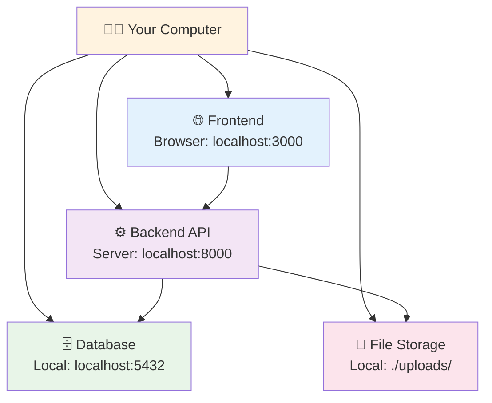
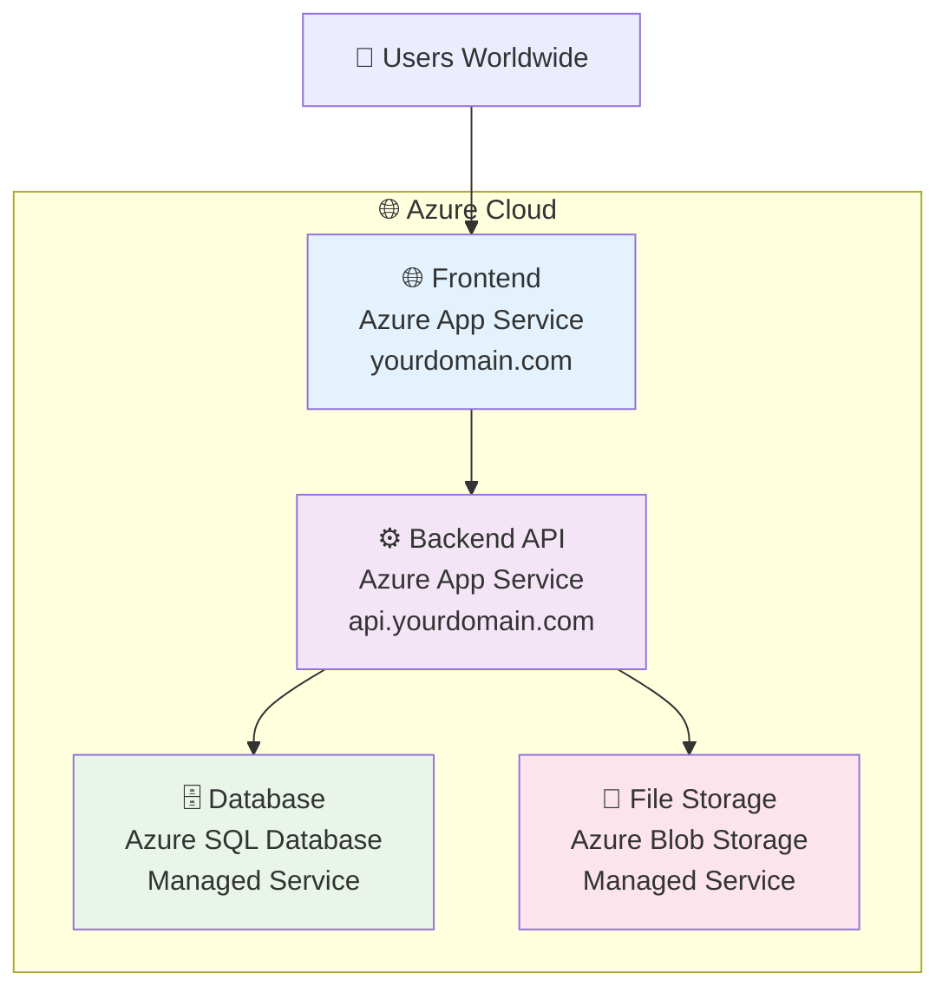
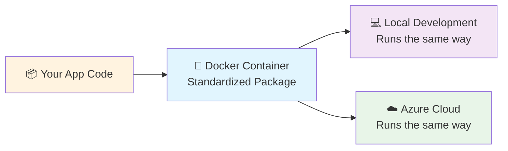
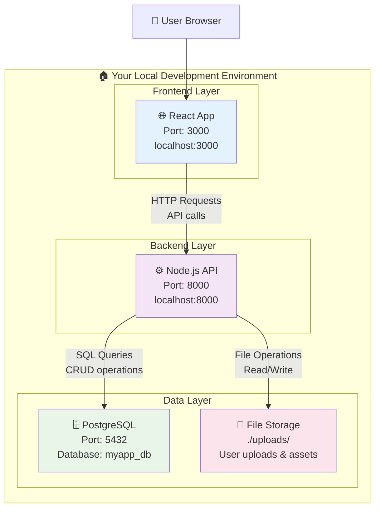
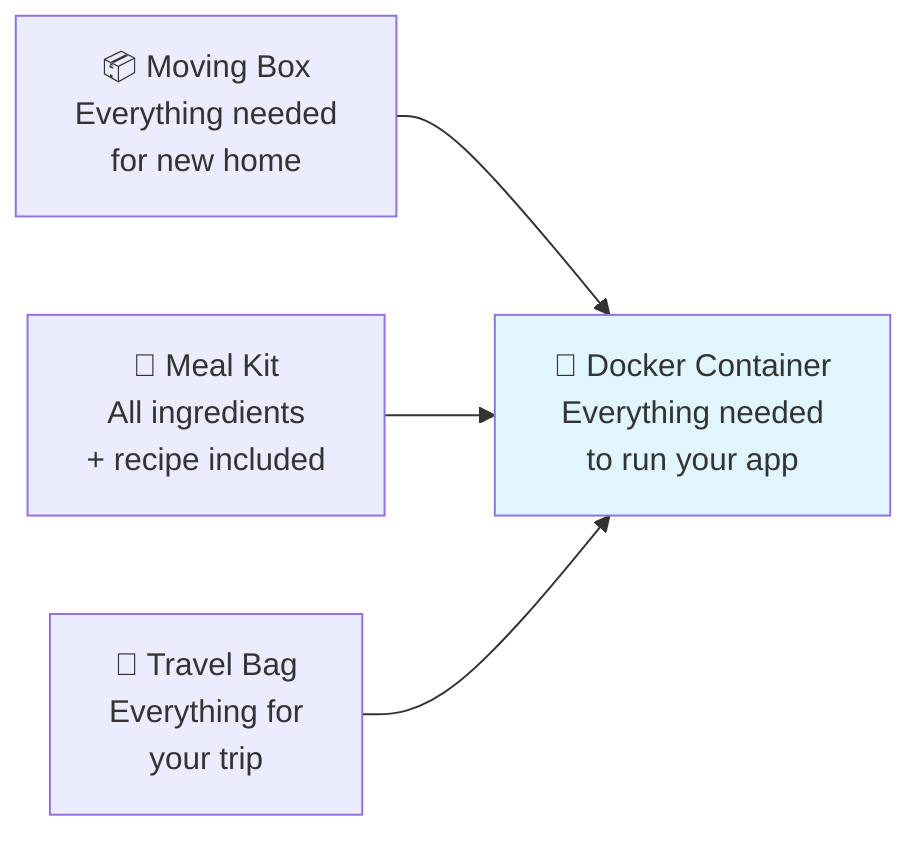
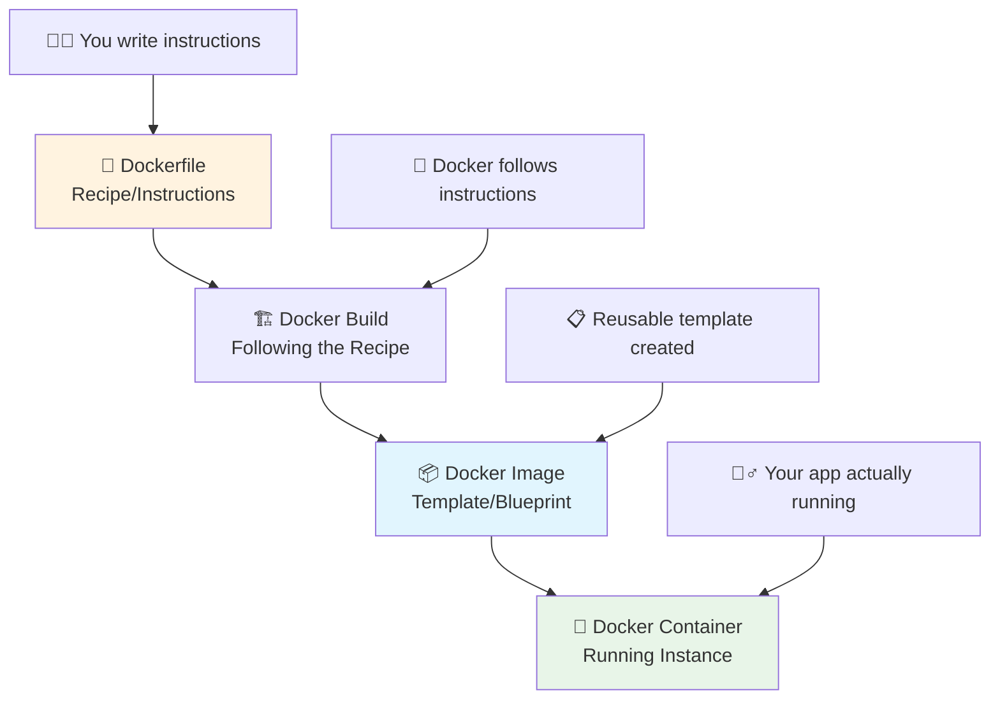
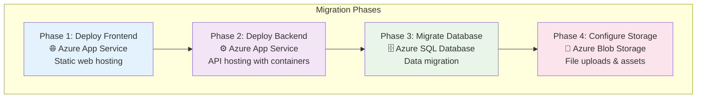
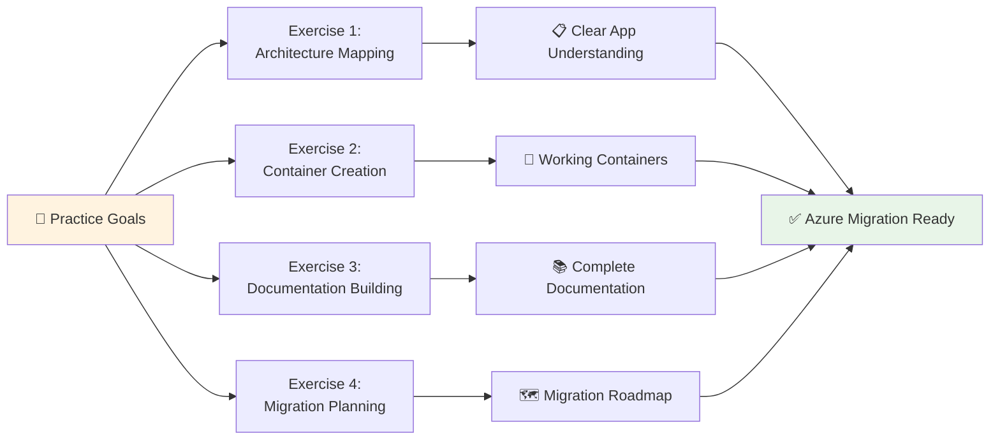
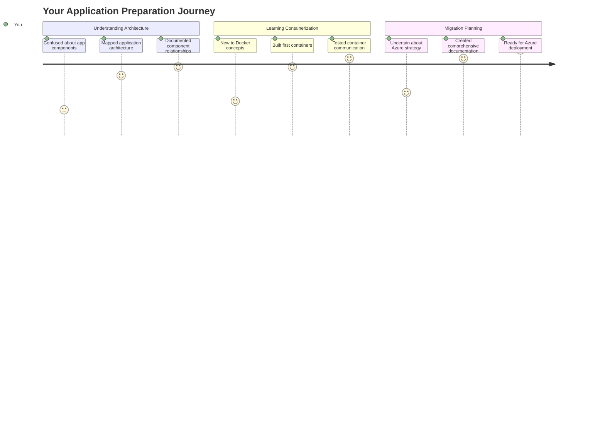
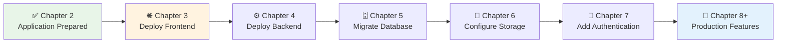

# Prepare for Success by Understanding Your Local Application

Welcome back to your Azure journey! In Chapter 1, you built an amazing foundation with your Azure environment—your account, tools, and resource group are all ready. Now comes an exciting step that many developers overlook: truly understanding what you've built before moving it to the cloud.

> 💡 **Learning Tip**: Taking time to understand your application now will save you hours of confusion later during deployment!

Think of this like preparing for a big move to a new house. Before the movers arrive, you need to know exactly what you have, how everything connects, and what needs special handling. The same principle applies when moving your application to Azure—understanding your current setup makes the migration smooth and successful.

Just like our friend Alex from earlier chapters, you might be thinking, "I know my app works locally, but how do I make sure it'll work in Azure?" That's exactly what we'll figure out together in this chapter.

> ⏱️ **Time Check**: This chapter takes about 60 minutes to complete. Perfect for a focused learning session!

## Introduction

Let's continue Alex's story. After setting up the Azure environment in Chapter 1, Alex is excited to start moving the application to the cloud. But then Alex realizes something important: "I built this app over several months, adding features piece by piece. I know it works, but do I really understand how all the parts work together?"

This is a common situation for developers. You build an application gradually—first a simple HTML page, then you add JavaScript for interactivity, then a backend API for data, then a database for persistence. Before you know it, you have a complex application with multiple moving parts.

> 🤔 **Quick Check**: Have you ever built something that works perfectly, but then struggled to explain exactly how it works to someone else?

**Why Understanding Your Application Architecture Matters**

Moving an application to the cloud isn't just about copying files to a server. You need to understand:
- How your frontend communicates with your backend
- What dependencies your application has
- How data flows through your system
- Which parts can be moved independently

When you understand these relationships, Azure migration becomes much easier. You'll know which Azure services you need, how to configure them, and how to connect everything together.

**What is Application Architecture? (The Simple Version)**

Application architecture is like the blueprint of a house. Just as a house blueprint shows how rooms connect, where plumbing goes, and how electricity flows, your application architecture shows how your code components connect and communicate.

Most modern web applications follow a similar pattern:
- **Frontend** (what users see): HTML, CSS, JavaScript running in browsers
- **Backend** (business logic): Server code that processes requests and manages data
- **Database** (data storage): Where your application stores and retrieves information
- **Static files** (assets): Images, documents, and other files users upload or download

Understanding how these pieces work together locally helps you plan how they'll work together in Azure.

> 💡 **Pro Tip**: Don't worry if your application seems complex. We'll break it down into manageable pieces that are easy to understand and migrate!

In this chapter, we'll map out your application's architecture, understand its dependencies, and prepare it for cloud deployment using containerization. Think of containerization as packing your application into standardized shipping containers—it ensures your app will run the same way in Azure as it does on your computer.

## Learning Objectives

By the end of this chapter, you'll feel confident and knowledgeable about these essential skills:

> 🎯 **Your Success Goals**

• **Architect like a professional**: You'll create a clear diagram of your application showing how all components connect and communicate with each other.

• **Master containerization**: You'll understand why containers make cloud deployment easier and create your first Docker containers for your application components.

• **Document for success**: You'll build comprehensive documentation of your application that will guide your entire Azure migration strategy.

• **Think in cloud patterns**: You'll identify which parts of your application can be moved to Azure independently, setting up a smart migration strategy.

> ✅ **Confidence Check**: After this chapter, you'll go from "I think I know how my app works" to "I completely understand my application and I'm ready for Azure!"

## Essential Background: Understanding Local Development vs Cloud Deployment

Before we dive into mapping your application, let's understand the fundamental differences between how applications work locally versus in the cloud. This knowledge helps you make better decisions during migration planning.

> 💡 **Learning Strategy**: We'll use familiar concepts to explain cloud patterns, so everything feels approachable!

**How Your Application Works Locally Right Now**

When you develop locally, everything runs on your single computer:



| Component | Local Address | What It Does | Example |
|-----------|---------------|--------------|---------|
| **Frontend** | `localhost:3000` | Shows user interface | React app serving HTML/CSS/JS |
| **Backend API** | `localhost:8000` | Processes business logic | Node.js server handling requests |
| **Database** | `localhost:5432` | Stores persistent data | PostgreSQL with user accounts |
| **File Storage** | `./uploads/` | Stores user files | Local folder for uploaded images |

This setup works great for development because everything is fast, easy to debug, and you control the entire environment.

**How Cloud Applications Work Differently**

In the cloud, these components become separate services that communicate over the internet:



**Key Differences Between Local and Cloud:**

• **Location**: Components run on different servers instead of your computer
• **Communication**: Services talk over HTTPS instead of localhost
• **Scaling**: Azure can automatically handle more users than your computer could
• **Reliability**: Azure provides backups, monitoring, and automatic recovery
• **Configuration**: Each service needs proper setup for security and performance

**Why Containerization Bridges the Gap**

Containers solve the biggest challenge in cloud migration: ensuring your application runs the same way everywhere. Think of containers like moving boxes that protect your belongings during a move.



**Understanding Container Benefits for Beginners:**

• **Consistency**: Your app runs identically on your computer and in Azure
• **Portability**: Containers work on any system that supports Docker
• **Isolation**: Each container runs independently, preventing conflicts
• **Efficiency**: Containers share resources while staying separate

Containers package your application with everything it needs to run—your code, runtime environment, system libraries, and dependencies. This means when you move to Azure, you're not just moving code; you're moving a complete, working environment.

**Planning Your Migration Strategy**

Understanding these concepts helps you plan which components to migrate first:

| Migration Order | Component | Why This Order Works |
|-----------------|-----------|---------------------|
| **Step 1** | Frontend | Easiest to deploy, immediate visible progress |
| **Step 2** | Backend API | Enables full functionality in the cloud |
| **Step 3** | Database | Requires careful data migration planning |
| **Step 4** | File Storage | Often the most complex due to existing data |

This progression lets you see results quickly while building confidence for more complex migrations.

## Mapping Your Current Application Architecture

Now let's create a comprehensive map of your application. This documentation becomes your migration roadmap and helps you understand exactly what you're working with. Think of this as creating the blueprint that guides your entire Azure journey.

**Identifying Your Application Components**

Most web applications have similar building blocks, even if they look different on the surface. Let's identify what you have:

> 🔍 **Discovery Time**: Look at your application and identify these common components:

**Frontend Components to Document:**
- What framework/library are you using? (React, Vue, Angular, vanilla JavaScript, etc.)
- What development server are you running? (Create React App, Vite, Express static, etc.)
- What port does your frontend run on locally?
- What API endpoints does your frontend call?

**Backend Components to Document:**
- What language and framework? (Node.js/Express, Python/Django, C#/ASP.NET, etc.)
- What port does your backend run on?
- What routes/endpoints does it provide?
- How does it connect to your database?
- Does it handle file uploads or serve static files?

**Database Components to Document:**
- What database technology? (PostgreSQL, MySQL, SQLite, MongoDB, etc.)
- What's the database name and connection details?
- What are your main tables/collections?
- Do you have any existing data that needs to be migrated?

**File Storage to Document:**
- Where do you store uploaded files? (local folder, cloud storage, etc.)
- What types of files does your app handle?
- How much storage space are you currently using?

> 💡 **Documentation Tip**: Write down everything, even if it seems obvious. You'll be grateful for detailed notes during migration!

**Creating Your Architecture Diagram**

Let's create a visual representation of your application. Here's a template you can adapt for your specific application:



**Documenting Component Relationships**

Understanding how your components communicate is crucial for successful migration. Create a table like this for your application:

| From Component | To Component | Communication Method | Purpose | Example |
|----------------|--------------|---------------------|---------|---------|
| Frontend | Backend API | HTTP POST/GET | User authentication | `POST /api/login` |
| Frontend | Backend API | HTTP GET | Fetch user data | `GET /api/users/profile` |
| Backend API | Database | SQL Queries | Store/retrieve data | `SELECT * FROM users` |
| Backend API | File Storage | File I/O | Save uploaded files | Write to `./uploads/` |

**Understanding Data Flow Patterns**

Document how data moves through your application during common user actions:

**Example: User Registration Flow**
1. User fills out registration form (Frontend)
2. Frontend sends POST request to `/api/register` (Frontend → Backend)
3. Backend validates user data (Backend)
4. Backend saves user to database (Backend → Database)
5. Backend returns success response (Backend → Frontend)
6. Frontend shows success message (Frontend)

**Example: File Upload Flow**
1. User selects file to upload (Frontend)
2. Frontend sends file via POST to `/api/upload` (Frontend → Backend)
3. Backend saves file to storage (Backend → File Storage)
4. Backend saves file metadata to database (Backend → Database)
5. Backend returns file URL (Backend → Frontend)
6. Frontend displays uploaded file (Frontend)

> ✅ **Progress Check**: Can you trace the flow of data for one major feature in your application?

Understanding these patterns helps you design the Azure equivalent flows and choose the right Azure services for each component.

## Introduction to Containerization with Docker

Containerization is like packing your application into a standardized shipping container that can run anywhere. Just as shipping containers revolutionized global trade by creating a standard way to transport goods, Docker containers revolutionize application deployment by creating a standard way to package and run applications.

**Understanding Containers Through Real-World Analogies**

Think of Docker containers like different types of standardized packaging you use every day:



| Real-World Example | Container Equivalent | Benefit |
|-------------------|---------------------|---------|
| **Moving Box** | Contains your app + dependencies | Everything needed is included |
| **Meal Kit** | Contains code + runtime environment | Consistent results anywhere |
| **Travel Bag** | Contains app + configuration | Portable and self-contained |

**Why Containers Make Cloud Migration Easier**

Without containers, moving your application to Azure is like trying to recreate your kitchen in someone else's house—you need to make sure they have the right appliances, ingredients, and tools. With containers, it's like bringing a food truck—everything you need is already inside!

• **Eliminates "it works on my machine" problems**: Your app runs the same everywhere
• **Simplifies dependency management**: All required libraries and tools are included
• **Enables consistent deployments**: Same container runs in development, testing, and production
• **Provides isolation**: Multiple applications can run without conflicting with each other

**Installing Docker Desktop (Your Container Platform)**

Docker Desktop provides everything you need to build and run containers on your local machine. It's like installing a moving company that handles all the packaging for you.

> 💻 **Installation Steps**:
1. Visit `docker.com/products/docker-desktop` 
2. Download the version for your operating system
3. Install using the default settings
4. Restart your computer when prompted
5. Open Docker Desktop and complete the initial setup

> ⏱️ **Time Check**: Docker installation takes about 10 minutes. Perfect time for a coffee break!

After installation, open your terminal and verify Docker is working:

```bash
docker --version
```

You should see something like `Docker version 24.0.7`. This confirms Docker is installed and ready to use!

**Understanding Docker Basics for Beginners**

Docker uses a few key concepts that are easy to understand once you know the analogies:



| Docker Concept | Real-World Analogy | Purpose |
|----------------|-------------------|---------|
| **Dockerfile** | Recipe for cooking | Instructions for building your container |
| **Docker Image** | Cake mix box | Template that can create multiple containers |
| **Docker Container** | Actual cake | Running instance of your application |

**Writing Your First Dockerfile**

A Dockerfile is a simple text file that tells Docker how to package your application. Here's a basic example for a Node.js application:

```dockerfile
# Start with a base image that has Node.js installed
FROM node:18-alpine

# Set the working directory inside the container
WORKDIR /app

# Copy package.json and package-lock.json
COPY package*.json ./

# Install dependencies
RUN npm install

# Copy the rest of your application code
COPY . .

# Expose the port your app runs on
EXPOSE 3000

# Command to start your application
CMD ["npm", "start"]
```

Let's break down what each instruction does:

• **FROM node:18-alpine**: Starts with a lightweight Linux system that has Node.js pre-installed
• **WORKDIR /app**: Creates and sets `/app` as the working directory inside the container
• **COPY package*.json ./**: Copies your package files to install dependencies first
• **RUN npm install**: Installs all the dependencies your app needs
• **COPY . .**: Copies your application code into the container
• **EXPOSE 3000**: Documents that your app listens on port 3000
• **CMD ["npm", "start"]**: Specifies the command to run when the container starts

> 💡 **Beginner Tip**: Start with simple Dockerfiles and gradually add complexity as you understand more!

## Building Your First Container

Now comes the exciting part—turning your application into a container! This is where the magic happens, and you'll see how Docker packages everything your app needs into a portable, runnable container.

**Preparing Your Application for Containerization**

Before creating containers, let's make sure your application is container-ready. Think of this as organizing your belongings before packing them for a move.

**For Node.js/JavaScript Applications:**

First, ensure your application has proper dependency management:

```json
{
  "name": "my-awesome-app",
  "version": "1.0.0",
  "scripts": {
    "start": "node server.js",
    "dev": "nodemon server.js"
  },
  "dependencies": {
    "express": "^4.18.2",
    "cors": "^2.8.5"
  }
}
```

Make sure your application listens on a configurable port:

```javascript
const express = require('express');
const app = express();

// Use environment variable for port, with fallback
const PORT = process.env.PORT || 3000;

app.get('/', (req, res) => {
  res.json({ message: 'Hello from containerized app!' });
});

app.listen(PORT, () => {
  console.log(`Server running on port ${PORT}`);
});
```

**Creating Your Frontend Container**

Let's containerize a React frontend application. Create a file named `Dockerfile` in your frontend directory:

```dockerfile
# Use official Node.js runtime as the base image
FROM node:18-alpine

# Set the working directory inside the container
WORKDIR /app

# Copy package.json and package-lock.json (if available)
COPY package*.json ./

# Install dependencies
RUN npm install

# Copy the rest of the application code
COPY . .

# Build the React application for production
RUN npm run build

# Install a simple server to serve the built files
RUN npm install -g serve

# Expose the port the app runs on
EXPOSE 3000

# Command to run the application
CMD ["serve", "-s", "build", "-l", "3000"]
```

This Dockerfile accomplishes several important tasks:

• **Establishes environment**: Creates a Node.js environment with all necessary tools
• **Manages dependencies**: Installs all packages your application needs
• **Builds application**: Compiles your React app into optimized static files
• **Provides web server**: Includes a lightweight server to serve your built application
• **Configures networking**: Exposes the correct port for external access

**Building and Testing Your Frontend Container**

Now let's build your container image. Open your terminal in your frontend directory and run:

```bash
# Build the container image
docker build -t my-frontend-app .

# Run the container to test it
docker run -p 3000:3000 my-frontend-app
```

Let's understand what these commands do:

• **docker build -t my-frontend-app .**: Builds a container image using the Dockerfile in the current directory (`.`) and tags it with the name `my-frontend-app`
• **docker run -p 3000:3000 my-frontend-app**: Runs a container from your image, mapping port 3000 inside the container to port 3000 on your computer

> ✅ **Success Check**: Open your browser to `localhost:3000`. If you see your application, congratulations—you've successfully containerized your frontend!

**Creating Your Backend API Container**

Now let's containerize your backend API. Create another `Dockerfile` in your backend directory:

```dockerfile
# Use official Node.js runtime
FROM node:18-alpine

# Set working directory
WORKDIR /app

# Copy package files
COPY package*.json ./

# Install dependencies
RUN npm install

# Copy source code
COPY . .

# Expose API port
EXPOSE 8000

# Start the API server
CMD ["npm", "start"]
```

Build and test your backend container:

```bash
# Build the backend container
docker build -t my-backend-api .

# Run the backend container
docker run -p 8000:8000 my-backend-api
```

**Understanding Container Networking**

When your containers run, they need to communicate with each other. In local development, you can test this by running both containers simultaneously:

```bash
# Run backend container in the background
docker run -d -p 8000:8000 --name backend my-backend-api

# Run frontend container
docker run -p 3000:3000 --name frontend my-frontend-app
```

The `-d` flag runs the container in the background, and `--name` gives your container a memorable name for easier management.

**Container Management Best Practices**

Learn these essential Docker commands for managing your containers:

```bash
# List running containers
docker ps

# List all containers (running and stopped)
docker ps -a

# Stop a running container
docker stop backend

# Remove a stopped container
docker rm backend

# Remove a container image
docker rmi my-backend-api
```

These commands help you manage your containers effectively:

• **docker ps**: Shows which containers are currently running, like checking which programs are active
• **docker stop**: Gracefully shuts down a container, similar to closing an application
• **docker rm**: Removes a stopped container to free up space
• **docker rmi**: Removes container images you no longer need

> 💡 **Pro Tip**: Use descriptive names for your containers and images. It makes management much easier!

## Putting It Together: Complete Application Documentation

Now that you understand your application architecture and have created containers, let's bring everything together into comprehensive documentation that will guide your Azure migration. This documentation becomes your roadmap for the entire cloud journey.

**Creating Your Application Architecture Document**

Your documentation should tell the complete story of your application. Here's a template you can adapt:

```markdown
# My Application Architecture Documentation

## Application Overview
- **Name**: MyAwesome WebApp
- **Purpose**: [Brief description of what your app does]
- **Technology Stack**: React frontend, Node.js backend, PostgreSQL database
- **Current Status**: Running locally, ready for Azure migration

## Component Architecture

### Frontend Application
- **Technology**: React 18.2.0
- **Development Server**: Create React App
- **Build Output**: Static files (HTML, CSS, JS)
- **Local URL**: http://localhost:3000
- **Container Port**: 3000
- **Dependencies**: See package.json

### Backend API
- **Technology**: Node.js 18 with Express 4.18.2
- **Local URL**: http://localhost:8000
- **Container Port**: 8000
- **Main Routes**: 
  - GET /api/health (health check)
  - POST /api/auth/login (user authentication)
  - GET /api/users/profile (user data)
- **Dependencies**: See package.json

### Database
- **Technology**: PostgreSQL 15
- **Local Connection**: localhost:5432
- **Database Name**: myapp_db
- **Main Tables**: users, posts, sessions
- **Current Data Size**: ~100MB

### File Storage
- **Current Method**: Local filesystem (./uploads/)
- **File Types**: Images (JPG, PNG), Documents (PDF)
- **Current Usage**: ~500MB
- **Access Pattern**: Read/Write via backend API
```

**Documenting Your Container Configuration**

Create a container reference that explains your Docker setup:

```yaml
# Container Configuration Summary

## Frontend Container (my-frontend-app)
- **Base Image**: node:18-alpine
- **Build Process**: npm install → npm run build → serve static files
- **Exposed Port**: 3000
- **Health Check**: GET / returns 200
- **Dependencies**: All frontend packages bundled

## Backend Container (my-backend-api)  
- **Base Image**: node:18-alpine
- **Build Process**: npm install → start server
- **Exposed Port**: 8000
- **Health Check**: GET /api/health returns 200
- **External Dependencies**: Database connection required

## Container Networking
- **Frontend → Backend**: HTTP calls to backend container
- **Backend → Database**: Will use Azure SQL Database connection
- **Backend → Storage**: Will use Azure Blob Storage
```

**Creating Your Azure Migration Plan**

Based on your application architecture, plan your Azure migration strategy:



| Migration Phase | Azure Service | Why This Order | Expected Duration |
|----------------|---------------|----------------|-------------------|
| **Phase 1: Frontend** | Azure App Service | Quick wins, immediate progress | 1 hour |
| **Phase 2: Backend** | Azure App Service | Enables full functionality | 2 hours |
| **Phase 3: Database** | Azure SQL Database | Requires careful data migration | 3 hours |
| **Phase 4: Storage** | Azure Blob Storage | File migration takes time | 2 hours |

**Understanding Resource Requirements for Azure**

Document what Azure resources you'll need for each component:

**Frontend Requirements:**
- Azure App Service (Free or Basic tier)
- Custom domain support (optional)
- SSL certificate (automatic with Azure)

**Backend Requirements:**
- Azure App Service (Basic tier for container support)
- Application insights for monitoring
- Environment variables for configuration

**Database Requirements:**
- Azure SQL Database (Basic tier for learning)
- Connection string configuration
- Data migration strategy

**Storage Requirements:**
- Azure Storage Account (Standard tier)
- Blob container for file uploads
- CDN for global file delivery (optional)

**Estimating Costs for Your Application**

Use Azure's pricing calculator to estimate monthly costs:

| Service | Tier | Estimated Monthly Cost | Purpose |
|---------|------|----------------------|---------|
| App Service (Frontend) | Free | $0 | Static site hosting |
| App Service (Backend) | Basic B1 | ~$13 | Container hosting |
| SQL Database | Basic | ~$5 | Data storage |
| Storage Account | Standard | ~$2 | File storage |
| **Total Estimated** | | **~$20/month** | Complete application |

> 💰 **Cost Tip**: Start with free tiers where possible, then scale up based on actual usage!

**Creating Your Pre-Migration Checklist**

Before starting your Azure migration, ensure everything is ready:

**Application Readiness:**
- [ ] All containers build successfully
- [ ] Application runs correctly in containers
- [ ] Database schema documented
- [ ] Configuration variables identified
- [ ] File storage requirements understood

**Azure Environment Readiness:**
- [ ] Azure account active with available credits
- [ ] Resource group created and organized
- [ ] Development tools installed and configured
- [ ] Billing alerts configured for cost protection

**Migration Preparation:**
- [ ] Architecture documentation complete
- [ ] Container images tested locally
- [ ] Migration plan reviewed and understood
- [ ] Backup of current application created

This comprehensive documentation serves as your guide throughout the Azure migration process, ensuring you don't miss important details and can troubleshoot issues effectively.

## Practice Time: Hands-On Application Preparation

Now let's put your knowledge into practice with exercises designed to prepare your application for successful Azure migration. These activities build the skills and documentation you'll need for the upcoming deployment chapters.



**Exercise Overview & Learning Objectives:**

| Exercise | Duration | Learning Focus | Skills Gained |
|----------|----------|----------------|---------------|
| **Architecture Mapping** | 20 minutes | Application understanding | Component identification and relationships |
| **Container Creation** | 25 minutes | Containerization skills | Docker fundamentals and practical application |
| **Documentation Building** | 15 minutes | Professional documentation | Clear communication and planning |
| **Migration Planning** | 10 minutes | Strategic thinking | Azure service selection and sequencing |

**Exercise 1: Create Your Application Architecture Map**

Let's create a comprehensive map of your application that will guide your entire Azure migration strategy.

> 🎯 **Goal**: Build a clear understanding of how your application components work together.

**Your Mission:** Document every component of your application and how they communicate.

**Step 1 - Component Discovery:**
Create a table listing each component of your application:

```markdown
| Component | Technology | Port | Purpose | Dependencies |
|-----------|------------|------|---------|-------------|
| Frontend | React | 3000 | User interface | Backend API |
| Backend | Node.js/Express | 8000 | Business logic | Database, File storage |
| Database | PostgreSQL | 5432 | Data persistence | None |
| Storage | Local files | N/A | File uploads | None |
```

**Step 2 - Communication Flow:**
Map how your components communicate during common user actions. Choose one key feature (like user login or file upload) and trace the complete flow:

```markdown
User Login Flow:
1. User enters credentials (Frontend)
2. Frontend sends POST to /api/login (Frontend → Backend)
3. Backend validates against database (Backend → Database)
4. Backend returns authentication token (Backend → Frontend)
5. Frontend stores token and redirects (Frontend)
```

**Step 3 - Dependency Analysis:**
List what each component needs to function properly:

```markdown
Frontend Dependencies:
- Backend API available at known URL
- Static file serving capability
- HTTPS for secure communication

Backend Dependencies:
- Database connection string
- File storage access
- Environment variables for configuration
```

> ⏱️ **Time Check**: Spend about 5 minutes on each step. Don't rush—thorough documentation saves hours later!

**Exercise 2: Containerize Your Application Components**

Practice creating Docker containers for your application components. This exercise builds the foundation for Azure deployment.

**Step 1 - Prepare Your Frontend Container:**
If you have a React/Vue/Angular application, create a `Dockerfile`:

```dockerfile
FROM node:18-alpine
WORKDIR /app
COPY package*.json ./
RUN npm install
COPY . .
RUN npm run build
RUN npm install -g serve
EXPOSE 3000
CMD ["serve", "-s", "build", "-l", "3000"]
```

Build and test it:
```bash
docker build -t my-frontend .
docker run -p 3000:3000 my-frontend
```

**Step 2 - Prepare Your Backend Container:**
Create a backend `Dockerfile`:

```dockerfile
FROM node:18-alpine
WORKDIR /app
COPY package*.json ./
RUN npm install
COPY . .
EXPOSE 8000
CMD ["npm", "start"]
```

Build and test:
```bash
docker build -t my-backend .
docker run -p 8000:8000 my-backend
```

**Step 3 - Test Container Communication:**
Run both containers and verify they can communicate:

```bash
# Run backend in background
docker run -d -p 8000:8000 --name backend my-backend

# Run frontend 
docker run -p 3000:3000 --name frontend my-frontend

# Test in browser at localhost:3000
```

> 💡 **Success Tip**: If containers build and run without errors, you're ready for Azure deployment!

**Exercise 3: Build Professional Documentation**

Create documentation that will guide your Azure migration and help others understand your application.

Create a `ARCHITECTURE.md` file with these sections:

```markdown
# Application Architecture Documentation

## Overview
[Brief description of your application]

## Component Architecture
[Detailed breakdown of each component]

## Container Configuration
[Docker setup for each container]

## Azure Migration Plan
[Step-by-step plan for moving to Azure]

## Resource Requirements
[What Azure services you'll need]

## Cost Estimates
[Expected monthly costs]
```

Fill in each section with the information you've gathered. This documentation becomes your migration roadmap and helps you make informed decisions during deployment.

**Exercise 4: Plan Your Azure Migration Strategy**

Based on your application analysis, create a strategic migration plan.

**Step 1 - Prioritize Components:**
Rank your application components by migration complexity:

```markdown
Migration Priority (Easiest to Hardest):
1. Frontend (Static files, no dependencies)
2. Backend API (Containerized, needs database connection)
3. Database (Data migration required)
4. File Storage (Existing files need migration)
```

**Step 2 - Map to Azure Services:**
Match each component to appropriate Azure services:

```markdown
Component → Azure Service Mapping:
- Frontend → Azure App Service (Static Web Apps)
- Backend → Azure App Service (Container support)
- Database → Azure SQL Database
- Storage → Azure Blob Storage
```

**Step 3 - Create Timeline:**
Estimate time required for each migration phase:

```markdown
Migration Timeline:
- Week 1: Deploy Frontend to Azure App Service
- Week 2: Deploy Backend API to Azure App Service  
- Week 3: Migrate Database to Azure SQL Database
- Week 4: Configure Azure Blob Storage for files
```

This planning exercise prepares you for successful Azure migration by ensuring you understand the scope, complexity, and resource requirements for each component.

## Solution Walkthrough: Understanding Your Application Preparation

Let's walk through the complete solution for preparing your application for Azure migration, explaining not just what you accomplished, but why each step is crucial for successful cloud deployment.

**Application Architecture Documentation Success**

Your architecture mapping exercise created a comprehensive blueprint of your application that serves multiple important purposes. This documentation helps you understand component relationships, plan migration strategies, and troubleshoot issues during deployment.

The component identification process revealed the fundamental building blocks of your application. By documenting each component's technology, port, and dependencies, you created a reference that guides Azure service selection. For example, identifying that your frontend is a React application that produces static build files tells you that Azure Static Web Apps or Azure App Service would be appropriate hosting solutions.

Understanding communication flows between components is crucial for configuring Azure networking and security. When you traced the user login flow, you identified all the network connections that need to work in Azure. This preparation helps you configure Azure App Service communication, set up proper CORS policies, and ensure your application maintains full functionality in the cloud.

**Containerization Success and Benefits**

Creating Docker containers for your application components represents a significant achievement that provides multiple benefits for Azure deployment. Containers solve the "it works on my machine" problem by packaging your application with all its dependencies, ensuring consistent behavior across development, testing, and production environments.

Your frontend container bundles your React application with a web server, creating a self-contained package that runs identically on your development machine and in Azure App Service. This consistency eliminates deployment surprises and makes troubleshooting much easier when issues arise.

The backend container packages your API server with its runtime environment, enabling Azure App Service to run your backend exactly as it runs locally. Container deployment also enables easy scaling—Azure can create multiple instances of your container to handle increased traffic without requiring application code changes.

**Documentation as Migration Foundation**

The comprehensive documentation you created serves as the foundation for your entire Azure migration strategy. Professional development teams rely on similar documentation to plan deployments, estimate costs, and coordinate migration activities across team members.

Your migration plan provides a logical sequence for moving application components to Azure. Starting with the frontend creates immediate visible progress and builds confidence for more complex backend and database migrations. This phased approach reduces risk by allowing you to validate each component before adding complexity.

Cost estimation documentation helps you make informed decisions about Azure service tiers and monitor spending throughout your migration. Understanding expected costs before deployment prevents budget surprises and helps you choose appropriate service levels for your application's requirements.

**Azure Service Alignment Strategy**

Your exercise in mapping application components to Azure services demonstrates strategic thinking about cloud architecture. This alignment process considers both technical requirements and cost optimization, ensuring your Azure deployment meets your application's needs efficiently.

Choosing Azure App Service for both frontend and backend hosting provides several advantages: integrated deployment pipelines, built-in scaling capabilities, and simplified management through a single Azure service. This choice reduces operational complexity while providing enterprise-grade hosting capabilities.

Planning database migration to Azure SQL Database prepares you for one of the most critical aspects of cloud migration. Azure SQL Database provides managed database services with automatic backups, scaling, and maintenance, reducing operational overhead while improving reliability and security.

**Container Networking and Communication**

Your container testing revealed important insights about application networking that directly apply to Azure deployment. Understanding how containers communicate locally helps you configure Azure App Service networking, environment variables, and service connections.

The port mapping you configured in Docker (`-p 3000:3000`) translates directly to Azure App Service configuration, where you'll specify which port your container listens on. This understanding streamlines Azure deployment configuration and reduces troubleshooting time.

Testing container communication locally validates that your application architecture works in a containerized environment, which closely mirrors how it will operate in Azure App Service. This validation reduces deployment risks and builds confidence in your migration strategy.

**Migration Readiness Assessment**

Your completed exercises demonstrate that your application is ready for Azure migration. You have working containers, comprehensive documentation, and a strategic migration plan that addresses both technical and business considerations.

The architecture documentation provides the roadmap for Azure deployment, the containers provide consistent deployment packages, and the migration plan provides the sequence and timeline for moving to Azure. This preparation significantly increases the likelihood of successful cloud migration.

Your readiness extends beyond technical preparation to include strategic thinking about costs, service selection, and operational considerations. This holistic preparation approach aligns with how professional development teams approach cloud migration projects.

## Knowledge Check: Confirming Your Application Understanding

Let's verify your understanding of application architecture and containerization concepts. This friendly assessment helps ensure you're ready to move forward with confidence to Azure deployment.

**Question 1: Container Benefits for Cloud Migration**

You're explaining to a colleague why containerization helps with cloud deployment. Which explanation best describes the primary benefit of containers for Azure migration?

A) Containers make applications run faster in the cloud
B) Containers ensure applications run consistently across different environments  
C) Containers automatically scale applications based on demand

**Correct Answer: B) Containers ensure applications run consistently across different environments**

Containers package your application with all its dependencies, runtime environment, and configuration, ensuring it runs the same way on your development machine, testing environment, and Azure cloud platform. This consistency eliminates the common "it works on my machine" problems that plague cloud deployments.

**Understanding the Reasoning Behind the Answer**

The primary value of containerization for cloud migration is environmental consistency. When you build a container on your local machine, that exact same container can run in Azure App Service without modification. The container includes not just your application code, but also the specific versions of runtime libraries, system dependencies, and configuration files your application needs.

This consistency is crucial because cloud environments differ from local development environments in many ways—different operating systems, different installed software, different default configurations. Containers bridge these differences by creating a standardized, portable package that works everywhere.

While containers can provide performance benefits and enable scaling (the other answer options), these are secondary benefits. The foundational value is consistency and portability, which makes cloud migration much more predictable and reliable.

**Question 2: Application Architecture Planning**

You have a web application with a React frontend, Node.js backend, PostgreSQL database, and local file storage. What's the best sequence for migrating these components to Azure?

A) Database first, then backend, then frontend, then file storage
B) Frontend first, then backend, then database, then file storage
C) All components simultaneously to maintain functionality

**Correct Answer: B) Frontend first, then backend, then database, then file storage**

This sequence follows the principle of incremental migration with immediate visible progress. Starting with the frontend provides quick wins and builds confidence, while moving from least complex (static files) to most complex (data migration) reduces risk at each step.

**Understanding Migration Strategy Logic**

Frontend-first migration works because modern frontend applications can often work with mocked or existing backend APIs during the initial deployment phase. This allows you to see your application running in Azure immediately, which provides psychological momentum and helps you become familiar with Azure deployment processes before tackling more complex components.

The backend migration comes second because it can often connect to your existing local database initially, allowing you to validate API functionality in Azure before migrating data. This incremental approach lets you test and validate each component thoroughly before adding the complexity of the next component.

Database migration requires careful planning for data transfer, schema migration, and connection string updates across all dependent components. By migrating the database after frontend and backend are working, you have a stable foundation and can focus entirely on data migration challenges.

File storage migration often involves transferring existing uploaded files and updating application code to use cloud storage APIs. This complexity is easiest to handle when all other components are already working reliably in Azure.

## Chapter Recap: Celebrating Your Application Preparation Success

Fantastic work! You've accomplished something really significant in this chapter. What started as "I think I know how my app works" has transformed into comprehensive understanding and professional-grade preparation for cloud migration. Let's celebrate these achievements and get excited about deploying to Azure!

> 🏆 **Major Achievement Unlocked**: You now understand your application architecture like a pro and have everything ready for successful Azure deployment!

**Your Learning Journey Progress:**



**What You Built and Why It's Awesome:**

| What You Accomplished | Why It's Professional-Grade | Industry Impact |
|----------------------|----------------------------|-----------------|
| **Architecture Documentation** | Complete system understanding with component relationships | "They document like a senior developer!" |
| **Working Docker Containers** | Consistent deployment packages for any environment | "Smart use of industry-standard tools!" |
| **Migration Strategy** | Phased approach with risk management | "They plan deployments like a pro!" |
| **Cost Planning** | Resource requirements and budget estimates | "They think about business impact!" |
| **Comprehensive Preparation** | Ready for smooth Azure deployment | "This person is ready for production work!" |

**From Local to Cloud: Your Preparation Excellence**

You've transformed your local application into a cloud-ready system through systematic analysis and preparation. Your architecture documentation provides a clear roadmap that professional development teams would be proud to follow.

The containers you created solve one of the biggest challenges in cloud migration—ensuring consistent behavior across environments. Your application will run in Azure exactly like it runs on your computer, eliminating deployment surprises and troubleshooting headaches.

Your migration plan demonstrates strategic thinking about cloud deployment. By planning to migrate components in logical order—frontend first for quick wins, then backend for functionality, then database for persistence, and finally storage for completeness—you've created a low-risk path to cloud success.

> 💪 **Confidence Boost**: You've built the foundation for successful Azure deployment. Every professional cloud developer goes through this exact preparation process!

**Your Azure Migration Readiness:**



**Your Resource Evolution Plan:**

| Upcoming Chapter | What Gets Deployed | Your Application Capability |
|------------------|-------------------|----------------------------|
| **Chapter 3** | Azure App Service (Frontend) | Users worldwide can access your app |
| **Chapter 4** | Azure App Service (Backend) | Full application functionality in cloud |
| **Chapter 5** | Azure SQL Database | Persistent cloud data storage |
| **Chapter 6** | Azure Blob Storage | Cloud file uploads and management |
| **Chapter 7** | Azure AD B2C | Professional user authentication |
| **Chapter 8** | Azure Key Vault | Enterprise security practices |

**Understanding Your Professional Development**

The skills you've developed in this chapter—architecture documentation, containerization, and migration planning—are exactly what senior developers use for production cloud deployments. You're not just learning Azure; you're developing professional cloud development practices.

Your approach to understanding application components before migration demonstrates the analytical thinking that distinguishes experienced developers. Many developers rush into cloud deployment without proper preparation, leading to failed migrations and frustrated troubleshooting sessions. Your systematic preparation prevents these problems.

The documentation you've created serves as a template for future projects. Whether you're migrating additional applications or working on team projects, the process you've learned—map architecture, create containers, plan migration—applies to any cloud deployment scenario.

**Building on Professional Practices**

Your containerization work introduces you to Infrastructure as Code concepts that are fundamental to modern cloud development. The Dockerfiles you've created are code that defines your application infrastructure, making deployments reproducible and reliable.

Your migration planning demonstrates project management skills that complement your technical abilities. Understanding how to sequence deployments, estimate costs, and manage risks are crucial skills for any developer working on production systems.

The systematic approach you've learned—understand, document, containerize, plan, deploy—represents a methodology that scales from personal projects to enterprise applications serving millions of users.

**Ready for Azure Deployment Success**

You're now ready to see your application running in Azure! Your containers ensure consistent deployment, your documentation provides clear guidance, and your migration plan eliminates guesswork from the deployment process.

The next chapter will use your frontend container to deploy your first Azure App Service, giving you the exciting experience of seeing your application accessible to users worldwide. All the preparation you've done makes this deployment straightforward and successful.

**Your Continuing Cloud Journey**

The foundation you've built extends far beyond this course. Container-based deployment, infrastructure documentation, and strategic migration planning are skills that remain valuable throughout your career as cloud applications become increasingly sophisticated.

Consider exploring additional containerization topics like Docker Compose for multi-container applications, Kubernetes for container orchestration, and CI/CD pipelines for automated deployments. The foundation you've built supports learning any of these advanced topics.

> 🎉 **Big Win**: You've transformed from someone with a working local application to someone with a professionally prepared, cloud-ready application architecture. Your journey from "local developer" to "cloud developer" is well underway!

## What You Can Do Next

Now that you've completed Chapter 2, here are concrete actions you can take to build on your learning:

### 🚀 **Next 5 Minutes**
- [ ] **Test your containers one more time** to ensure they work perfectly
- [ ] **Commit your Dockerfiles to version control** (Git) to preserve your work
- [ ] **Share your architecture diagram** with a friend or colleague
- [ ] **Review your migration plan** to feel confident about next steps

### ⏰ **Next 1 Hour**  
- [ ] **Create a backup** of your current application before migration
- [ ] **Install Azure CLI extension for containers** if you haven't already
- [ ] **Explore Docker Hub** to see how other developers share containers
- [ ] **Read Chapter 3 overview** to understand what's coming next

### 📅 **Next 1 Week**
- [ ] **Complete Chapter 3** (deploying your frontend to Azure)
- [ ] **Practice Docker commands** to become more comfortable with containers
- [ ] **Explore Azure App Service documentation** to understand deployment options
- [ ] **Join Docker and Azure communities** online for continued learning

### 🌟 **Bonus Challenges**
- [ ] **Create a Docker Compose file** to run multiple containers together
- [ ] **Optimize your Dockerfiles** for smaller image sizes
- [ ] **Document your learning journey** in a blog post or social media
- [ ] **Help another developer** understand containerization basics

> 💡 **Study Tip**: Keep your architecture documentation handy—you'll reference it throughout your Azure migration!

---

**Ready for Chapter 3?** → [Go Live Instantly by Deploying Your Frontend to the Cloud](../03-deploy-frontend/README.md)

You've done incredible work preparing your application for the cloud. Take a moment to appreciate this major milestone—you're now ready to deploy to Azure! 🎉