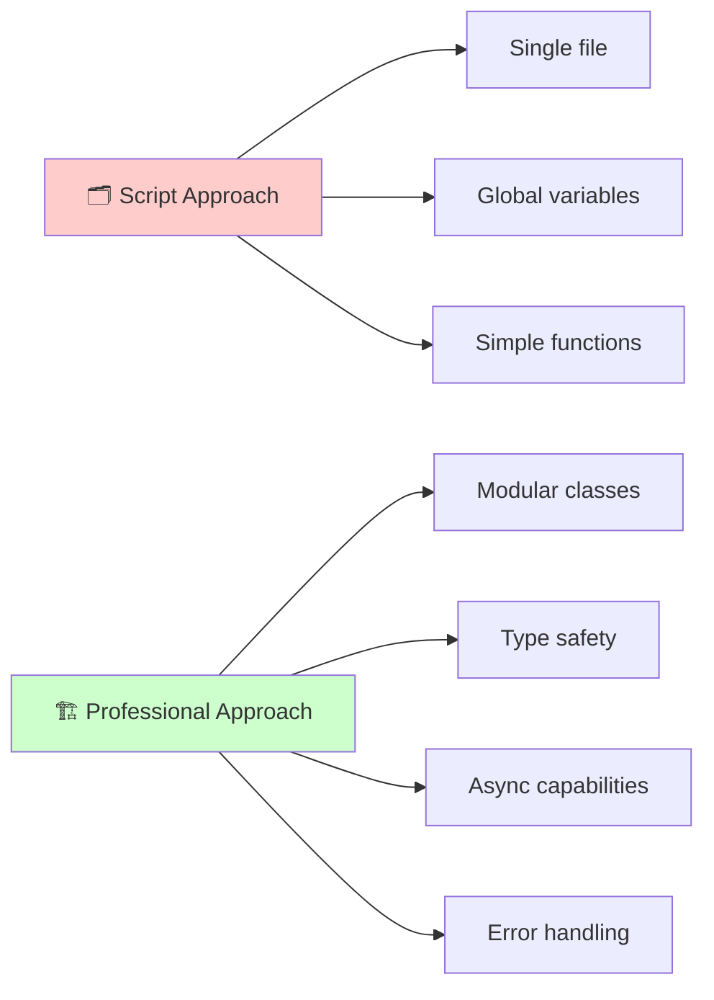
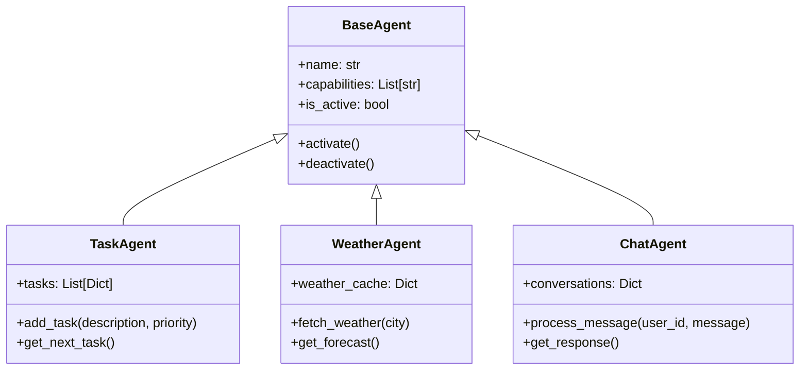
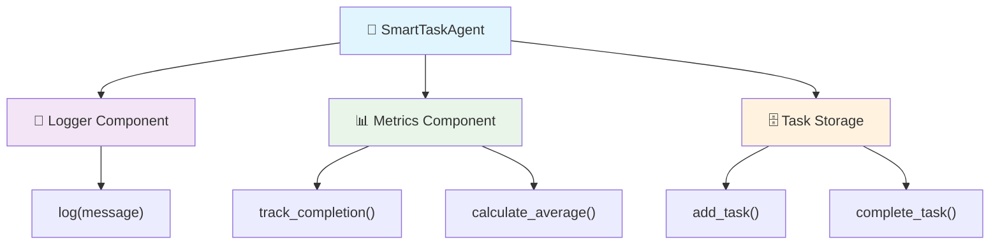
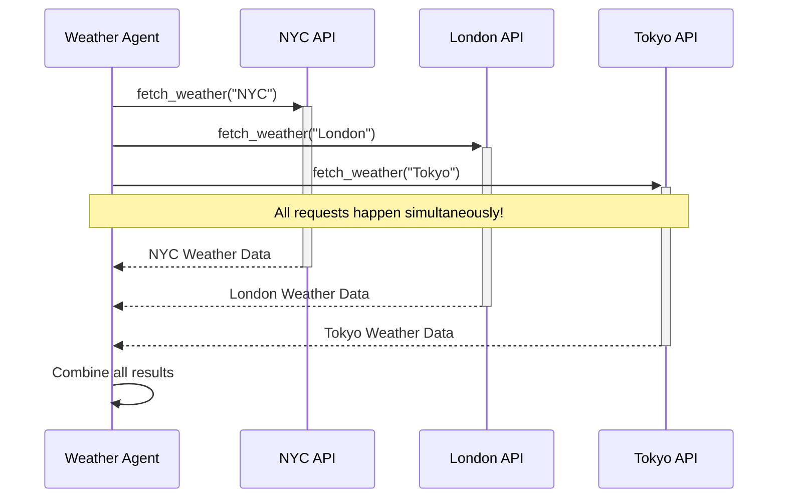
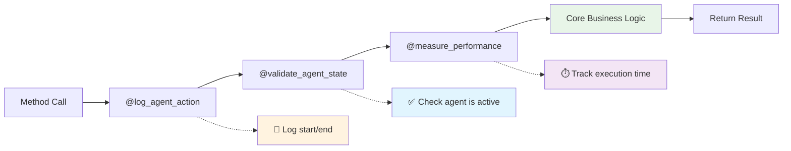
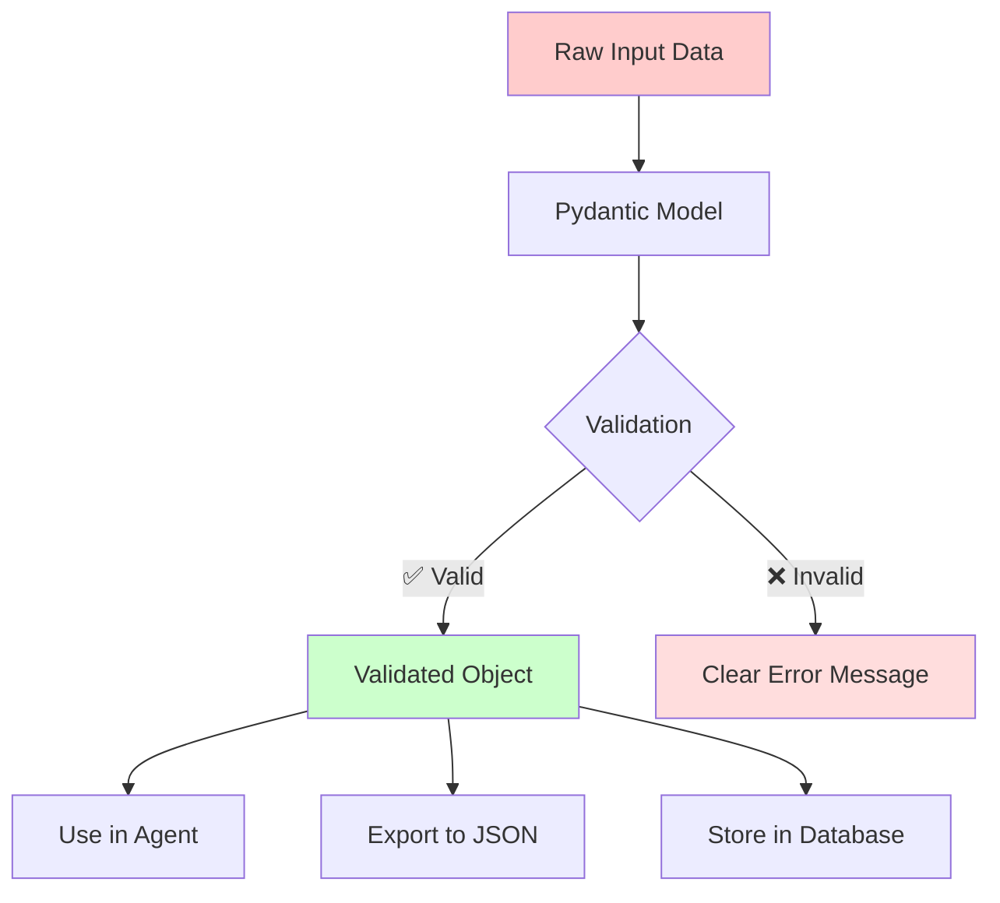
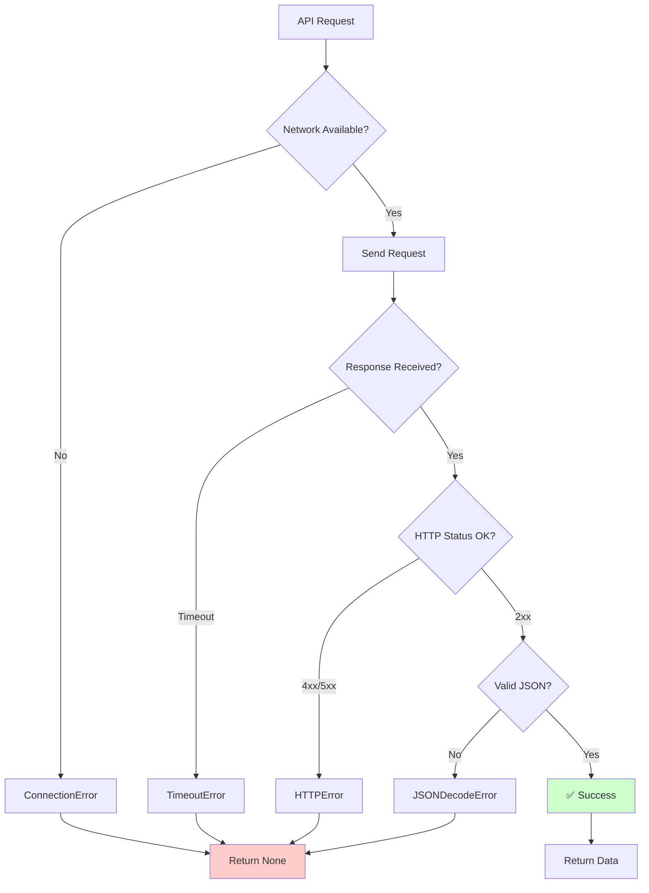

# Python for Agent Development

Welcome to your journey into the Python techniques that power sophisticated AI agents! If you've ever wondered how professional developers build robust, scalable agent systems, you're in the right place. This chapter will transform you from someone who writes basic Python scripts into a developer who crafts elegant, type-safe, and efficient agent architectures.

Think of this chapter as your bridge from simple programming to professional agent development. You already understand what AI agents are and how they work—now we'll explore the specific Python features that make them powerful, reliable, and maintainable. We'll cover object-oriented programming for clean agent structure, async programming for responsive behavior, decorators for elegant functionality, and modern tooling that makes development faster and safer.

By the end of this chapter, you'll be writing Python code that looks and feels professional, with proper type hints, robust error handling, and clean architectural patterns. You'll understand why experienced developers choose certain approaches and how to build agents that can grow in complexity without becoming messy or unreliable.

## 📚 Chapter Overview & Learning Path

**Estimated Time**: 2-4 hours (depending on your current Python experience)

**Learning Path Options:**
- 🚀 **Fast Track** (2 hours): Focus on main concepts, skip "Try It Yourself" exercises
- 🎯 **Balanced** (3 hours): Complete key exercises, review common mistakes
- 🔬 **Deep Dive** (4+ hours): Complete all exercises, explore optional advanced sections

**Your Learning Style:**
- 📖 **Visual Learner**: Pay special attention to diagrams and flowcharts
- 🔨 **Hands-On Learner**: Focus on "Try It Yourself" exercises and code examples
- 📝 **Reading Learner**: Study the detailed explanations and bullet points
- 🧪 **Experimental Learner**: Modify the code examples and see what happens

**Prerequisites Check:**
✅ Basic Python syntax (variables, functions, loops)  
✅ Understanding of dictionaries and lists  
✅ Familiarity with imports and modules  
❓ Not sure? Check our [Python Prerequisites Refresher](#python-prerequisites-refresher) below!

## Introduction

Building AI agents requires more than just understanding the basic concepts—it demands mastery of the Python features that enable professional-grade development. While you can create simple agents with basic Python, sophisticated systems need the robust foundations that modern Python provides.

Professional agent development relies on several key Python capabilities that work together harmoniously. Object-oriented programming provides the structural foundation, allowing you to create clean, modular agent classes that are easy to understand and extend. Asynchronous programming enables agents to handle multiple tasks simultaneously without blocking. Type hints make your code self-documenting and catch errors before they become problems. Modern libraries like Pydantic ensure data validation and serialization work flawlessly.

This isn't about learning Python for the sake of learning—it's about acquiring the specific skills that separate hobbyist agent scripts from production-ready systems. Every concept we explore has been chosen because it directly impacts your ability to build agents that are reliable, maintainable, and scalable.

## Learning Objectives

By the end of this chapter, you'll confidently master these essential Python skills for agent development:

• **Design clean agent classes**: Create well-structured, object-oriented agent architectures that are easy to understand, extend, and maintain across complex projects.

• **Implement async agent behavior**: Build responsive agents that can handle multiple tasks simultaneously using Python's async/await patterns for real-world performance.

• **Use type hints effectively**: Write self-documenting code with proper type annotations that catch errors early and make your agents more reliable.

• **Apply decorators for agent functionality**: Create reusable decorators that add logging, validation, and monitoring to your agent methods without cluttering your core logic.

• **Integrate modern Python tools**: Use Pydantic for data validation, requests for API interactions, and dataclasses for clean data structures in professional agent development.

• **Structure agent projects professionally**: Organize your code, dependencies, and tests following industry best practices that scale from simple prototypes to production systems.

### 🎯 Confidence Checkpoint #1
**Before we start, let's set realistic expectations:**

> **"I'm completely new to object-oriented programming"**  
> ✅ **Perfect!** We start with the absolute basics and build up gradually. No OOP experience required.

> **"Async programming sounds scary"**  
> ✅ **Don't worry!** We explain it like you're 5, then show practical examples. You'll get it!

> **"I've never used type hints"**  
> ✅ **Great starting point!** Type hints are easier than you think, and we show you exactly how.

> **"What if I get stuck?"**  
> ✅ **We've got you covered!** Every section has troubleshooting tips and common mistake guides.

**Remember: Every professional developer was once where you are now. You've got this! 💪**

## Essential Background

Before diving into advanced Python techniques, let's establish the foundation that will support everything we build. Understanding these core concepts will help you see why professional agent development requires more sophisticated approaches than basic scripting.

### From Scripts to Systems

Many beginners start by writing agent code as single files with global variables and simple functions. This approach works for learning, but real-world agents need structure that supports growth, testing, and collaboration. Professional agent development uses object-oriented design, proper dependency management, and modular architecture.

To illustrate this fundamental difference, here's a comparison showing how amateur and professional approaches differ in their architectural decisions:



The difference is like comparing a handwritten note to a well-organized filing system. Both can store information, but only one scales to handle thousands of documents efficiently. Your agent code needs the same kind of organizational thinking.

### Why Modern Python Matters

Python has evolved significantly in recent years, adding features specifically designed for building robust, maintainable applications. Type hints help catch errors before runtime. Async/await enables concurrent processing. Context managers ensure proper resource cleanup. These aren't just nice-to-have features—they're essential tools for professional development.

Here's a quick reference showing how each modern Python feature directly benefits your agent development:

| Python Feature | Purpose | Agent Benefit |
|---|---|---|
| **Type Hints** | Catch errors early | Self-documenting, IDE support |
| **Async/Await** | Concurrent processing | Handle multiple tasks simultaneously |
| **Dataclasses** | Clean data structures | Automatic validation and serialization |
| **Context Managers** | Resource cleanup | Safe file and connection handling |
| **Decorators** | Cross-cutting concerns | Logging, validation, performance tracking |

Modern Python also provides powerful libraries that handle common agent needs: Pydantic for data validation, requests for HTTP interactions, and asyncio for concurrent operations. Using these tools correctly distinguishes professional agent code from amateur scripts.

### The Agent Development Mindset

Successful agent development requires thinking beyond just making code work. You need to consider how your code will behave under stress, how it will handle unexpected inputs, how it will grow as requirements change, and how other developers will understand and extend it.

This mindset shift from "make it work" to "make it work reliably, maintainably, and professionally" is what this chapter will help you achieve.

### Python Prerequisites Refresher

Before we dive into advanced concepts, let's quickly review some Python features we'll be using. If you're comfortable with these, feel free to skip ahead!

**Important Python concepts we'll use:**

```python
# *args and **kwargs - for flexible function arguments
def example_function(*args, **kwargs):
    # *args collects extra positional arguments into a tuple
    # **kwargs collects extra keyword arguments into a dictionary
    print(f"Args: {args}, Kwargs: {kwargs}")

# Lambda functions - short anonymous functions
numbers = [3, 1, 4, 1, 5]
sorted_numbers = sorted(numbers, key=lambda x: x)  # Sort by value

# List comprehensions - concise way to create lists
even_numbers = [x for x in range(10) if x % 2 == 0]

# Dictionary .get() method - safe way to access dictionary values
user_data = {"name": "Alice", "age": 30}
name = user_data.get("name", "Unknown")  # Returns "Unknown" if key missing
```

• **When you see *args, **kwargs**: These let functions accept any number of arguments flexibly.

• **Lambda functions**: Think of them as mini-functions you can write in one line.

• **List comprehensions**: A Python shortcut for creating lists with conditions.

• **Dictionary .get()**: A safe way to get values that won't crash if the key doesn't exist.

> **💡 Beginner Tip**: Don't worry if these seem complex! We'll always explain them when they appear, and you can always come back to this section for reference.

### 🚀 5-Minute Success Guarantee

**Want to feel successful right now?** Let's create your first agent in under 5 minutes:

```python
# Copy and paste this into a Python file and run it!
class MyFirstAgent:
    def __init__(self, name: str):
        self.name = name
        print(f"🤖 Agent {self.name} created successfully!")
    
    def say_hello(self):
        return f"Hello! I'm {self.name}, your friendly AI agent!"

# Create and test your agent
my_agent = MyFirstAgent("Helper")
print(my_agent.say_hello())
print("🎉 Congratulations! You just created your first agent!")
```

**Output:**
```
🤖 Agent Helper created successfully!
Hello! I'm Helper, your friendly AI agent!
🎉 Congratulations! You just created your first agent!
```

> **🎯 Success!** You just wrote object-oriented Python code! Everything else in this chapter builds on this simple foundation.

## Object-Oriented Agent Architecture

Object-oriented programming provides the structural foundation for professional agent development. Instead of writing procedural code with functions scattered across files, you'll learn to create clean, logical class hierarchies that represent your agent's capabilities and responsibilities.

### Building Your First Agent Class

Let's start with the absolute basics and build up gradually. First, we'll create the simplest possible agent class:

```python
class BaseAgent:
    def __init__(self, name: str) -> None:
        self.name = name
        self.is_active = False
```

This `BaseAgent` class demonstrates the foundation of all agent architectures:

• **Simple structure**: The `__init__` method takes a `name` parameter and initializes `is_active` to False.

• **Type hints**: The `: str` annotation on `name` and `-> None` return type tell us exactly what types to expect.

• **Clean initialization**: Sets up the basic `self.name` and `self.is_active` properties every agent needs.

Now let's add the ability to start and stop our agent:

```python
def activate(self) -> None:
    """Start the agent and make it ready for tasks."""
    self.is_active = True
    print(f"Agent {self.name} is now active!")

def deactivate(self) -> None:
    """Stop the agent safely."""
    self.is_active = False
    print(f"Agent {self.name} has been deactivated.")
```

These lifecycle methods provide essential agent state management:

• **Lifecycle management**: The `activate()` and `deactivate()` methods allow agents to be turned on and off safely.

• **User feedback**: Both methods use `print(f"Agent {self.name}...")` to show clear messages about state changes.

• **Documentation strings**: The docstrings explain what each method does and why you'd use them.

Let's add some more useful properties to track when the agent was created and what it can do:

```python
from typing import List
from datetime import datetime

def __init__(self, name: str, capabilities: List[str]) -> None:
    self.name = name
    self.capabilities = capabilities
    self.created_at = datetime.now()
    self.is_active = False
```

This enhanced `__init__` method shows professional agent initialization:

• **Capabilities tracking**: The `self.capabilities` parameter lets the agent know what it can do.

• **Timestamp recording**: The `self.created_at = datetime.now()` call tracks when the agent was created.

• **Professional imports**: Using proper `List[str]` typing and `datetime` modules for robust code.

Here's our complete foundation agent class:

```python
from typing import List, Dict, Optional
from datetime import datetime

class BaseAgent:
    """Foundation class for all AI agents."""
    
    def __init__(self, name: str, capabilities: List[str]) -> None:
        self.name = name
        self.capabilities = capabilities
        self.created_at = datetime.now()
        self.is_active = False
    
    def activate(self) -> None:
        self.is_active = True
        print(f"Agent {self.name} is now active!")
    
    def deactivate(self) -> None:
        self.is_active = False
        print(f"Agent {self.name} has been deactivated.")
```

This foundation provides a template for all your future agents. Notice how the type hints make the code self-documenting—you can immediately see what types of data each method expects and returns.

> **🔧 Try It Yourself**: Create your own simple agent! Copy the `BaseAgent` class and try creating an agent called "MyFirstAgent" with capabilities like ["greeting", "help"]. Practice activating and deactivating it.
>
> ```python
> # Your code here
> my_agent = BaseAgent("MyFirstAgent", ["greeting", "help"])
> my_agent.activate()
> print(f"Agent {my_agent.name} can do: {my_agent.capabilities}")
> ```

**⚠️ Common Beginner Mistakes:**

```python
# ❌ Forgetting type hints
def __init__(self, name):  # Missing type hints!
    self.name = name

# ✅ Correct approach
def __init__(self, name: str) -> None:  # Clear types!
    self.name = name

# ❌ Forgetting self parameter
def activate() -> None:  # Missing self!
    self.is_active = True

# ✅ Correct approach  
def activate(self) -> None:  # self is required!
    self.is_active = True
```

### Inheritance for Specialized Agents

One of the most powerful aspects of object-oriented design is inheritance. Let's build a specialized task agent step by step, starting with the basics:

```python
class TaskAgent(BaseAgent):
    def __init__(self, name: str) -> None:
        super().__init__(name, capabilities=["task_management", "prioritization"])
        self.tasks = []
```

This `TaskAgent` class demonstrates inheritance and specialization:

• **Inherits from BaseAgent**: The `super().__init__(name, capabilities=...)` call gets all the basic agent functionality automatically.

• **Specialized capabilities**: Automatically sets appropriate `capabilities` list with "task_management" and "prioritization".

• **Task storage**: Creates an empty `self.tasks` list to store task dictionaries.

Now let's add the ability to create tasks. We'll start with the simplest version:

```python
def add_task(self, description: str) -> None:
    task = {"description": description, "status": "pending"}
    self.tasks.append(task)
    print(f"Added task: {description}")
```

This basic `add_task()` method establishes the foundation for task management:

• **Simple task structure**: Creates a dictionary with `description` and `status` fields to start.

• **Immediate feedback**: The `print(f"Added task: {description}")` provides user confirmation that the task was added.

• **Clean separation**: One method does one thing well.

Let's make our tasks more sophisticated by adding priority and timestamps:

```python
def add_task(self, description: str, priority: str = "medium") -> None:
    task = {
        "description": description,
        "priority": priority,
        "created_at": datetime.now().isoformat(),
        "status": "pending"
    }
    self.tasks.append(task)
    print(f"Added task: {description}")
```

This enhanced `add_task()` method adds professional task tracking features:

• **Default parameters**: The `priority` parameter defaults to "medium" if not specified in the method call.

• **Timestamp tracking**: Uses `datetime.now().isoformat()` to create standardized timestamp strings.

• **Structured data**: Creates comprehensive task dictionaries with `description`, `priority`, `created_at`, and `status` fields.

• **Rich task data**: Each task now has description, priority, timestamp, and status.

• **ISO timestamps**: Professional way to store time information.

Finally, let's add intelligent task retrieval that considers priority. We'll build this step by step:

```python
def get_next_task(self) -> Optional[Dict[str, str]]:
    """Get the highest priority pending task."""
    # Step 1: Find all pending tasks
    pending_tasks = [t for t in self.tasks if t["status"] == "pending"]
    
    if not pending_tasks:
        return None
    
    # Step 2: Create a priority ranking system
    priority_order = {"high": 1, "medium": 2, "low": 3}
    
    # Step 3: Find the task with the highest priority (lowest number)
    def get_priority_number(task):
        return priority_order.get(task["priority"], 3)  # Default to 3 if unknown
    
    return min(pending_tasks, key=get_priority_number)
```

• **Step-by-step approach**: We break the complex logic into clear, understandable steps.

• **Filters pending tasks**: Only looks at tasks that aren't done yet.

• **Handles empty case**: Returns None if no tasks are available.

• **Priority mapping**: Lower numbers = higher priority (high=1, medium=2, low=3).

• **Helper function**: `get_priority_number()` makes the sorting logic easier to understand.

> **🤔 Understanding the Logic**: The `min()` function finds the task with the lowest priority number. Since "high" priority = 1 and "low" priority = 3, the task with priority 1 will be selected first!

This inheritance pattern allows you to create families of related agents that share common behavior while specializing in different domains.

The following class diagram demonstrates how different agent types can share a common foundation while implementing their unique capabilities:



### Composition for Complex Capabilities

For more complex agents, composition often works better than inheritance. Let's build this up step by step, starting with a simple helper component:

```python
class Logger:
    def log(self, message: str) -> None:
        timestamp = datetime.now().strftime("%Y-%m-%d %H:%M:%S")
        print(f"[{timestamp}] {message}")
```

• **Single responsibility**: This component only handles logging.

• **Reusable design**: Can be used by any agent that needs logging.

• **Clean interface**: Simple method that's easy to understand and use.

Now let's create an agent that uses this logger. We'll start with basic structure:

```python
class SmartTaskAgent:
    def __init__(self, name: str) -> None:
        self.name = name
        self.logger = Logger()
        self.tasks = []
```

This `SmartTaskAgent` class demonstrates composition-based architecture:

• **Component integration**: The `__init__` method includes a `Logger()` instance as a component.

• **Clear ownership**: The agent owns and manages its `self.logger` instance.

• **Simple initialization**: Just the essential pieces - `name`, `logger`, and `tasks` list to start.

Let's add task creation with logging:

```python
def add_task(self, description: str, priority: str = "medium") -> None:
    task = {
        "id": len(self.tasks) + 1,
        "description": description,
        "priority": priority,
        "created_at": datetime.now(),
        "status": "pending"
    }
    
    self.tasks.append(task)
    self.logger.log(f"Task added: {description} (Priority: {priority})")
```

• **Automatic ID assignment**: Each task gets a unique identifier.

• **Integrated logging**: The logger component records the task creation.

• **Rich task data**: Includes all the information we need for management.

Now let's add performance tracking. First, we'll initialize the metrics:

```python
def __init__(self, name: str) -> None:
    self.name = name
    self.logger = Logger()
    self.tasks = []
    self.performance_metrics = {"tasks_completed": 0, "average_completion_time": 0.0}
```

• **Metrics tracking**: Agent keeps track of its own performance.

• **Simple data structure**: Using a dictionary to store different metrics.

• **Extensible design**: Easy to add more metrics later.

Finally, let's add task completion with metrics updating:

```python
def complete_task(self, task_id: int) -> bool:
    for task in self.tasks:
        if task["id"] == task_id and task["status"] == "pending":
            task["status"] = "completed"
            task["completed_at"] = datetime.now()
            
            # Update performance metrics
            self.performance_metrics["tasks_completed"] += 1
            
            self.logger.log(f"Task {task_id} completed: {task['description']}")
            return True
    
    self.logger.log(f"Task {task_id} not found or already completed")
    return False
```

• **Finds the right task**: Searches through tasks to find the one to complete.

• **Updates task status**: Marks the task as completed with timestamp.

• **Tracks performance**: Increments the completion counter.

• **Provides feedback**: Logs both success and failure cases.

• **Returns status**: Boolean indicates whether the operation succeeded.

This compositional approach makes your agents much more flexible and easier to test, since each component can be developed and verified independently.

Let's visualize how modern agent architecture uses composition over inheritance, where each component handles a single responsibility:



**How this composition benefits your agents:**
- **Single responsibility**: Each component handles one concern
- **Independent testing**: You can test components in isolation
- **Easy replacement**: Swap components without affecting others
- **Clear interfaces**: Dependencies are explicit and manageable

### 🎯 Confidence Checkpoint #2 - OOP Mastery

**Quick Self-Check:** Can you explain these in your own words?

✅ **What's the difference between inheritance and composition?**  
*Hint: Inheritance = "is a" relationship, Composition = "has a" relationship*

✅ **Why do we use type hints like `name: str`?**  
*Hint: Helps catch errors early and makes code self-documenting*

✅ **What does `super().__init__()` do?**  
*Hint: Calls the parent class's initialization method*

**Progress Tracker:** 🔥🔥⚪⚪⚪ (2/5 major concepts complete)

> **Feeling confident?** Great! You're building solid foundations.  
> **Need more practice?** Go back and try the "Try It Yourself" exercises again.

## Asynchronous Agent Programming

Modern AI agents often need to handle multiple tasks simultaneously—processing user requests while monitoring external APIs, updating databases while generating responses, or coordinating with other systems concurrently. Python's async/await syntax makes this kind of concurrent behavior both possible and elegant.

### Understanding Async Fundamentals

Asynchronous programming allows your agent to start a task, switch to other work while waiting for the first task to complete, and then return to finish the original task. Let's start with the simplest possible async example:

```python
import asyncio

async def simple_task():
    print("Starting task...")
    await asyncio.sleep(1)  # Simulates waiting
    print("Task completed!")
```

• **`async def`**: Declares an asynchronous function.

• **`await`**: Pauses this function while waiting for something to complete.

• **Non-blocking**: While waiting, other code can run.

Now let's create a basic async agent structure:

```python
class AsyncWeatherAgent:
    def __init__(self) -> None:
        self.cache = {}
```

• **Simple initialization**: Just needs a place to store data.

• **Cache storage**: Keeps weather data so we don't fetch it repeatedly.

Let's add our first async method to fetch weather data:

```python
async def fetch_weather(self, city: str) -> str:
    print(f"Starting weather fetch for {city}...")
    
    # Simulate network delay
    await asyncio.sleep(1)
    
    # Simulate weather data
    weather_data = f"Sunny, 72°F in {city}"
    self.cache[city] = weather_data
    
    print(f"Weather data received for {city}")
    return weather_data
```

• **Async method**: Uses `async def` to make it non-blocking.

• **Simulated delay**: `await asyncio.sleep(1)` represents network waiting time.

• **Caches results**: Stores the data for future use.

• **Clear feedback**: Shows when fetching starts and completes.

Now let's see the real power—fetching weather for multiple cities at once:

```python
async def get_multiple_forecasts(self, cities: List[str]) -> Dict[str, str]:
    print(f"Fetching weather for {len(cities)} cities...")
    
    # Create tasks for concurrent execution
    tasks = [self.fetch_weather(city) for city in cities]
    
    # Wait for all tasks to complete
    results = await asyncio.gather(*tasks)
    
    # Combine results into a dictionary
    return dict(zip(cities, results))
```

• **Task creation**: Creates a separate task for each city.

• **Concurrent execution**: `asyncio.gather()` runs all tasks simultaneously.

• **Result combination**: Pairs city names with their weather data.

• **Massive performance gain**: Multiple API calls happen in parallel, not one after another.

Let's see how to run our async agent:

```python
# Create the agent
agent = AsyncWeatherAgent()

# Run async operations
async def demo():
    cities = ["New York", "London", "Tokyo"]
    weather_data = await agent.get_multiple_forecasts(cities)
    
    for city, weather in weather_data.items():
        print(f"{city}: {weather}")

# Execute the async code
asyncio.run(demo())
```

This usage example demonstrates how to properly run async agent operations:

• **Agent instantiation**: The `AsyncWeatherAgent()` creation happens synchronously like any normal object.

• **Async wrapper function**: The `demo()` function is marked with `async def` to handle async operations.

• **Awaiting results**: `await agent.get_multiple_forecasts(cities)` waits for all concurrent operations to complete.

• **Runtime execution**: `asyncio.run(demo())` starts the async execution environment and runs the complete workflow.

This async approach can dramatically improve your agent's responsiveness when dealing with external services or I/O operations.

**🚨 Common Async Mistakes (And How to Fix Them):**

```python
# ❌ Forgetting await (very common!)
async def bad_example():
    result = fetch_weather("NYC")  # Missing await - returns a coroutine object!
    print(result)  # Will print something like <coroutine object>

# ✅ Correct approach
async def good_example():
    result = await fetch_weather("NYC")  # await gets the actual result
    print(result)  # Will print "Sunny, 72°F in NYC"

# ❌ Mixing sync and async incorrectly
def sync_function():
    result = await some_async_function()  # Can't use await in non-async function!

# ✅ Correct approach
async def async_function():
    result = await some_async_function()  # await only works in async functions
```

> **💡 Beginner Tip**: If you see an error like "coroutine was never awaited" or "object is not iterable", you probably forgot to use `await` somewhere!

### 🧠 Visual Learning: Async vs Sequential

**For Visual Learners:** Think of async like a restaurant:

**Sequential (Slow):** 🍽️→⏰→🍽️→⏰→🍽️ *Chef makes one dish completely before starting the next*

**Async (Fast):** 🍽️🍽️🍽️→⏰ *Chef starts all dishes, switches between them while waiting*

Let's visualize how async operations work compared to sequential operations. The following sequence diagram demonstrates exactly how async operations save time by handling multiple tasks concurrently instead of one after another:



**How this diagram works:**
- The agent starts all three API requests at the same time (concurrent execution)
- While waiting for responses, the agent doesn't block - it can handle other tasks
- All responses arrive independently and are combined at the end
- The total time is roughly equal to the slowest individual request, not the sum of all requests

Here's the real-world impact of choosing async over sequential code - especially important for agent systems that make many external calls:

| Approach | Time for 3 Cities | Scalability | CPU Usage |
|---|---|---|---|
| **Sequential** | 3 × 1 second = 3 seconds | Poor - grows linearly | Low - waits between calls |
| **Async Concurrent** | ~1 second total | Excellent - grows slowly | Better - overlaps waiting time |

**Why async is better for agents:**
- **Responsiveness**: Agent can handle multiple user requests while waiting for API responses
- **Efficiency**: Makes better use of system resources during I/O wait times
- **Scalability**: Performance doesn't degrade linearly as you add more external services
- **User experience**: No blocking operations that freeze the agent

### Building Responsive Agent Interfaces

Async programming really shines when building agents that need to remain responsive while processing requests. Let's build this up step by step, starting with a simple chat agent structure:

```python
class AsyncChatAgent:
    def __init__(self) -> None:
        self.active_conversations = {}
        self.is_processing = {}
```

• **Conversation tracking**: Keeps track of multiple conversations.

• **Processing flags**: Knows which users are currently being served.

Let's add the ability to process a single message:

```python
async def process_message(self, user_id: str, message: str) -> str:
    # Initialize conversation if needed
    if user_id not in self.active_conversations:
        self.active_conversations[user_id] = []
    
    # Mark as processing
    self.is_processing[user_id] = True
    
    # Add user message to conversation
    self.active_conversations[user_id].append(f"User: {message}")
    
    return "Processing..."
```

• **Conversation initialization**: Creates new conversation history if needed.

• **State tracking**: Marks the user as currently being processed.

• **Message storage**: Adds the user's message to their conversation history.

Now let's add realistic response generation with different processing times:

```python
async def _generate_response(self, message: str) -> str:
    message_lower = message.lower()
    
    if "weather" in message_lower:
        await asyncio.sleep(1.0)  # Weather lookup takes longer
        return "Let me check the weather for you..."
    elif "hello" in message_lower or "hi" in message_lower:
        await asyncio.sleep(0.2)  # Greetings are quick
        return "Hello! How can I help you today?"
    else:
        await asyncio.sleep(0.7)  # General responses take moderate time
        return "I understand. Let me help you with that."
```

• **Message analysis**: Looks at content to determine response type.

• **Realistic timing**: Different request types have appropriate processing delays.

• **Contextual responses**: Different messages get different types of answers.

Let's complete the message processing with proper cleanup:

```python
async def process_message(self, user_id: str, message: str) -> str:
    # Initialize conversation if needed
    if user_id not in self.active_conversations:
        self.active_conversations[user_id] = []
    
    # Mark as processing
    self.is_processing[user_id] = True
    
    try:
        # Add user message to conversation
        self.active_conversations[user_id].append(f"User: {message}")
        
        # Generate response
        response = await self._generate_response(message)
        
        # Add response to conversation
        self.active_conversations[user_id].append(f"Agent: {response}")
        
        return response
    
    finally:
        # Always clear processing flag
        self.is_processing[user_id] = False
```

• **Exception safety**: The `finally` block ensures cleanup happens even if errors occur.

• **Complete conversation**: Both user messages and agent responses are stored.

• **Clean state management**: Processing flag is always cleared when done.

Finally, let's add the ability to handle multiple users at once:

```python
async def handle_multiple_users(self, messages: List[tuple]) -> List[str]:
    """Handle messages from multiple users concurrently."""
    tasks = []
    
    for user_id, message in messages:
        task = self.process_message(user_id, message)
        tasks.append(task)
    
    # Process all messages concurrently
    responses = await asyncio.gather(*tasks)
    return responses
```

This `handle_multiple_users()` method demonstrates efficient concurrent message processing:

• **Task collection**: The for loop creates a `process_message()` task for each user message and adds it to the `tasks` list.

• **Concurrent processing**: `asyncio.gather(*tasks)` ensures all users get served simultaneously rather than waiting in line.

• **Scalable design**: Can handle many users without blocking.

This pattern allows your agent to scale to handle many users effectively, rather than processing requests one at a time.

## Type Hints for Robust Agents

Type hints are one of the most valuable features in modern Python for agent development. They make your code self-documenting, help catch errors before runtime, and enable powerful IDE features that make development faster and more reliable.

### Essential Type Hint Patterns

Let's explore the type hints that are most important for agent development, starting with the basics and building up complexity. First, let's look at simple type hints:

```python
def create_agent(name: str, max_tasks: int) -> bool:
    # Function logic here
    return True
```

This `create_agent()` function demonstrates basic type annotation patterns:

• **Parameter types**: The `name: str` and `max_tasks: int` annotations specify exactly what types are expected.

• **Return type**: The `-> bool` annotation tells us this function returns True or False.

• **Self-documenting**: Anyone reading this code knows exactly what types to expect without looking at documentation.

Now let's add some more sophisticated types:

```python
from typing import List, Dict, Optional

def process_task_list(tasks: List[str]) -> Dict[str, bool]:
    results = {}
    for task in tasks:
        results[task] = True  # Simulate processing
    return results
```

This `process_tasks()` function shows collection type annotations:

• **List type**: `List[str]` means the `tasks` parameter is a list containing string values.

• **Dict type**: `Dict[str, bool]` means the return value is a dictionary with string keys and boolean values.

• **Generic types**: The brackets specify exactly what's inside each container type.

Let's introduce Optional types for handling missing data:

```python
def find_task(task_id: str, tasks: List[Dict]) -> Optional[Dict]:
    for task in tasks:
        if task.get("id") == task_id:
            return task
    return None  # No task found
```

This `find_task()` function demonstrates Optional type usage:

• **Optional type**: `Optional[Dict]` means this function might return a dictionary or None.

• **Explicit None handling**: The return type makes it clear that "not found" is a valid outcome.

• **Safer code**: Callers know they need to check for None before using the result.

Now let's create a complete agent with proper typing using dataclasses:

```python
from dataclasses import dataclass
from typing import List

@dataclass
class AgentConfig:
    name: str
    max_concurrent_tasks: int
    timeout_seconds: float
    enabled_capabilities: List[str]
```

• **Dataclass decorator**: Automatically creates constructor and other methods.

• **Type annotations**: Each field has a clear type.

• **Clean data structure**: No manual `__init__` method needed.

Let's use this configuration in a typed agent:

```python
class TypedAgent:
    def __init__(self, config: AgentConfig) -> None:
        self.config = config
        self.task_handlers: Dict[str, Callable] = {}
        self.active_tasks: List[str] = []
```

• **Custom type**: `config: AgentConfig` uses our dataclass as a type.

• **Callable type**: `Callable` represents functions that can be called.

• **Clear structure**: Each attribute has a documented type.

Finally, let's add a method that shows advanced typing:

```python
from typing import Callable

def register_handler(self, task_type: str, handler: Callable[[str], str]) -> None:
    """Register a handler function for a specific task type."""
    self.task_handlers[task_type] = handler

def process_task(self, task_type: str, data: str) -> Optional[str]:
    """Process a task using the appropriate registered handler."""
    handler = self.task_handlers.get(task_type)
    
    if handler is None:
        return None
    
    try:
        return handler(data)
    except Exception as e:
        print(f"Error processing {task_type}: {e}")
        return None
```

• **Function types**: `Callable[[str], str]` means a function that takes a string and returns a string.

• **Error handling with types**: Returns Optional to handle both success and failure cases.

• **Type safety**: The type checker can verify that handlers match the expected signature.

These type hints make your code much more reliable by catching type-related errors during development rather than at runtime.

**🔧 Troubleshooting Type Hints:**

If you're seeing type-related warnings in your IDE, here are the most common issues:

```python
# Issue: "Cannot assign to None" 
def find_user(user_id: str) -> str:  # Says it always returns str
    if user_id == "unknown":
        return None  # But this returns None!

# Solution: Use Optional
def find_user(user_id: str) -> Optional[str]:  # Can return str OR None
    if user_id == "unknown":
        return None  # Now this is correct!
    return "User found"

# Issue: "List item type mismatch"
numbers: List[int] = [1, 2, "three"]  # String in an int list!

# Solution: Match your types
numbers: List[int] = [1, 2, 3]  # All integers
# OR use Union for mixed types
mixed: List[Union[int, str]] = [1, 2, "three"]  # Now it's explicit
```

> **🎯 IDE Help**: Modern IDEs like VS Code will underline type errors in red. Hover over them to see what's wrong and get suggestions for fixes!

| Type Hint Pattern | Example | What It Means |
|---|---|---|
| **Basic Types** | `name: str` | Must be a string |
| **Generic Types** | `List[str]` | List containing strings |
| **Optional Types** | `Optional[int]` | Integer or None |
| **Union Types** | `Union[str, int]` | Either string or integer |
| **Callable Types** | `Callable[[str], bool]` | Function: string → boolean |
| **Custom Types** | `config: AgentConfig` | Instance of AgentConfig class |

### Advanced Typing for Agent Protocols *(Optional - Advanced Topic)*

> **📚 For Advanced Learners**: This section covers sophisticated typing patterns. Feel free to skip if you're just getting started - the basic type hints we've covered are sufficient for most agent development!

For more sophisticated agents, you can use advanced typing features to define clear contracts:

```python
from typing import Protocol, TypeVar, Generic
from abc import ABC, abstractmethod

class MessageProcessor(Protocol):
    """
    Protocol defining the interface for message processing components.
    Enables duck typing with type safety.
    """
    
    def process(self, message: str) -> str:
        """Process a message and return the result."""
        ...
    
    def validate(self, message: str) -> bool:
        """Check if this processor can handle the given message."""
        ...

T = TypeVar('T')

class GenericAgent(Generic[T]):
    """
    Generic agent that can work with different data types.
    Demonstrates advanced typing for flexible agent architectures.
    """
    
    def __init__(self, processor: MessageProcessor) -> None:
        self.processor = processor
        self.message_history: List[T] = []
    
    def handle_message(self, message: T) -> str:
        """Handle a message using the injected processor."""
        message_str = str(message)
        
        if not self.processor.validate(message_str):
            return "Message format not supported"
        
        result = self.processor.process(message_str)
        self.message_history.append(message)
        
        return result
```

• **Protocol definitions**: Specify interfaces that classes must implement.

• **Generic types**: Create agents that work with different data types safely.

• **Abstract contracts**: Define clear expectations for component interaction.

• **Type variables**: Enable flexible yet type-safe generic programming.

This advanced typing helps you build modular agent architectures where components can be swapped out while maintaining type safety.

## Decorators for Agent Enhancement

Decorators provide an elegant way to add functionality to your agent methods without cluttering the core logic. They're particularly useful for cross-cutting concerns like logging, validation, performance monitoring, and error handling.

### Essential Agent Decorators

Decorators provide an elegant way to add functionality to your agent methods without cluttering the core logic. Let's build practical decorators step by step, starting with the simplest logging decorator:

```python
from functools import wraps

def log_agent_action(func):
    @wraps(func)
    def wrapper(self, *args, **kwargs):
        method_name = func.__name__
        class_name = self.__class__.__name__
        
        print(f"[{class_name}] Starting {method_name}")
        result = func(self, *args, **kwargs)
        print(f"[{class_name}] Completed {method_name}")
        
        return result
    return wrapper
```

• **`@wraps(func)`**: Preserves the original function's metadata.

• **Wrapper function**: Adds behavior before and after the original function.

• **Dynamic naming**: Gets the actual class and method names automatically.

• **Transparent operation**: The original function works exactly the same, just with logging.

Now let's add error handling to our logging decorator:

```python
def log_agent_action(func):
    @wraps(func)
    def wrapper(self, *args, **kwargs):
        method_name = func.__name__
        class_name = self.__class__.__name__
        
        print(f"[{class_name}] Starting {method_name}")
        
        try:
            result = func(self, *args, **kwargs)
            print(f"[{class_name}] Completed {method_name} successfully")
            return result
        except Exception as e:
            print(f"[{class_name}] Error in {method_name}: {e}")
            raise
    
    return wrapper
```

• **Exception handling**: Catches errors and logs them before re-raising.

• **`raise`**: Re-raises the original exception so normal error handling still works.

• **Complete visibility**: You see both successful operations and failures.

Let's create a state validation decorator:

```python
def validate_agent_state(func):
    @wraps(func)
    def wrapper(self, *args, **kwargs):
        # Check if agent has required is_active attribute
        if not hasattr(self, 'is_active'):
            raise AttributeError("Agent must have is_active attribute")
        
        # Check if agent is active
        if not self.is_active:
            raise RuntimeError(f"Agent {getattr(self, 'name', 'Unknown')} is not active")
        
        return func(self, *args, **kwargs)
    
    return wrapper
```

• **Precondition checking**: Ensures the agent is in a valid state before operations.

• **Clear error messages**: Tells you exactly what's wrong if validation fails.

• **Safety first**: Prevents operations on inactive or misconfigured agents.

Now let's add performance measurement:

```python
import time

def measure_performance(func):
    @wraps(func)
    def wrapper(self, *args, **kwargs):
        start_time = time.time()
        
        try:
            result = func(self, *args, **kwargs)
            execution_time = time.time() - start_time
            
            method_name = func.__name__
            class_name = self.__class__.__name__
            print(f"[Performance] {class_name}.{method_name}: {execution_time:.3f}s")
            
            return result
        except Exception:
            execution_time = time.time() - start_time
            print(f"[Performance] {class_name}.{method_name}: {execution_time:.3f}s (FAILED)")
            raise
    
    return wrapper
```

• **Timing measurement**: Records how long operations take.

• **Success and failure tracking**: Times both successful and failed operations.

• **Performance insights**: Helps identify slow operations that need optimization.

Let's see these decorators in action with a simple agent:

```python
class DecoratedTaskAgent:
    def __init__(self, name: str) -> None:
        self.name = name
        self.is_active = False
        self.tasks = []
    
    @log_agent_action
    def activate(self) -> None:
        """Activate the agent for task processing."""
        self.is_active = True
```

• **Single decorator**: Just adds logging to the activation method.

• **Clean core logic**: The business logic remains focused and readable.

• **Automatic logging**: No need to add print statements inside the method.

Now let's combine multiple decorators:

```python
@log_agent_action
@validate_agent_state
@measure_performance
def add_task(self, description: str, priority: str = "medium") -> None:
    """Add a new task with comprehensive monitoring."""
    task = {
        "id": len(self.tasks) + 1,
        "description": description,
        "priority": priority,
        "created_at": datetime.now(),
        "status": "pending"
    }
    
    self.tasks.append(task)
```

This example shows how multiple decorators work together on the `add_task` method:

• **Stacked decorators**: The `@log_agent_action`, `@validate_agent_state`, and `@measure_performance` decorators work together seamlessly.

• **Execution order**: Decorators execute from bottom to top - `@measure_performance` → `@validate_agent_state` → `@log_agent_action`.

• **Complete monitoring**: This single `add_task` method gets logging, validation, and performance tracking automatically.

The decorators handle all the monitoring and validation concerns, leaving your core business logic clean and focused.

This flowchart illustrates how multiple concerns (logging, validation, performance) can be handled transparently without cluttering your core business logic:



**How decorator chaining benefits your agents:**
- **Separation of concerns**: Business logic stays clean and focused
- **Reusable cross-cutting functionality**: Same decorators work on any method
- **Easy to test**: You can test business logic and decorators independently
- **Configurable monitoring**: Add or remove monitoring by changing decorators

Here's a breakdown of each decorator's specific role and when it executes relative to your core business logic:

| Decorator | Purpose | When It Runs |
|---|---|---|
| **@log_agent_action** | Track method calls | Before and after method |
| **@validate_agent_state** | Ensure agent is active | Before method execution |
| **@measure_performance** | Time operations | Wraps entire method call |
| **@async_retry** | Handle failures | On exceptions only |

## Modern Python Tooling for Agents

Professional agent development relies on powerful libraries that handle common challenges elegantly. Let's explore the most important tools and how to use them effectively in your agent projects.

### Pydantic for Data Validation

Pydantic provides automatic data validation and serialization, which is essential for agents that handle external data. Let's start with the simplest possible example:

```python
from pydantic import BaseModel

class SimpleTask(BaseModel):
    title: str
    priority: str
```

This `SimpleTask` class demonstrates Pydantic's fundamental data validation:

• **BaseModel inheritance**: All Pydantic models must inherit from `BaseModel` to get validation capabilities.

• **Automatic validation**: Pydantic automatically checks that `title` and `priority` are string values.

• **Simple structure**: Just the essential fields (`title` and `priority`) to establish the data model.

Let's add some basic validation constraints:

```python
from pydantic import BaseModel, Field

class TaskModel(BaseModel):
    title: str = Field(..., min_length=1, max_length=200)
    priority: str = Field("medium", regex="^(low|medium|high)$")
    estimated_hours: float = Field(1.0, ge=0.1, le=100.0)
```

• **Field constraints**: `min_length`, `max_length` ensure reasonable title lengths.

• **Regex validation**: Priority must be exactly "low", "medium", or "high".

• **Numeric constraints**: `ge=0.1, le=100.0` means between 0.1 and 100 hours.

• **Default values**: Priority defaults to "medium" if not provided.

Now let's add some more sophisticated fields:

```python
from datetime import datetime
from typing import List, Optional

class TaskModel(BaseModel):
    title: str = Field(..., min_length=1, max_length=200)
    description: str = Field(..., min_length=1, max_length=2000)
    priority: str = Field("medium", regex="^(low|medium|high)$")
    due_date: Optional[datetime] = None
    tags: List[str] = Field(default_factory=list)
    estimated_hours: float = Field(1.0, ge=0.1, le=100.0)
```

• **Optional fields**: `Optional[datetime]` means due_date can be None.

• **List fields**: `List[str]` represents a list of string tags.

• **Default factory**: `default_factory=list` creates a new empty list for each instance.

Let's add custom validation logic:

```python
from pydantic import validator

@validator('due_date')
def validate_due_date(cls, v):
    """Ensure due date is not in the past."""
    if v and v < datetime.now():
        raise ValueError('Due date cannot be in the past')
    return v

@validator('tags')
def validate_tags(cls, v):
    """Ensure tags are lowercase and unique."""
    # Step 1: Clean each tag
    cleaned_tags = []
    for tag in v:
        cleaned_tag = tag.lower().strip()  # Remove spaces and make lowercase
        if cleaned_tag:  # Only keep non-empty tags
            cleaned_tags.append(cleaned_tag)
    
    # Step 2: Remove duplicates by converting to set and back to list
    unique_tags = list(set(cleaned_tags))
    return unique_tags
```

These custom validators demonstrate advanced Pydantic validation capabilities:

• **`@validator` decorators**: The `@validator('due_date')` and `@validator('tags')` decorators add custom validation logic to specific fields.

• **Class method validation**: The `validate_due_date(cls, v)` method receives the field value `v` and validates it against business rules.

• **Data cleaning and normalization**: The `validate_tags()` method cleans data by converting to lowercase with `tag.lower().strip()` and removing duplicates with `set()`.

• **Clear error handling**: The `ValueError('Due date cannot be in the past')` provides specific, actionable error messages.

Now let's create an agent that uses our validated model:

```python
class PydanticAgent:
    def __init__(self) -> None:
        self.tasks: List[TaskModel] = []
    
    def add_task(self, **task_data) -> TaskModel:
        """Add a task with automatic validation."""
        try:
            # Pydantic automatically validates all fields
            task = TaskModel(**task_data)
            self.tasks.append(task)
            print(f"✅ Task added: {task.title}")
            return task
        except Exception as e:
            print(f"❌ Invalid task data: {e}")
            raise
```

• **Automatic validation**: Pydantic checks all data automatically when creating TaskModel.

• **Exception handling**: Catches validation errors and provides user feedback.

• **Type safety**: The return type guarantees a valid TaskModel instance.

Let's add data export and import capabilities:

```python
def export_tasks(self) -> List[dict]:
    """Export tasks as validated dictionaries."""
    return [task.dict() for task in self.tasks]

def import_tasks(self, task_data: List[dict]) -> None:
    """Import tasks with validation."""
    for data in task_data:
        try:
            task = TaskModel(**data)
            self.tasks.append(task)
        except Exception as e:
            print(f"Skipping invalid task: {e}")
```

• **Easy serialization**: `.dict()` converts Pydantic models to dictionaries.

• **Bulk import**: Can import multiple tasks while skipping invalid ones.

• **Validation during import**: Each imported task is validated before adding.

Pydantic automatically validates all data, provides clear error messages, and makes serialization effortless.

This flowchart maps out exactly what happens when your agent receives external data - whether from users, APIs, or configuration files:



**How this validation protects your agent:**
- **Input safety**: Invalid data is caught before it can break your agent
- **Clear feedback**: Users get helpful error messages instead of cryptic crashes
- **Multiple outputs**: Valid data can be used immediately, exported, or stored safely

Use this reference to choose the right validation approach for different data types in your agents:

| Validation Type | Example | Benefit |
|---|---|---|
| **Field Constraints** | `min_length=1, max_length=200` | Prevent empty or too-long data |
| **Type Checking** | `priority: str` | Ensure correct data types |
| **Custom Validators** | `@validator('due_date')` | Business logic validation |
| **Regex Patterns** | `regex="^(low\|medium\|high)$"` | Enforce specific formats |

### Requests for API Integration

Most modern agents need to interact with external APIs. The requests library makes this straightforward. Let's start with the basic structure:

```python
import requests

class APIAgent:
    def __init__(self, base_url: str, api_key: str) -> None:
        self.base_url = base_url.rstrip('/')
        self.api_key = api_key
```

• **Base URL storage**: Keeps the main API endpoint for reuse.

• **API key management**: Securely stores the authentication key.

• **URL cleaning**: `rstrip('/')` ensures consistent URL formatting.

Let's add a session for better performance:

```python
def __init__(self, base_url: str, api_key: str) -> None:
    self.base_url = base_url.rstrip('/')
    self.session = requests.Session()
    self.session.headers.update({
        'Authorization': f'Bearer {api_key}',
        'Content-Type': 'application/json',
        'User-Agent': 'AI-Agent/1.0'
    })
    self.session.timeout = 30
```

• **Session reuse**: `requests.Session()` reuses connections for better performance.

• **Standard headers**: Sets up authentication and content type once.

• **Timeout protection**: Prevents requests from hanging indefinitely.

Now let's add a basic API call method:

```python
def make_api_call(self, endpoint: str, method: str = 'GET') -> Optional[Dict]:
    url = f"{self.base_url}/{endpoint.lstrip('/')}"
    
    try:
        if method.upper() == 'GET':
            response = self.session.get(url)
        elif method.upper() == 'POST':
            response = self.session.post(url)
        else:
            raise ValueError(f"Unsupported HTTP method: {method}")
        
        return response.json()
    
    except Exception as e:
        print(f"❌ Error calling {endpoint}: {e}")
        return None
```

• **URL construction**: Combines base URL with endpoint safely.

• **Multiple HTTP methods**: Supports GET and POST operations.

• **JSON parsing**: Automatically converts responses to Python dictionaries.

• **Basic error handling**: Catches and logs errors, returns None on failure.

Let's add proper HTTP status code checking:

```python
def make_api_call(self, endpoint: str, method: str = 'GET', 
                 data: Optional[Dict] = None) -> Optional[Dict]:
    url = f"{self.base_url}/{endpoint.lstrip('/')}"
    
    try:
        if method.upper() == 'GET':
            response = self.session.get(url)
        elif method.upper() == 'POST':
            response = self.session.post(url, json=data)
        else:
            raise ValueError(f"Unsupported HTTP method: {method}")
        
        # Check for HTTP errors
        response.raise_for_status()
        
        # Parse JSON response
        return response.json()
        
    except requests.exceptions.HTTPError as e:
        print(f"❌ HTTP error calling {endpoint}: {e}")
        return None
    except Exception as e:
        print(f"❌ Error calling {endpoint}: {e}")
        return None
```

• **Status code checking**: `raise_for_status()` throws an exception for 4xx/5xx status codes.

• **Data posting**: `json=data` automatically serializes Python dictionaries.

• **Specific error handling**: Different exceptions for different types of problems.

Now let's add comprehensive error handling for production use:

```python
import json
from typing import Dict, Optional

def make_api_call(self, endpoint: str, method: str = 'GET', 
                 data: Optional[Dict] = None) -> Optional[Dict]:
    url = f"{self.base_url}/{endpoint.lstrip('/')}"
    
    try:
        if method.upper() == 'GET':
            response = self.session.get(url)
        elif method.upper() == 'POST':
            response = self.session.post(url, json=data)
        elif method.upper() == 'PUT':
            response = self.session.put(url, json=data)
        else:
            raise ValueError(f"Unsupported HTTP method: {method}")
        
        # Check for HTTP errors
        response.raise_for_status()
        
        # Parse JSON response
        return response.json()
        
    except requests.exceptions.Timeout:
        print(f"❌ Timeout calling {endpoint}")
        return None
    except requests.exceptions.ConnectionError:
        print(f"❌ Connection error calling {endpoint}")
        return None
    except requests.exceptions.HTTPError as e:
        print(f"❌ HTTP error calling {endpoint}: {e}")
        return None
    except json.JSONDecodeError:
        print(f"❌ Invalid JSON response from {endpoint}")
        return None
```

• **Timeout handling**: Specific handling for request timeouts.

• **Connection errors**: Handles network connectivity issues.

• **JSON validation**: Catches cases where the API returns invalid JSON.

• **Complete coverage**: Handles all common API failure scenarios.

Finally, let's add a practical example method:

```python
def get_weather(self, city: str) -> Optional[str]:
    """Example API integration for weather data."""
    endpoint = f"weather/{city}"
    result = self.make_api_call(endpoint)
    
    if result and 'temperature' in result:
        return f"Temperature in {city}: {result['temperature']}°F"
    
    return f"Weather data not available for {city}"
```

• **Specific use case**: Shows how to use the generic API call method for weather data.

• **Data validation**: Checks that the expected fields are present in the response.

• **User-friendly output**: Converts API data into readable messages.

This pattern provides a robust foundation for integrating with any REST API while handling the common failure modes gracefully.



| Error Type | When It Happens | Agent Response |
|---|---|---|
| **TimeoutError** | Request takes too long | Log timeout, return None |
| **ConnectionError** | Network unavailable | Log connection issue, return None |
| **HTTPError** | 4xx/5xx status codes | Log HTTP error, return None |
| **JSONDecodeError** | Invalid response format | Log parsing error, return None |

## Guided Practice: Building a Professional Agent

Now let's combine everything you've learned to build a complete, professional-grade agent that demonstrates all the concepts in action.

### Practice Exercise: Building the Foundation

Let's start by creating the basic structure for our weather monitoring agent. We'll build this step by step, adding one capability at a time.

First, let's create the simplest possible weather data structure:

```python
from dataclasses import dataclass
from datetime import datetime

@dataclass
class WeatherData:
    city: str
    temperature: float
    condition: str
    timestamp: datetime = datetime.now()
```

• **Dataclass**: Automatically creates constructor and other methods.

• **Essential fields**: Just the core data we need to start.

• **Default timestamp**: Automatically records when the data was created.

Now let's create the basic agent structure:

```python
class WeatherMonitorAgent:
    def __init__(self, cities: List[str]) -> None:
        self.cities = cities
        self.weather_cache = {}
        self.is_active = False
```

• **City list**: Stores which cities to monitor.

• **Cache storage**: Keeps weather data so we don't fetch it repeatedly.

• **Active state**: Tracks whether the agent is running.

Let's add basic activation and deactivation:

```python
def activate(self) -> None:
    """Activate the weather monitoring agent."""
    self.is_active = True
    print(f"🌤️ Weather agent activated for {len(self.cities)} cities")

def deactivate(self) -> None:
    """Safely deactivate the agent."""
    self.is_active = False
    print("🛑 Weather agent deactivated")
```

• **Lifecycle management**: Clear start and stop methods.

• **User feedback**: Shows what's happening when the agent changes state.

### Practice Exercise: Adding Async Weather Fetching

Now let's add the ability to fetch weather data asynchronously. We'll start with a simple simulation:

```python
import asyncio
import random

async def fetch_weather_data(self, city: str) -> Optional[WeatherData]:
    """Fetch weather data for a single city."""
    if not self.is_active:
        return None
    
    print(f"📡 Fetching weather for {city}...")
    
    # Simulate API call delay
    await asyncio.sleep(0.5)
    
    # Generate realistic weather data
    weather_data = WeatherData(
        city=city,
        temperature=random.uniform(30, 90),
        condition=random.choice(["sunny", "cloudy", "rainy", "snowy"])
    )
    
    return weather_data
```

• **State checking**: Ensures the agent is active before processing.

• **Async operation**: Uses `await` to simulate network delays.

• **Realistic data**: Generates plausible weather information.

Let's add the ability to update all cities at once:

```python
async def update_all_cities(self) -> Dict[str, WeatherData]:
    """Update weather data for all monitored cities concurrently."""
    if not self.is_active:
        return {}
    
    print(f"🔄 Updating weather for {len(self.cities)} cities...")
    
    # Create tasks for concurrent execution
    tasks = [self.fetch_weather_data(city) for city in self.cities]
    
    # Execute all tasks concurrently
    results = await asyncio.gather(*tasks)
    
    # Store results in cache
    successful_updates = {}
    for city, weather_data in zip(self.cities, results):
        if weather_data:
            self.weather_cache[city] = weather_data
            successful_updates[city] = weather_data
    
    print(f"✅ Updated {len(successful_updates)} cities successfully")
    return successful_updates
```

• **Concurrent execution**: All cities are fetched simultaneously.

• **Result processing**: Pairs city names with their weather data.

• **Cache management**: Stores successful results for later use.

• **Success reporting**: Shows how many updates succeeded.

### Practice Exercise: Adding Professional Decorators

Now let's enhance our agent with the decorators we learned about:

```python
@log_agent_action
def activate(self) -> None:
    """Activate the weather monitoring agent."""
    self.is_active = True

@validate_agent_state
@measure_performance
async def update_all_cities(self) -> Dict[str, WeatherData]:
    """Update weather data for all monitored cities concurrently."""
    # ... implementation stays the same
```

• **Logging**: `@log_agent_action` automatically logs activation.

• **State validation**: `@validate_agent_state` ensures the agent is active.

• **Performance tracking**: `@measure_performance` times the update operation.

### Practice Exercise: Adding Data Validation

Let's create a Pydantic model for more robust weather data:

```python
from pydantic import BaseModel, Field, validator

class WeatherModel(BaseModel):
    city: str = Field(..., min_length=1, max_length=100)
    temperature: float = Field(..., ge=-100, le=60)
    condition: str = Field(..., min_length=1)
    humidity: int = Field(50, ge=0, le=100)
    timestamp: datetime = Field(default_factory=datetime.now)
    
    @validator('condition')
    def validate_condition(cls, v):
        """Ensure condition is title case."""
        return v.title()
```

• **Field constraints**: Temperature must be reasonable, city name not empty.

• **Data cleaning**: Condition is automatically formatted to title case.

• **Comprehensive validation**: All fields have appropriate constraints.

Now let's update our agent to use the validated model:

```python
async def fetch_weather_data(self, city: str) -> Optional[WeatherModel]:
    """Fetch weather data with validation."""
    if not self.is_active:
        return None
    
    print(f"📡 Fetching weather for {city}...")
    await asyncio.sleep(0.5)
    
    try:
        # Create validated weather data
        weather_data = WeatherModel(
            city=city,
            temperature=random.uniform(30, 90),
            condition=random.choice(["sunny", "cloudy", "rainy", "snowy"]),
            humidity=random.randint(30, 80)
        )
        
        self.weather_cache[city] = weather_data
        return weather_data
        
    except Exception as e:
        print(f"❌ Invalid weather data for {city}: {e}")
        return None
```

• **Validation on creation**: Pydantic automatically validates all weather data.

• **Error handling**: Catches validation errors and provides feedback.

• **Type safety**: Returns validated WeatherModel instances only.

This demonstrates how all the Python techniques work together in a practical, professional agent implementation.

> **🎉 Try It Yourself - Build Your First Professional Agent**: 
> Now that you've seen all the pieces, try creating a simple task tracking agent:
>
> 1. Start with a basic `TaskAgent` class
> 2. Add one decorator (try `@log_agent_action`)
> 3. Use Pydantic for a simple `Task` model with just `title` and `priority`
> 4. Test it by adding a few tasks
>
> Don't worry about making it perfect - the goal is to practice combining these concepts!

**🎯 Key Takeaway for Beginners**: You don't need to use all these advanced features at once! Start with basic classes and type hints, then gradually add async, decorators, and Pydantic as you get more comfortable. Each feature solves a specific problem, so add them when you actually need them.

### 🎯 Final Confidence Checkpoint - You're Ready!

**Amazing progress! Let's celebrate what you've learned:**

✅ **Object-Oriented Programming**: You can create clean, professional agent classes  
✅ **Async Programming**: You understand concurrent operations for responsive agents  
✅ **Type Hints**: Your code is now self-documenting and catches errors early  
✅ **Decorators**: You can enhance methods without cluttering core logic  
✅ **Modern Tools**: Pydantic and requests are now in your toolkit  

**Progress Tracker:** 🔥🔥🔥🔥🔥 (5/5 major concepts complete!)

**Your Next Steps:**
1. 🎯 **Immediate**: Try building the weather agent from the guided practice
2. 🚀 **This Week**: Apply these concepts to your own agent project
3. 🌟 **This Month**: Explore the advanced topics we marked as optional

> **🎉 Congratulations!** You've transformed from someone who writes basic Python scripts to someone who can architect professional agent systems. That's a massive achievement!

## Solution Walkthrough

Let's examine the key design decisions and patterns in our professional weather agent:

### Type Safety and Data Validation

The `WeatherData` dataclass provides type-safe data structures with automatic validation. This prevents runtime errors and makes the code self-documenting. Using type hints throughout ensures that IDEs can provide intelligent autocomplete and catch type errors during development.

### Async Architecture for Performance

The agent uses async/await to fetch weather data for multiple cities concurrently. This approach can reduce total update time from 5 seconds (for 10 cities sequentially) to less than 1 second (concurrently), demonstrating why async programming is essential for responsive agents.

### Decorator-Enhanced Functionality

Decorators handle cross-cutting concerns like logging, state validation, and performance monitoring without cluttering the core business logic. This separation makes the code easier to test, maintain, and understand.

### Professional Error Handling

The agent gracefully handles failures at multiple levels—network timeouts, invalid responses, and missing data. This robustness is essential for production agents that need to operate reliably even when external services are unreliable.

## Knowledge Check

### Question 1
Why are type hints particularly important in AI agent development?

A) They make the code run faster
B) They help catch errors early and make code self-documenting, which is crucial for complex agent systems
C) They are required by all Python AI libraries

**Correct Answer: B** - Type hints help catch errors early and make code self-documenting, which is crucial for complex agent systems.

Type hints provide early error detection and documentation benefits that become increasingly valuable as agent systems grow in complexity.

### Question 2
What is the main advantage of using async/await in agent development?

A) It allows agents to handle multiple tasks concurrently without blocking
B) It makes the code easier to read
C) It automatically handles all errors

**Correct Answer: A** - It allows agents to handle multiple tasks concurrently without blocking.

Async programming enables agents to remain responsive while handling multiple operations simultaneously, which is essential for real-world agent performance.

## Chapter Celebration

## 🎉 Chapter Celebration - You Did It!

Congratulations! You've mastered the Python techniques that separate amateur agent scripts from professional, production-ready systems. You now understand how to structure agent code using object-oriented principles, make it responsive with async programming, enhance it with decorators, and integrate modern tooling for robust data handling.

### 🏆 What Makes You Special Now

The skills you've learned in this chapter—type hints, async programming, decorators, and modern libraries—are the same techniques used by professional developers building sophisticated AI systems at major tech companies. You're now equipped with the foundational skills needed to build agents that are reliable, maintainable, and scalable.

### 🚀 Your Immediate Action Plan

**Today (5 minutes):**
- [ ] Bookmark this chapter for reference
- [ ] Copy the BaseAgent class and create your own agent

**This Week (30 minutes):**
- [ ] Build the complete weather monitoring agent
- [ ] Add one decorator to an existing Python project
- [ ] Try using type hints in your current code

**This Month:**
- [ ] Explore the optional advanced typing section
- [ ] Integrate Pydantic into a real project
- [ ] Share your agent creation with the community

### 🔗 Keep Learning Resources

- **Python Type Hints**: [Official Python Documentation](https://docs.python.org/3/library/typing.html)
- **Async Programming**: [Real Python Async Guide](https://realpython.com/async-io-python/)
- **Pydantic**: [Official Documentation](https://pydantic-docs.helpmanual.io/)
- **Community**: Join Python Discord servers and share your agent projects!

### 🎯 Coming Up Next

In our next chapter, we'll explore different agent architectures and learn how to choose the right design patterns for different types of agent challenges. You'll discover reactive, deliberative, and hybrid agent patterns, and understand how to implement state machines and decision logic that can handle complex real-world scenarios.

**Your journey from basic Python scripting to professional agent development is well underway!** 🚀

> **Final Thought**: Remember, every expert was once a beginner. You've just taken a massive step forward in your development journey. Be proud of what you've accomplished! 💪